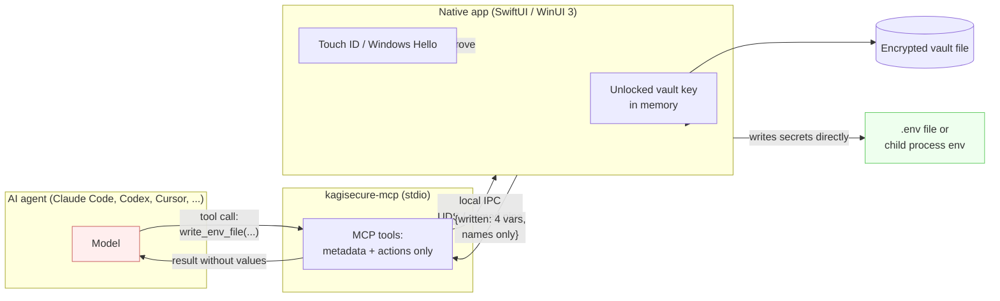

# kagisecure

**The vault your AI agents can use but never see.**

kagisecure is an open-source secrets and password manager designed for the era of AI coding
agents. Agents need your `DATABASE_URL`, your `STRIPE_SECRET_KEY`, your SSH passphrase — but
they should never *read* them. kagisecure gives agents a Model Context Protocol (MCP) server
that can **list**, **describe**, and **inject** secrets, while the secret values themselves stay
inside a local encrypted vault and never enter the model's context window.

> **Status: M6 complete (core + CLI + MCP sidecar + macOS app + browser autofill in Chromium
> *and* Safari, wired together); M7 (release engineering) next.** An agent can discover and
> inject secrets without ever seeing one, and the thing that approves it is now the app:
> `kagisecure-mcp` implements all nine MCP tools, and the macOS app owns the unlocked vault, runs
> the IPC listener, and raises a native approval sheet — caller identity with a code-signature
> verdict, the canonical directory, the variable **names**, a `.gitignore` warning, an editable
> lease TTL, and a Touch ID gate before anything is granted. `kagisecure daemon` is retained as
> the headless channel for CI and SSH sessions and now runs the same library rather than a second
> implementation. A `⇧⌘G` sheet generates passwords and passphrases, Login items can carry a TOTP
> field with a live countdown ring, and `⇧⌘Space` opens a Quick Access panel for copying a
> password, username or one-time code without leaving whatever app you were in.
>
> **M6 adds autofill in the browser**, on a second channel that — unlike everything else here —
> deliberately carries one value. Click the key icon in a matched site's password field, or press
> `⌘\`; the app raises the same approval sheet, checks the origin against the item's saved
> websites (eTLD+1 under the Public Suffix List, exact scheme and port), and the password crosses
> once, for that fill. There is **no autofill on page load**, ever. The extension stores nothing:
> no values, no URLs, not even a match result. A one-time code is a separate, second click. See
> [docs/browser-extension.md](docs/browser-extension.md) and the
> [threat-model addendum](docs/threat-model-browser-extension.md), which is where the cost of that
> value crossing is written down rather than glossed.
>
> **Safari is supported too, since M6b**, from the same extension source and over the same
> protocol. It needs none of Chromium's plumbing — no helper binary, no manifest file, no id to
> check — because the extension is an app extension inside `Kagisecure.app` itself, talking to the
> app over a socket in an App Group only the two of them share
> ([ADR-0024](docs/decisions/0024-safari-app-group-socket.md)). It is also the one path where the
> approval sheet's identity check can read *verified*: the only process on that socket is code we
> signed, where on Chrome our own native messaging helper is the half that cannot be attributed.
> Enable it in Safari → Settings → Extensions. It needs a signed build —
> `make macos SIGN=developer-id` ([ADR-0025](docs/decisions/0025-developer-id-for-local-builds.md)).
>
> Two honest caveats, and one thing not yet seen working. Touch ID for *unlock* still falls back to
> the master password: `keychain-access-groups` is a restricted entitlement that AMFI validates
> against a provisioning profile at every exec, and a Developer ID signature does **not** satisfy
> it — measured in M6b, and the process is killed before `main`
> ([ADR-0011](docs/decisions/0011-secure-enclave-under-ad-hoc-signing.md)). Touch ID for *approval*
> works on every build, because it needs no entitlement. A caller's code signature reads
> "unverified" on an ad-hoc build and on every Chromium fill
> ([ADR-0015](docs/decisions/0015-peer-code-signature-verification.md)). And **no fill has yet been
> performed in real Safari by a human** — everything below Safari is tested, including across a
> real App Sandbox boundary, but the last hop is not
> ([docs/browser-extension.md](docs/browser-extension.md) §8).
>
> The vault format is not frozen and interfaces will still change. See
> [docs/roadmap.md](docs/roadmap.md).

## The problem

Every current workflow for giving an agent access to credentials is bad:

| Workflow | Problem |
| --- | --- |
| Paste the secret into chat | The value is now in the model context, the provider's logs, and your transcript history. |
| Commit a `.env` file | Plaintext on disk, in git, and readable by every process you run. |
| Let the agent `cat .env` | Same as pasting, but automated. A prompt injection in a tool result can exfiltrate it. |
| `export` in your shell profile | Every process inherits it, forever, with no audit trail. |

kagisecure's position: an agent almost never needs to *know* a secret. It needs the secret to be
*present* — in a `.env` file it is about to run against, or in the environment of a process it is
about to spawn. Those are actions, and actions can be gated on a human fingerprint.

## How it works



The red box never sees the green box's contents. The MCP sidecar does not hold the vault key
either — it is a thin, unprivileged broker. The native app owns key material, shows the approval
prompt, and performs the injection itself.

## Core guarantees (design intent)

1. **No MCP tool returns a secret value.** Not truncated, not masked, not "just this once".
   This is enforced at the Rust type level: the `Secret` newtype has no `Serialize` impl reachable
   from the MCP crate. See [ADR-0002](docs/decisions/0002-no-secret-values-over-mcp.md).
2. **Every injection is approved by a human**, via Touch ID or Windows Hello, in the native app —
   not in the agent's UI. The agent cannot forge, replay, or auto-answer the prompt.
3. **Approvals are leased**, scoped to a project directory and a time window, not granted
   globally and forever.
4. **The vault is a plain file** you own, encrypted with XChaCha20-Poly1305 under an Argon2id-derived
   key. No server, no account, no telemetry.
5. **A forgotten master password does not mean lost data.** Vault creation prints a one-time,
   256-bit printable recovery code (Base32 with a checksum) that unlocks the vault independent of
   the master password or any enrolled biometric. See
   [docs/vault-format.md §3.2](docs/vault-format.md#32-recovery).
6. **Local-first and offline.** kagisecure has no network code paths in v1.

## Install

### The DMG

Download [`Kagisecure.dmg`](https://github.com/itsucara/kagisecure/releases/latest/download/Kagisecure.dmg) from the [releases page](https://github.com/itsucara/kagisecure/releases),
open it, and drag **Kagisecure** to Applications. Then open it from `/Applications` as you would
any app — no right-click-Open, no `xattr` incantation.

**Official builds are signed and notarized by Itsucara** (Apple Developer ID team
`4CZNJKU58K`). You can check any copy yourself:

```console
$ codesign -dv --verbose=4 /Applications/Kagisecure.app 2>&1 | grep Authority
$ spctl -a -vv -t install /Applications/Kagisecure.app
#   → accepted, source=Notarized Developer ID
$ xcrun stapler validate /Applications/Kagisecure.app
```

The app is a **universal binary** — Apple silicon and Intel — and needs **macOS 15 or later**. It
carries the CLI, the MCP sidecar and the browser's native messaging host inside the bundle, in
`Contents/Helpers`, each signed and notarized with it
([ADR-0026](docs/decisions/0026-helper-binaries-inside-the-app-bundle.md)). The app's setup
screens point your MCP client and your browser at those copies, so nothing has to be on `PATH`.
To put the CLI there anyway:

```console
$ ln -sf /Applications/Kagisecure.app/Contents/Helpers/kagisecure /usr/local/bin/kagisecure
```

### Homebrew

```console
$ brew install --cask itsucara/tap/kagisecure
```

The cask installs the app and links all three bundled helpers into `PATH`. It lives in
[itsucara/homebrew-tap](https://github.com/itsucara/homebrew-tap); a copy is kept at
[packaging/homebrew/kagisecure.rb](packaging/homebrew/kagisecure.rb).

`brew uninstall --zap --cask kagisecure` deliberately does **not** delete your vault. Your
`.kagivault` is your data; removing a password manager should not remove your passwords.

### From source

Needs Xcode 26+, a Rust toolchain (1.98 or newer, edition 2024) and `brew install xcodegen`.

```console
$ make macos        # bindgen -> helpers -> icon -> xcodegen -> xcodebuild -> embed
$ make run          # and launch it
```

A build from source is ad-hoc signed and needs no Apple Developer account. Two things do not work
under an ad-hoc signature and both say so rather than failing quietly: the Safari extension, which
needs an App Group and therefore a team ([ADR-0024](docs/decisions/0024-safari-app-group-socket.md)),
and the "verified" rendering of the approval sheet's identity check
([ADR-0015](docs/decisions/0015-peer-code-signature-verification.md)). `make macos SIGN=developer-id`
uses a real identity if you have one. [docs/releasing.md](docs/releasing.md) is the full
signing-and-notarization pipeline.

## Try it

Requires a Rust toolchain (1.98 or newer, edition 2024).

```console
$ cargo install --path crates/kagisecure-cli    # or: cargo run -p kagisecure-cli -- ...

$ kagisecure vault init
New master password:
New master password (again):
Created /Users/you/Library/Application Support/kagisecure/default.kagivault

Your one-time recovery code:

    XXXXXX-XXXXXX-XXXXXX-XXXXXX-XXXXXX-XXXXXX-XXXXXX-XXXXXX-XXXXXX

Write it down now. It is shown once and is not stored anywhere.
```

Add an item. Concealed values are prompted for — never typed on the command line, where they
would land in `ps` output and your shell history:

```console
$ kagisecure item add --title "Acme staging" --category api-credential \
      --field username=deploy --secret token
Master password:
Value for token:
Added 0f9ba24f-c09d-4b48-b4c1-83c6d5ec2c6b
```

List and inspect. `item show` prints labels, not values, unless you ask:

```console
$ kagisecure item list
ID          TITLE           CATEGORY          FIELDS  UPDATED
0f9ba24f    Acme staging    api-credential         2  2026-09-09

$ kagisecure item show "Acme staging"
FIELD               KIND          VALUE
username            text          deploy
token               concealed     <concealed>

Concealed values are hidden. Pass --reveal to print them to this terminal.
```

Run something with the secret in its environment. kagisecure spawns the process itself — no
shell, so `;` and `$(...)` in an argument are just characters — and replaces injected values in
the output on the way back:

```console
$ kagisecure run --env TOKEN="Acme staging/token" -- printenv TOKEN
[kagisecure:redacted:TOKEN]

$ kagisecure run --no-masking --env TOKEN="Acme staging/token" -- npm run deploy
```

Masking is a guard against accidental echo — a stack trace printing a connection string — not a
security boundary: it is an exact-value substring replacement, so a command that transforms the
value before printing it defeats it.

Forgotten the master password? That is what the recovery code is for:

```console
$ kagisecure recover
Recovery code:
New master password:
New master password (again):
```

### Coming from 1Password

Export from 1Password 8 — **your account name ▸ Export ▸ the vaults you want ▸ 1Password Unencrypted
Export (`.1pux`)** — then look at the plan before you commit to it:

```console
$ kagisecure import ~/Downloads/export.1pux --dry-run
Detected 1pux · 3 vaults · 412 items
  login 331 · credit-card 4 · secure-note 51 · ssh-key 2 · other 24
Duplicates: 0
Not imported: 17 attachments, 2 passkeys

Nothing was written (--dry-run).
```

`--dry-run` writes nothing and prints exactly the report the real run does. When it looks right,
drop the flag:

```console
$ kagisecure import ~/Downloads/export.1pux --report ./import-report.md
Imported 412 items into "Personal".
```

Everything arrives with `agent_visible = false`, so no agent sees any of it until you say so. The
report lists every item, every preserved field and every drop — **names and counts only, never
values**. Your 1Password password history comes across too, held as `Secret` like any live
password: never visible to an agent, never searchable, and never printed. Re-running the same
import is safe: `--on-duplicate skip` is the default, and `update` /
`keep-both` are there when you want them. CSV exports from 1Password, Apple Passwords, Chrome and
Firefox work the same way — see [docs/import.md](docs/import.md).

That `.1pux` in `~/Downloads` is a **complete plaintext copy of your password manager**. Delete it
as soon as the import is done; `--shred-source` will do it for you:

```console
$ kagisecure import ~/Downloads/export.1pux --shred-source
```

Shredding is **best effort, not a secure erase** — with copy-on-write filesystems, SSD
wear-levelling, Spotlight indexes and local snapshots, the bytes can survive the unlink. The
reliable step is yours: do not leave the export anywhere that gets backed up.

## Give an agent access to it

Group the variables a project needs into an **environment** and decide what agents may see
(nothing, until you say so). You can do all of this in the app — Agent access → Environments — or
from the terminal:

```console
$ kagisecure env create "acme / staging" --agent-visible
$ kagisecure env add-var --environment "acme / staging" \
      --name TOKEN --bind "Acme staging/token"
$ kagisecure env agent-access --allow --logical-vault Personal
$ kagisecure env agent-access --allow --item "Acme staging"
```

Then open the app and unlock it. That is the process that owns the key and answers agents; the
sidebar footer shows a green antenna once it is listening. On a machine with no GUI, run
`kagisecure daemon` in its own terminal instead — it binds the same socket, so only one of the two
can run at a time.

Then point your agent at the sidecar:

```console
$ claude mcp add --transport stdio kagisecure -s local -- "$(kagisecure mcp path)"
```

`kagisecure mcp install claude-desktop|codex|cursor` prints (or, with `--write`, applies) the
equivalent configuration for the other clients; the app's **Set up your agent** screen shows the
same snippets with this install's real path and a copy button.

When the agent asks for an injection, the app raises a sheet showing the caller (and what its code
signature did or did not establish), the resolved directory, the variable **names**, the
`.gitignore` status, and the lease it is about to mint — with the TTL editable downward — and asks
for a fingerprint before granting anything. Deny needs no fingerprint; nobody answering for 60
seconds returns `APPROVAL_TIMEOUT`. Afterwards, the app's Audit pane, or
`kagisecure audit --verify`, shows every call — including the ones you refused — and checks the
log's hash chain. `kagisecure lock` drops the key and every lease, from a terminal, even when the
app is what is holding them.

The full walkthrough is in [docs/mcp-server.md §11](docs/mcp-server.md).

Other things worth knowing:

- `--vault <PATH>` or `KAGISECURE_VAULT` points at a different vault file.
- `--password-stdin` reads the master password from standard input, for CI.
- `kagisecure --help` lists the exit codes.

## Platforms

| Component | Language | Status |
| --- | --- | --- |
| `kagisecure-core` (vault, crypto, injector, generator, TOTP) | Rust | **working (M1–M5)** |
| `kagisecure-cli` | Rust | **working (M1)** |
| `kagisecure-mcp` (stdio MCP server) | Rust, [rmcp](https://github.com/modelcontextprotocol/rust-sdk) 3.2.0 | **working (M2)** |
| `kagisecure-agent` (IPC listener, approvals, leases) | Rust | **working (M4, M6)** |
| `kagisecure-extension-ipc` (browser channel: protocol, origin rule) | Rust | **working (M6)** |
| `kagisecure-nmhost` (native messaging host) | Rust | **working (M6)** |
| `kagisecure-ffi` (UniFFI surface) | Rust, [uniffi](https://mozilla.github.io/uniffi-rs) 0.32.0 | **working (M3–M4)** |
| `kagisecure-import` (1PUX + CSV parsers, dedupe, report) | Rust | in progress (M8) |
| macOS app | SwiftUI + UniFFI | **working (M4–M6)**, universal (arm64 + x86_64; Intel builds but is untested on hardware) |
| Browser extension (Chrome, Edge, Arc, Brave, Chromium) | MV3 / native messaging | **working (M6)** |
| Browser extension (Safari) | Safari Web Extension in the app bundle | **working (M6b)**, needs `SIGN=developer-id`; last hop unconfirmed |
| Windows app | WinUI 3 / C# | deferred (optional / later) |

No Electron, no Tauri, no webview. Native UI on both platforms.

## The macOS app

A native SwiftUI app modeled on 1Password 8's three-pane layout: sidebar, item list, item detail.
It links `kagisecure-core` in-process through `kagisecure-ffi`, so there is no second
implementation of anything — categories, templates, search, filtering and the sidebar's counts all
come out of Rust.

What works:

- Unlock with the master password or the one-time recovery code; a lock screen that is a root-view
  swap, not an overlay, because a locked vault has no key and therefore nothing to render.
- Sidebar sections: All Items, Favorites, every category (shown even at zero), Tags, Archive,
  Trash, and an **Agent access** section — Environments (with the editor where you type the value
  an agent asked for but was not allowed to supply), Leases with a live countdown and per-row
  Revoke, Audit with filters, and Set up your agent.
- Item detail with concealed fields masked at a fixed width, per-field reveal and copy-without-
  reveal, edit mode, favorites, archive, trash and permanent delete.
- The per-item and per-field **"Visible to agents"** toggles, off by default on every new item.
- Auto-lock on idle, sleep and screen lock; locking drops the vault key, stops serving agents, and
  kills every lease it had granted.
- The **approval sheet**, gated by `LAContext` (Touch ID, falling back to the login password), and
  a menu-bar item showing lock state, a badge when something is waiting, and Revoke All / Lock Now.
- A **password generator** sheet (`+` menu, ⇧⌘G, or the die button on any concealed field):
  random-character or word-based (memorable) passwords, every knob live-previewed, a five-level
  strength meter driven by the recipe's entropy rather than a guess, and a short in-session
  history. The same `kagisecure-core` recipe backs `kagisecure generate` on the CLI.
- **TOTP fields** on Login items: paste an `otpauth://` URI or enter a secret manually, see a live
  preview before saving, then a large monospace code with a countdown ring in the detail pane.
  Codes are recomputed from the wall clock every tick, not decremented, so they cannot drift.
- **Quick Access** (`⇧⌘Space`, or the menu-bar item): a floating panel, independent of the main
  window's search and selection, for finding an item and copying its password (⏎), username
  (⌘⏎) or current one-time code (⌥⏎) without switching apps.

What is not there yet: QR-code scanning for TOTP setup (paste-URI and manual entry are built),
attachments, and the one-click "Add to `.gitignore`" button on the approval sheet. Menu entries
for the later ones exist and are disabled rather than hidden, so the menu tells the truth.

### Building it

Needs Xcode 26+, a Rust toolchain with `aarch64-apple-darwin`, and `brew install xcodegen`. A
*release* build additionally needs `x86_64-apple-darwin`; see [docs/releasing.md](docs/releasing.md).

```console
$ make macos        # bindgen -> helpers -> icon -> xcodegen -> xcodebuild -> embed
$ make macos-test   # and the test bundle
$ make run          # build, then launch
$ make release      # the signed, notarized DMG (needs a Developer ID certificate)
```

The Xcode project is generated from `apps/macos/project.yml` and is not committed
([ADR-0010](docs/decisions/0010-app-sandbox-off-and-generated-project.md)); the *generated Swift
bindings* are committed and `cargo xtask bindgen` (run locally; this ran in CI until CI was removed
on 2026-09-19) fails the build if they drift
([ADR-0009](docs/decisions/0009-checked-in-swift-bindings.md)). Point the app at a scratch vault
with `KAGISECURE_HOME`.

## Testing

Three layers, and they answer different questions.

```console
$ make check                     # cargo build + cargo test  — 476 Rust tests
$ make macos-test                # xcodebuild test           — 91 Swift tests
$ npm --prefix extensions/chrome test   # node --test         — 43 JavaScript tests
$ make e2e                       # the end-to-end harness    — 75 scenarios
```

The first three are unit and integration tests: they run in-process, or across two processes the
test itself started, and they are what `cargo test --workspace` covers. **`make e2e` covers the
seams between processes** — a real MCP client talking to a real sidecar over a real socket to a
real daemon, a real browser launching the real native messaging host, the CLI's exit codes as a
script actually sees them, and the real macOS app driven through its accessibility tree while a
real agent asks it for a secret.

```console
$ make e2e                       # every suite except the macOS app — see below
$ make e2e SUITE=mcp,cli         # just the headless ones, the subset run locally in place of CI
$ make e2e SUITE=app E2E_GUI=1   # just the macOS app, when the Mac is free
$ make e2e E2E_GUI=1             # all four
$ make e2e E2E_KEEP=1            # keep the temporary vaults, sockets and screenshots
```

**The app suite takes over the mouse and keyboard for about half an hour.** XCUITest synthesises
real clicks and keystrokes at the window server, and whatever else you are doing on that Mac will
receive them. So it is opt-in: a plain `make e2e` leaves it out, `make e2e SUITE=app` without
`E2E_GUI=1` is refused rather than silently skipped, and `E2E_GUI=1` is you saying the machine is
free.

It writes `e2e/report/index.html` — pass/fail per scenario, durations, embedded screenshots and log
excerpts, and an environment header saying what it ran against — and `e2e/report/junit.xml`. It
exits non-zero if anything failed. Every scenario builds its own vault under a temporary directory;
nothing touches `~/Library/Application Support/kagisecure/`.

| Suite | What it drives | Scenarios |
| --- | --- | --- |
| `mcp` | `kagisecure-mcp` over a socket to `kagisecure daemon`, three processes | 21 |
| `extension` | Microsoft Edge, the real unpacked extension, `kagisecure-nmhost` | 15 + 2 manual |
| `cli` | `kagisecure` against scratch vaults and the committed golden vector | 18 |
| `app` | The real `Kagisecure.app` through XCUITest, and a real `kagisecure-mcp` raising its approval sheet | 21 |

The browser suite needs a real login session (an MV3 extension does not load in a headless
Chromium) and Microsoft Edge — Chrome 137 removed `--load-extension` — so it is local-only; the
headless subset run in place of CI is `SUITE=mcp,cli`. Safari cannot be driven by automation at all: its scenarios report as *skipped*
with the manual steps printed into the report, never as failures.

The app suite needs a window server too, and on some machines one thing more: macOS can refuse to
let a test runner drive another process. When it does, the suite reports as *skipped* with the
one-line fix — `sudo DevToolsSecurity -enable`, or `security authorize -ue
system.privilege.taskport` for this login session — rather than failing. `make e2e` will not grant
it for you: the suite does not change the security posture of the machine it is measuring. What
stands in for the human there is one thing only, the fingerprint, through a `BiometricGate` double
injected by a launch argument that a release build does not compile.

[docs/e2e-harness.md](docs/e2e-harness.md) is the long version: the architecture, how to add a
suite, a scenario or a screen, and the accessibility-identifier convention the app suite is written
against.

## Documentation

| Document | What it covers |
| --- | --- |
| [docs/architecture.md](docs/architecture.md) | Components, process model, FFI vs IPC boundary, repo layout |
| [docs/threat-model.md](docs/threat-model.md) | Assets, adversaries, mitigations, explicit non-goals |
| [docs/vault-format.md](docs/vault-format.md) | File format, key hierarchy, AEAD choice, item schema |
| [docs/mcp-server.md](docs/mcp-server.md) | Tool list + schemas, approval flow, lease model, client setup |
| [docs/browser-extension.md](docs/browser-extension.md) | Autofill: the protocol, approvals and leases, setup for Chromium and Safari, the source layout, testing |
| [docs/threat-model-browser-extension.md](docs/threat-model-browser-extension.md) | The browser as a new semi-trusted component: assets, adversaries, residual risks |
| [docs/ui-spec.md](docs/ui-spec.md) | The macOS app: layout, item rendering, lock screen, shortcuts |
| [docs/import.md](docs/import.md) | Importing from 1PUX and the four CSV exports: mapping, dedupe, the report, what is dropped |
| [docs/releasing.md](docs/releasing.md) | Signing, notarization, the DMG, and the verification that proves it worked |
| [docs/e2e-harness.md](docs/e2e-harness.md) | `make e2e`: the cross-process test suites, the report, and how to add one |
| [docs/roadmap.md](docs/roadmap.md) | M0–M7 with acceptance criteria |
| [CHANGELOG.md](CHANGELOG.md) | What changed in each version, and what is known not to work |
| [docs/decisions/](docs/decisions/) | Architecture Decision Records |

## Prior art

kagisecure's MCP surface is deliberately modelled on 1Password's **Environments MCP server**,
which exposes tools like `create_environment`, `append_variables`, `list_variables`, and
`create_local_env_file`, never returns secret values, and shows authorization prompts in the
desktop app rather than in the agent. That shape is, in our reading, correct. kagisecure's
contribution is to make it open source, cross-platform, and file-based rather than tied to a
hosted account.

## Contributing

See [CONTRIBUTING.md](CONTRIBUTING.md). During M0–M1 the most useful contribution is review of
the design documents — particularly [docs/threat-model.md](docs/threat-model.md) and
[docs/vault-format.md](docs/vault-format.md). Please open an issue rather than a PR for
cryptographic design questions.

Security issues: see [SECURITY.md](SECURITY.md). Do not open a public issue for a vulnerability.

## License

Dual-licensed under either of:

- Apache License, Version 2.0 ([LICENSE-APACHE](LICENSE-APACHE))
- MIT license ([LICENSE-MIT](LICENSE-MIT))

at your option. This is the standard Rust ecosystem convention.

Unless you explicitly state otherwise, any contribution intentionally submitted for inclusion in
this work by you, as defined in the Apache-2.0 license, shall be dual-licensed as above, without
any additional terms or conditions.

Copyright (c) 2026 kagisecure contributors.

## About

kagisecure is built and maintained by [Itsucara](https://itsucara.com). The product site is
[kagisecure.com](https://kagisecure.com).
