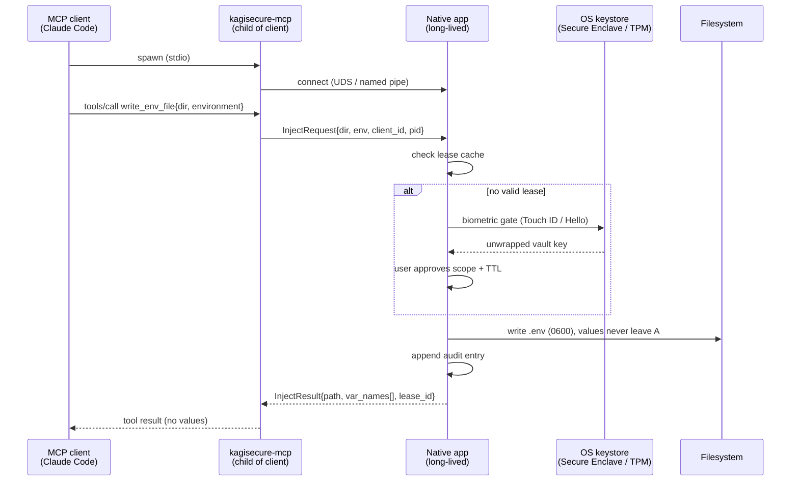

# Architecture

Status: **partly implemented.** `kagisecure-core`, `kagisecure-cli`, `kagisecure-ipc` and
`kagisecure-mcp` exist as of M2; `kagisecure-ffi` and the macOS app exist as of M3;
`kagisecure-agent` and the app's IPC listener exist as of M4; the Windows app does not. Version
numbers cited are those verified as current on 2026-09-09.

## 1. Design constraints

These come from the project's fixed decisions and drive everything below:

1. One shared Rust core. Vault format, crypto, item CRUD, 1Password import, and the MCP server
   all live in a single Cargo workspace. No logic is reimplemented per platform.
2. Native UI on both desktops: SwiftUI on macOS, WinUI 3 / C# on Windows. No Electron, no Tauri.
3. Secret values must never leave the process that is authorized to hold them, except by being
   written into a file or a child process environment that the *user* approved.
4. Biometric approval is present from day one, not bolted on later.
5. The MCP server is a separate stdio binary so that MCP clients can spawn it with the config
   shape they already understand, and so that a crash or a hostile client cannot touch the
   app's address space.

## 2. Components

| Component | Crate / project | Kind | Holds key material? |
| --- | --- | --- | --- |
| Core library | `crates/kagisecure-core` | Rust lib | Yes, while unlocked |
| Agent library | `crates/kagisecure-agent` | Rust lib | Yes — it borrows the host's unlocked vault |
| FFI shim | `crates/kagisecure-ffi` | Rust cdylib/staticlib | Yes (it is the core, in-process) |
| MCP sidecar | `crates/kagisecure-mcp` | Rust bin, stdio | **No** |
| IPC protocol | `crates/kagisecure-ipc` | Rust lib | **No** |
| CLI | `crates/kagisecure-cli` | Rust bin | Yes, when run interactively |
| macOS app | `apps/macos` | SwiftUI, links FFI | Yes |
| Windows app | `apps/windows` | WinUI 3 / C#, links FFI | Yes |

### 2.1 `kagisecure-core`

The whole product, minus UI and transport. Public surface, roughly:

- `Vault` — open/create/save, header parsing, KDF parameter handling, migration.
- `VaultKey` / `Kek` — key hierarchy types; all `Zeroize + ZeroizeOnDrop`.
- `Item`, `Field`, `Category`, `Secret` — the item model (see [vault-format.md](vault-format.md)).
- `Injector` — the only code that materializes plaintext outside the vault: writes `.env` files
  and builds child-process environments.
- `import::onepux`, `import::csv`, `import::dotenv`.
- `audit` — append-only local audit log.
- `lease` — approval leases (directory + TTL + scope).

`kagisecure-core` has **no** networking, no MCP types, and no UI types. It does not know what an
agent is.

### 2.2 `kagisecure-mcp` (the sidecar)

A stdio binary. Speaks MCP 2026-07-28 via `rmcp` 3.2.0 with the `transport-io` feature; tools are
declared with rmcp's `#[tool]` attribute macros.

Resolved at implementation time: rmcp 3.2.0 uses `#[tool_router]` on the inherent `impl`,
`#[tool]` on each method, and `#[tool_handler(router = self.tool_router)]` on the `ServerHandler`
`impl`. Arguments arrive as `Parameters<T>` where `T: Deserialize + JsonSchema`, and a handler may
take `Peer<RoleServer>` to read the client's self-reported `clientInfo`.

Critically, the sidecar:

- **does not link `kagisecure-core`'s crypto or vault-open paths.** It depends on
  `kagisecure-core` with `default-features = false`, which gives it the metadata-only modules
  (`proto`, `audit`, `lease`) and not `Secret`, plus `kagisecure-ipc` for the request/response
  enums. `cargo tree -e features`, run locally (this ran in CI until CI was removed on
  2026-09-19), asserts that `secret-material` is absent from both crates' feature graphs.
- **cannot open a vault file.** It has no KDF, no password prompt, no keychain access.
- forwards every meaningful request over local IPC to the native app and renders the reply.

If the sidecar is compromised, the attacker gets the ability to *ask* for injections. They still
have to get past a fingerprint.

### 2.3 `kagisecure-cli`

`kagisecure` — the human/CI entry point. Subcommands, as shipped in M1: `vault init|unlock`,
`item add|list|show|rm`, `run --env NAME=item/field [--no-masking] -- cmd`, `recover`. `lock`,
`env write`, `import` and `audit` were scoped for M1 but deferred to M2 — see
[roadmap.md](roadmap.md#m1--core-crate--cli).

The CLI is also the **temporary approval channel** in M2, before the native apps exist: it can run
as a small foreground daemon that owns the unlocked vault and answers IPC approval requests with a
terminal prompt. This is explicitly a stand-in, marked insecure-by-comparison in its own help text,
and it is retained afterwards for headless/CI use behind an opt-in flag. See §2.6.

M2 added `env create|list|add-var|rm|write|agent-access`, `daemon`, `lock`, `audit` and
`mcp path|install` to the subcommand list above.

### 2.3a `kagisecure-agent` (added in M4)

Everything the process that owns the unlocked vault does *for agents*: the IPC listener, caller
verification, the lease store, the approval queue, the nine tool handlers, the audit append, and
the calls into `Injector`. It is the M2 daemon's logic, lifted out of the CLI so that the macOS
app and `kagisecure daemon` run one implementation rather than two
([ADR-0013](decisions/0013-agent-library-split.md)).

It sits above the core rather than inside it, because §2.1's description of `kagisecure-core` —
"no networking, no MCP types, and no UI types; it does not know what an agent is" — is a property
worth keeping, and because putting a socket library in the core would drag `interprocess` into the
graph of every crate that opens a vault.

The public surface is six synchronous calls plus a handful of accessors:

```text
Agent::start(handle, config)      next_request(timeout)   resolve(id, decision, verification)
leases() / revoke_lease(id)       take_lock_request()     stop()
```

`VaultHandle` is how the vault is shared: an `Arc<Mutex<Option<Vault>>>` the host and the agent
both hold. Taking the vault out of it *is* the lock — the key zeroizes on drop — and the handle's
lock hook fires at the same moment, denying every approval still waiting and dropping every lease.
There is no interval in which a locked vault serves an agent.

The library never destroys its host's vault: `Request::Lock` (which is what `kagisecure lock`
sends) raises a flag the host polls, and the host performs the lock, because the host is what owns
the vault's lifetime.

### 2.4 `kagisecure-ffi`

A thin crate that re-exports a UniFFI-annotated subset of `kagisecure-core` and nothing else. It
exists so that the FFI surface is an explicit, reviewable list rather than "whatever `core` made
public". Built as a `cdylib` (and `staticlib` for macOS app bundling).

As implemented in M3: proc-macro UniFFI 0.32 (`#[uniffi::export]`, `#[derive(uniffi::Record /
Enum / Object / Error)]`, `uniffi::setup_scaffolding!()`), one object (`VaultSession`) and a
handful of free functions, all synchronous. Which secret material crosses it, and why each
crossing exists, is enumerated in [ADR-0008](decisions/0008-ffi-secret-crossings.md) — four
kinds, no more, and adding a fifth is an edit to that ADR.

### 2.5 Native apps

Both apps do the same four jobs:

1. Own the unlocked vault key in memory, guarded by the platform biometric.
2. Present the vault UI (browse, edit, import).
3. Run the IPC listener, show approval sheets, and perform the injection.
4. Spawn and supervise the `kagisecure-mcp` sidecar binary bundled alongside them.

The apps are UI + platform integration only. Any logic that would need to be written twice is a
bug in the layering.

**As implemented in M4**, the macOS app does jobs 1, 2 and 3. Job 4 — spawning and supervising the
sidecar — it deliberately does not do, and neither does anything else: the sidecar is a child of
the MCP client, which is what §3 always said, so what the app owes is the *path*, which its "Set
up your agent" screen shows along with each client's configuration snippet. Putting a signed copy
of the sidecar inside the bundle (§8) is done — see §8 and
[ADR-0026](decisions/0026-helper-binaries-inside-the-app-bundle.md).

Job 3 is `kagisecure-agent`, hosted in-process: the app calls `agent_start` when it unlocks and
`agent_stop` when it locks, and a background task polls `agent_next_request` for questions to put
in front of the user. The item model, category templates, search, filtering and sidebar counts all
live in `kagisecure-core` and reach Swift through `kagisecure-ffi` — the app computes none of
them, and now neither does it compute a lease rule.

### 2.6 `kagisecure daemon` — the headless approval channel

Since M4 the real answer to §2.5 is the app. This subcommand is what remains for the cases the app
cannot serve — an SSH session, CI, a Linux box with no GUI — and it is retained rather than
removed because those cases are real. **It is no longer a second implementation:** everything that
decides anything lives in `kagisecure-agent` (§2.3a) and is the same code the app runs; what is
left in the CLI is a vault unlock, a `y`/`N` read and a banner.

Everything §2.5 lists as the app's four jobs, minus the UI:

1. It owns the unlocked vault key, taken from a master-password prompt rather than a biometric.
2. There is no vault UI. `kagisecure env`, `item` and `audit` are it.
3. It runs the IPC listener, shows an approval prompt **in its own terminal**, and performs the
   injection itself — writing the `.env`, spawning the child, minting and consuming the lease,
   and appending the audit entry.
4. It does not spawn the sidecar; the MCP client does, exactly as it will in M4.

The prompt prints what [ui-spec.md](ui-spec.md) §10.2 says the approval sheet shows: the caller
as verified (or, honestly, as `[UNVERIFIED]`), the canonical directory, the variable names, the
`.gitignore` status, and the TTL and use count of the lease it is about to mint. It answers `y`
or `N`, times out after 60 seconds into `APPROVAL_TIMEOUT`, and there is no "always allow".

**This is a weaker approval channel than the app's and the daemon says so on startup:** anything
that can write to that terminal can answer the prompt. What is *not* weaker is everything behind
it — the lease rules, the exact-directory match, the audit chain, and the fact that no secret
value crosses the IPC boundary — because that is now literally the same code, in
`kagisecure-agent`, reached through the same approval queue. See
[ADR-0007](decisions/0007-m2-daemon-and-ipc-deviations.md) §1–§3 and
[ADR-0013](decisions/0013-agent-library-split.md).

A test-only `--auto-approve` flag exists for the integration suite and is **refused at startup in
a release build**, so a shipped binary has no code path to an unattended approval (ADR-0007 §2).

Every state-changing request appends one audit entry and then saves — re-serializing and
re-encrypting the *whole* vault body to disk, not just the new entry; batching multiple appends
into a single save is deferred.

## 3. Process model



Key points:

- The sidecar is a **child of the MCP client**, not of the app. The app does not control its
  lifetime; the client does. The app therefore treats every IPC connection as untrusted and
  identifies it (see §5).
- The app is long-lived and may serve several sidecars at once (Claude Code in two repos, Cursor,
  Codex CLI) from one unlocked vault.
- If the app is not running, the sidecar's tools fail with a structured, actionable error
  (`APP_NOT_RUNNING`) rather than falling back to anything weaker.

## 4. The FFI boundary vs the IPC boundary

This is the most important structural decision in the project, so it gets its own section.

**Two different boundaries carry two different kinds of traffic.**

| | UniFFI (in-process) | IPC (cross-process) |
| --- | --- | --- |
| Who | Native app ⟷ `kagisecure-ffi` | `kagisecure-mcp` ⟷ native app |
| Direction | Mostly synchronous calls down into Rust | Request/response, app is the server |
| Carries | Vault open/lock, item CRUD, import, audit reads, injection execution | Metadata queries, injection *requests*, approval results |
| May carry plaintext? | Yes — same process, same trust domain | **Never** |
| Callbacks into the foreign language? | Avoided (see below) | N/A |

### 4.1 Why approvals do not ride on UniFFI async callbacks

The obvious design is: Rust calls up into Swift ("show a Touch ID sheet") and awaits the answer.
We are not doing that. UniFFI's async foreign-callback path has a set of known rough edges —
`Sendable` conformance problems under Swift 6 strict concurrency, issues around
`tokio` `async_runtime` on exported async traits, and reference cycles in foreign trait objects.
Building the security-critical approval path on the least-settled part of the binding generator
is a poor trade.

Instead: **Rust never calls up into the UI to ask a question.** The native app is the one that
receives approval requests (over IPC), drives its own biometric API in its own language, and then
calls *down* into Rust to perform the approved action. Every FFI call is app→Rust and returns a
value. That is UniFFI's well-trodden path.

**As implemented in M4**, that inversion is a queue. `kagisecure-agent` parks the IPC thread on a
condvar for at most 60 seconds; Swift runs a background task calling
`agent_next_request(timeout_ms)`, which blocks *in Rust* and returns a metadata record or nothing,
shows the sheet, and answers with `agent_resolve(id, decision, verification)`. `kagisecure-ffi`
exports no `async fn`, no callback interface and no foreign trait object. See
[ADR-0014](decisions/0014-approval-queue-over-ffi.md).

### 4.2 IPC transport

The `interprocess` crate (2.4.4) — one API over Unix domain sockets and Windows named pipes, with
Tokio integration. Framing: length-prefixed JSON, one request/response per frame.

> Assumption: length-prefixed JSON (u32 LE length + UTF-8 body, 1 MiB frame cap) rather than a
> binary codec. The traffic volume is tiny and human-readable frames make the security-critical
> path auditable. Revisit only if profiling says otherwise.

Endpoint locations:

- macOS: `~/Library/Application Support/kagisecure/run/daemon.sock`, mode `0600`, in a `0700`
  directory.
- Linux: `$XDG_RUNTIME_DIR/kagisecure/daemon.sock`, falling back to
  `~/.local/share/kagisecure/run/daemon.sock`, same modes.
- Windows: `\\.\pipe\kagisecure-<user>`, with a DACL granting only the creating user.
- `KAGISECURE_SOCKET` overrides all of the above, which is how the tests run several daemons at
  once without touching the user's own.

As implemented the file is named `daemon.sock` rather than `app.sock`. The app took the same path
over in M4 and kept the name, because the sidecar and every documented `KAGISECURE_SOCKET` example
already refer to it and renaming it would break them for no gain. **Only one process can hold it:**
whichever of the app and the daemon binds second fails with `AddrInUse`, which
`kagisecure-agent` turns into a message the UI shows verbatim ("another kagisecure is already
listening on …; quit the kagisecure app, or stop `kagisecure daemon`"). `interprocess`'s pre-`bind` `fchmod` is
unsupported on macOS, so there the socket is created and then chmod-ed — the `0700` directory is
the boundary that keeps other local users out either way (ADR-0007 §3).

### 4.3 What the sidecar may ask for

The IPC protocol is deliberately narrow — roughly one message per MCP tool, plus a handshake.
There is no generic "read field" or "decrypt" message. **The protocol has no message whose reply
contains a secret value.** That is the enforcement point; the MCP schema merely reflects it.

## 5. Client identity and binding

The app must be able to say *who* is asking. On connect, the sidecar sends a handshake with its
own pid, its parent pid, its argv0, and a self-reported client name (from MCP `clientInfo`). The
app then independently verifies:

- **macOS:** `LOCAL_PEERPID` / audit token from the socket, then code-signing identity of that pid
  via `SecCodeCopyGuestWithAttributes`. Self-reported values are used only for display, never for
  authorization.
- **Windows:** `GetNamedPipeClientProcessId`, then the image path and signature of that process.

**As implemented in M2.** `kagisecure-mcp` keeps `#![forbid(unsafe_code)]`; `kagisecure-ipc`
keeps `#![deny(unsafe_code)]` with a single, self-contained `#![allow(unsafe_code)]` module,
`kernel_peer.rs`, which is the only place in the crate that calls FFI (ADR-0007 §3):

- the peer's **effective uid** comes from the kernel and is a hard gate — a connection from
  another local user is refused, not warned about;
- the peer's **pid** also comes from the kernel on every platform the project ships to:
  `SO_PEERCRED` on Linux, and `getsockopt(SOL_LOCAL, LOCAL_PEERPID)` on macOS, where `xucred`
  carries no pid. The sidecar's self-reported pid is adopted **only** when that syscall itself
  fails, for display only, and the identity is then rendered `[UNVERIFIED]` in the prompt and the
  audit log;
- the pid is resolved to an executable path (`proc_pidpath` on macOS, `/proc/<pid>/exe` on Linux,
  else `ps -o comm=`) for display;
- code-signature verification arrived in M4 and happens on the **app** side:
  `SecCodeCopyGuestWithAttributes` on the kernel's pid, `SecCodeCheckValidity`, then the signing
  identifier, the ad-hoc flag and the team identifier compared against the app's own. The verdict
  is shown on the sheet and travels back down with the decision, into the lease and the audit
  entry. The CLI daemon performs no such check and records "code signature not checked". See
  [ADR-0015](decisions/0015-peer-code-signature-verification.md), including why an ad-hoc-signed
  build can only ever report *unverified*.

The approval sheet shows the *verified* identity and the working directory, and warns visibly when
the caller is unsigned or unrecognized.

**M6 added a second peer with a second shape.** The browser extension reaches the app through
`kagisecure-nmhost`, a native messaging host the browser launches — and which the browser does not
verify in any way. So the identity for that channel has two halves: the connecting process (uid
from the kernel, pid from the kernel, executable from the pid) and the **first recognized browser
within three hops of its process ancestry**, because a native host with no browser above it is a
program pretending to be a browser extension. Both pids get a code-signature verdict, and the sheet
renders both — on an unsigned build the browser's can genuinely be *verified* while our own
helper's cannot. A host that fails the ancestry gate is refused before it can ask anything. See
[ADR-0019](decisions/0019-native-messaging-forwarder.md) and
[browser-extension.md](browser-extension.md).

> Assumption: we will ship allow-listed known-good sidecar identities (our own bundled binary) and
> treat any other caller as "unknown, show a stronger warning" rather than refusing outright —
> refusing would break users who build from source. Owner should confirm.

## 6. Monorepo layout

```
kagisecure/
├── Cargo.toml                    # workspace
├── README.md
├── LICENSE-MIT
├── LICENSE-APACHE
├── CONTRIBUTING.md
├── SECURITY.md
├── crates/
│   ├── kagisecure-core/          # vault, crypto, items, import, injector, audit, lease
│   │   ├── src/
│   │   │   ├── vault/            # header, body, migration
│   │   │   ├── crypto/           # kdf, aead, wrap, zeroize helpers
│   │   │   ├── model/            # Item, Field, Category, Secret
│   │   │   ├── import/           # onepux, csv, dotenv
│   │   │   ├── inject/           # env file writer, process spawner
│   │   │   ├── proto.rs          # metadata types (no Secret)
│   │   │   ├── audit.rs          # append-only log + hash chain
│   │   │   └── lease.rs
│   │   └── tests/                # incl. vault-format golden vectors
│   ├── kagisecure-ipc/           # the MCP IPC protocol (no Secret in its graph)
│   ├── kagisecure-extension-ipc/ # the browser channel: protocol, framings, origin rule (M6)
│   ├── kagisecure-agent/         # IPC listeners, approval queue, leases, tool handlers
│   ├── kagisecure-mcp/           # stdio MCP server (rmcp)
│   ├── kagisecure-nmhost/        # the native messaging host: a pipe, no vault (M6)
│   ├── kagisecure-cli/           # `kagisecure` binary, incl. the M2 approval daemon
│   └── kagisecure-ffi/           # UniFFI surface -> cdylib/staticlib
├── extensions/
│   └── chrome/                   # MV3 extension, plain JS, no build step (M6)
├── apps/
│   ├── macos/                    # SwiftUI app, Xcode project, generated Swift bindings
│   │   ├── kagisecure/
│   │   ├── Generated/            # uniffi-generated Swift (checked in? see below)
│   │   └── Scripts/build-rust.sh
│   └── windows/                  # WinUI 3 app (C#), generated C# bindings
│       ├── Kagisecure.App/
│       ├── Kagisecure.Interop/   # generated or hand-written P/Invoke
│       └── Scripts/build-rust.ps1
├── docs/
│   └── decisions/
└── xtask/                        # cargo xtask: bindgen, helpers, embed, version, dist
```

~~Assumption: generated bindings are **not** checked in.~~ **Resolved (M3): the generated Swift
*is* checked in; the binary artifacts are not.** See
[ADR-0009](decisions/0009-checked-in-swift-bindings.md) for why — chiefly that SwiftPM cannot
resolve a package whose sources are absent, so a fresh clone would not open in Xcode. `cargo xtask
bindgen`, run locally (this ran in CI until CI was removed on 2026-09-19), regenerates and the
build fails on a diff; the same run additionally asserts that a second `cargo xtask bindgen` run
changes nothing.

The macOS tree as built in M3 differs slightly from the sketch above:

```
apps/macos/
├── project.yml                 # XcodeGen spec; Kagisecure.xcodeproj is generated, not committed
├── Kagisecure/                 # app sources: App, Models, Services, Views
├── KagisecureFFI/              # local SwiftPM package
│   ├── Package.swift
│   ├── Sources/KagisecureFFI/  # generated Swift — committed
│   └── Artifacts/              # xcframework + headers — generated, not committed
├── KagisecureTests/            # XCTest bundle (Swift Testing), hosted in the app
└── Signing/Provisioned.entitlements
```

`Scripts/build-rust.sh` never appeared: `cargo xtask bindgen` does that job, from Rust, the same
way on a laptop as it ran in CI before CI was removed on 2026-09-19.

## 7. Build and toolchain

| Thing | Choice | Notes |
| --- | --- | --- |
| Rust edition / MSRV | 2024 edition, MSRV pinned in workspace `Cargo.toml` | MSRV bumps are a minor-version event |
| Binding generator (Swift) | UniFFI 0.32.0 (2026-06-30) | Swift is a first-class UniFFI target |
| Binding generator (C#) | `uniffi-bindgen-cs`, else `csbindgen` + hand-written P/Invoke | See [ADR-0003](decisions/0003-uniffi-vs-csbindgen.md) |
| MCP | `rmcp` 3.2.0 (2026-08-31) | stdio via `transport-io`. An `initialize` handshake negotiates 2025-11-25; 2026-07-28 needs the `discover` lifecycle (ADR-0007) |
| IPC | `interprocess` 2.4.4 | UDS + named pipes, Tokio support |
| KDF | `argon2` 0.6.0 | Argon2id |
| AEAD | `chacha20poly1305` 0.11.0 (primary), `aes-gcm` 0.11.1 (alt) | See [vault-format.md](vault-format.md) |
| Memory hygiene | `zeroize` 1.9.0; `secrecy` 0.10.3 under review | `secrecy` looks stale; re-evaluate before depending on it |
| Task runner | `cargo xtask` | No Make, no shell-script sprawl. `bindgen`, `helpers`, `embed`, `version`, `dist` |
| Dependency policy | `cargo deny` (`deny.toml`) | Licenses + advisories, run locally and before every release (ran in CI until CI was removed on 2026-09-19) |
| Release | `cargo xtask dist` → signed, notarized, stapled DMG | [docs/releasing.md](releasing.md), [ADR-0028](decisions/0028-the-release-pipeline.md) |
| macOS toolchain | Xcode (SwiftUI), `aarch64-apple-darwin` + `x86_64-apple-darwin` → universal | Shipped in M7, see [ADR-0027](decisions/0027-universal-binaries.md), which supersedes [ADR-0012](decisions/0012-m3-scope-deviations.md) §1 |
| macOS project | XcodeGen spec → generated `.xcodeproj` | [ADR-0010](decisions/0010-app-sandbox-off-and-generated-project.md) §2 |
| macOS deployment target | macOS 15 | Built against the macOS 26 SDK; run and screenshotted on macOS 26.1 |
| Windows toolchain | .NET 8+/WinUI 3, `x86_64-pc-windows-msvc` (+ `aarch64` later) | |

Former CI matrix (removed 2026-09-19, now run locally per platform): `ubuntu-latest` (core + mcp +
cli tests, clippy, fmt, `cargo deny`), `macos-latest` (core tests + Swift bindgen + app build + app
tests), `windows-latest` (core tests + C# interop + app build).

### Building and running the macOS app

Prerequisites: Xcode 26 or later, a Rust toolchain with the `aarch64-apple-darwin` target, and
`xcodegen` (`brew install xcodegen`). A *release* build additionally needs `x86_64-apple-darwin`;
see [docs/releasing.md](releasing.md).

```console
$ make macos          # cargo xtask bindgen -> xcodegen generate -> xcodebuild build
$ make macos-test     # the same, then xcodebuild test
$ make run            # build, then open the .app
```

`cargo xtask bindgen` is not optional on a fresh clone: it produces
`apps/macos/KagisecureFFI/Artifacts/KagisecureFFI.xcframework`, which the SwiftPM package's
`binaryTarget` points at, and without it the package will not resolve.

The app opens the vault at `$KAGISECURE_HOME/default.kagivault`, defaulting to
`~/Library/Application Support/kagisecure/default.kagivault`. Setting `KAGISECURE_HOME` to a
scratch directory is how to try it against a throwaway vault:

```console
$ KAGISECURE_HOME=/tmp/ks-demo open -n build/Debug/Kagisecure.app
```

The default build is ad-hoc signed and needs no Apple Developer account. Touch ID needs a real
identity *and* a provisioning profile — see
[ADR-0011](decisions/0011-secure-enclave-under-ad-hoc-signing.md), which also records what that
means for what is and is not verified.

## 8. Sidecar packaging

**Done as of M7.** Three binaries ship **inside** the app bundle, each signed with the same
Developer ID certificate as the app, under the Hardened Runtime, and notarized in the same
submission:

- `Kagisecure.app/Contents/Helpers/kagisecure-mcp` — the MCP sidecar
- `Kagisecure.app/Contents/Helpers/kagisecure-nmhost` — the browser's native messaging host
- `Kagisecure.app/Contents/Helpers/kagisecure` — the CLI

**`Contents/Helpers`, not `Contents/MacOS`.** The conventional directory is the wrong one here and
the failure is silent: the app's own executable is `Contents/MacOS/Kagisecure`, the CLI is
`kagisecure`, and the default macOS filesystem is case-insensitive — so copying the CLI in beside
the app overwrites the app, with no error from `cp`, `codesign` or `xcodebuild`.
[ADR-0026](decisions/0026-helper-binaries-inside-the-app-bundle.md) has the measurement.

The app prints the absolute path to its bundled sidecar in a "Set up your agent" screen and offers
one-click copy of each client's config snippet (see [mcp-server.md](mcp-server.md) §9); the
"Browser extension" screen writes the `NativeMessagingHosts` manifest with the bundled host's
absolute path. One search answers both, and `kagisecure mcp path` as well: bundled copy, then
`KAGISECURE_MCP` / `KAGISECURE_NMHOST`, then beside the running executable, then an installed
`/Applications/Kagisecure.app`, then `PATH`.

Still to come, and not done:

- Windows: next to the app executable inside the MSIX package.
- A Homebrew *formula* for a standalone `kagisecure` / `kagisecure-mcp`, for people who want the
  CLI daemon path without the GUI app. The **cask** installs the app and links the three bundled
  helpers into `PATH`, which covers most of that need
  (`packaging/homebrew/kagisecure.rb`).

## 9. What is deliberately absent

- No network stack, no sync server, no account system in v1.
- No browser extension in v1. It is a later but committed milestone (M6, Safari + Chrome
  autofill), sequenced after the macOS app and its MCP integration — see
  [roadmap.md](roadmap.md#m6--browser-extension-autofill-safari--chrome).
- No plugin system for third-party MCP tools inside kagisecure. The tool list is fixed and
  auditable; that is a feature.
- No secret values in any log, crash report, or telemetry (there is no telemetry).
