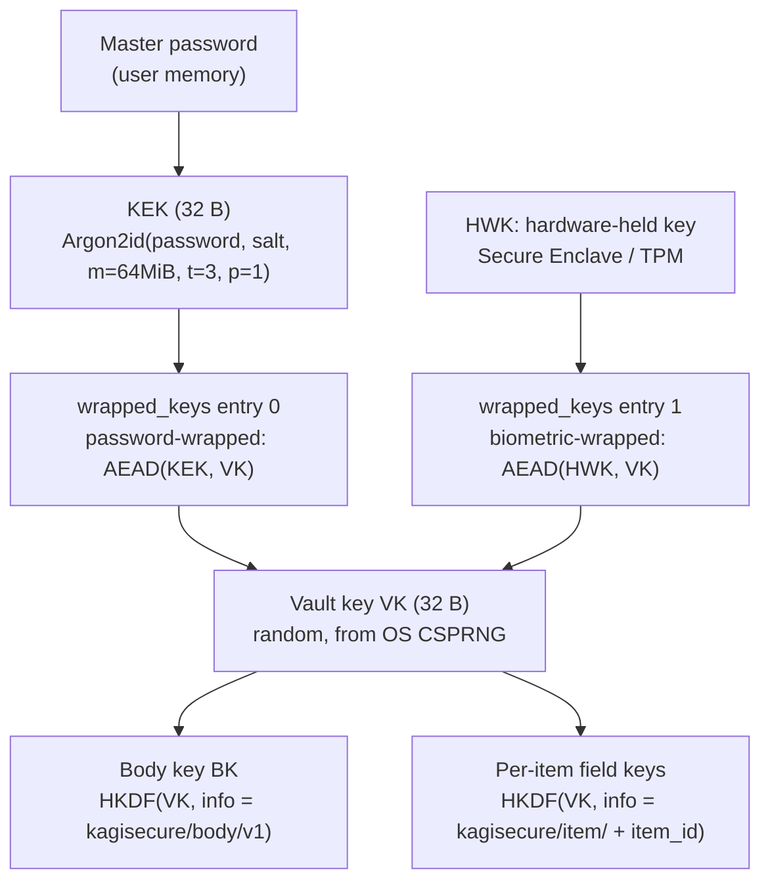

# Vault format

Status: **design phase**. Format version 1 is not frozen; it freezes when M1 ships with golden
vectors. Until then, breaking changes are expected and no migration is promised.

## 1. Goals

1. A single portable file. Copyable, backup-able, syncable by any file sync the user already has.
2. Nothing sensitive readable without the master password or an enrolled biometric.
3. The header is plaintext and self-describing, so a future version can always tell what it is
   looking at and how to derive the key.
4. Cryptographic parameters are data, not code, so they can be raised without a format break.
5. Lossless enough to hold a 1Password export without dropping fields.

## 2. File layout

```
+--------------------------------------------------------------+
| MAGIC        "KAGIVLT\x00"                        8 bytes     |
| format_ver   u16 LE                               2 bytes     |  = 1
| header_len   u32 LE                               4 bytes     |
| header       CBOR, plaintext                      header_len  |
| body_nonce   24 bytes (XChaCha20-Poly1305)        24 bytes    |
| body_ct      AEAD ciphertext || 16-byte tag       rest of file|
+--------------------------------------------------------------+
```

- The header is **plaintext by necessity** (it contains the KDF salt and parameters needed to
  derive the key that decrypts everything else).
- The header is **authenticated**: the full byte range from `MAGIC` through the end of `header`
  is passed as AAD to the body's AEAD. Tampering with KDF parameters — e.g. downgrading Argon2id
  memory to 8 KiB — makes the body fail to decrypt rather than making an attack cheaper.
- CBOR (RFC 8949) for the header: compact, deterministic encoding available, no ambiguity about
  binary blobs. Body plaintext is also CBOR.

> Assumption: CBOR over JSON for both header and body. JSON would need base64 for every salt,
> nonce, and wrapped key, inflating the file and complicating canonical AAD bytes. Owner may
> prefer JSON for hackability; if so, the AAD rule below must become "the exact header bytes as
> written", not a re-serialization.

### 2.1 Header (CBOR map)

| Key | Type | Meaning |
| --- | --- | --- |
| `v` | u16 | header schema version (independent of `format_ver`) |
| `vault_id` | bytes(16) | random UUIDv4, stable for the life of the file |
| `created_at` | u64 | unix seconds |
| `kdf` | map | KDF descriptor, below |
| `body_aead` | text | `"xchacha20poly1305"` or `"aes256gcm"` |
| `wrapped_keys` | array of map | wrapped copies of the vault key, below |
| `compression` | text | `"none"` or `"zstd"` — applies to body plaintext before encryption |
| `kdf_hint` | text? | optional human note, e.g. `"desktop-2026"` |

`kdf` map:

| Key | Type | Value for v1 default |
| --- | --- | --- |
| `alg` | text | `"argon2id"` |
| `salt` | bytes(16) | random, per vault, regenerated on password change; slots carrying their own `kdf` are unaffected (§3, [ADR-0006](decisions/0006-per-slot-kdf-parameters.md)) |
| `m_kib` | u32 | `65536` (64 MiB) |
| `t` | u32 | `3` |
| `p` | u32 | `1` |
| `out_len` | u32 | `32` |

### 2.2 Body (CBOR, encrypted)

```
body := {
  "schema": 1,
  "vaults":  [ VaultMeta, ... ],     # logical vaults inside the file
  "items":   [ Item, ... ],
  "envs":    [ Environment, ... ],
  "audit_head": bytes(32)            # hash chain head, see §8
}
```

Everything after unlock is in memory as one structure. Vaults are a *logical* grouping inside one
file, mirroring 1Password's account→vault tree; kagisecure does not use one file per vault.

> Assumption: single-file, multiple logical vaults. The alternative (one file per vault) makes
> selective sharing easier later but multiplies unlock prompts. Chosen for simplicity; revisit if
> team sharing ever lands.

## 3. Key hierarchy



- **KEK** is derived from the master password. It never leaves memory and is zeroized once the
  vault key is unwrapped.
- **VK** (vault key) is 32 random bytes generated once at vault creation. It is *never* derived
  from the password, so a password change re-wraps rather than re-encrypts.
- **Wrapped copies** live in the header. There are at least one (password) and optionally more
  (Touch ID on this Mac, Windows Hello on that PC, a recovery key). Each entry:

```
{
  "kind":   "password" | "platform" | "recovery",
  "id":     text,             # e.g. "macos-secure-enclave-<device-uuid>"
  "label":  text,             # shown in UI: "MacBook Pro (Touch ID)"
  "aead":   "xchacha20poly1305",
  "nonce":  bytes(24),
  "ct":     bytes,            # wrap of VK, AAD = vault_id || kind || id
  "added_at": u64,
  "kdf":    { ... }?          # optional; same shape as the header's kdf map
}
```

The optional per-slot `kdf` applies to that slot alone; when it is absent the header's `kdf`
applies. It exists because the header's salt is rerolled on password change, which would
otherwise invalidate the recovery slot — see [ADR-0006](decisions/0006-per-slot-kdf-parameters.md).
v1 writes the password slot without it and the recovery slot with it. `"platform"` slots do not
use it: a hardware-held key is not stretched from a password.

- **Body key** and **per-item keys** are HKDF-SHA256 derivations of VK with distinct `info`
  strings, so a single nonce-reuse mistake in one subsystem does not compromise another, and so
  future selective sharing (hand someone one item's key) stays possible.

> Assumption: per-item subkeys are derived but, in format v1, the body is encrypted as one blob
> with the body key and per-item keys are unused. They are specified now so that a later format
> can adopt per-item encryption without a key-hierarchy change. This costs nothing today.

### 3.1 Platform (biometric) wrapping

**macOS.** VK is wrapped with a key held in the Keychain as a Secure Enclave–backed
`kSecAttrTokenIDSecureEnclave` private key, with a `SecAccessControl` created using
`.biometryCurrentSet` (plus `.privateKeyUsage`). Consequences, by design:

- Enrolling or removing a fingerprint invalidates the wrap. The user falls back to the master
  password and re-enrolls. This is the correct behavior: it means an attacker who adds their
  finger cannot inherit access.
- The key is bound to the device. Copying the vault file to another Mac requires the password.

**Windows.** VK is wrapped with a key from `KeyCredentialManager`, TPM-backed where available,
and each use is gated by `UserConsentVerifier.RequestVerificationAsync`.

Caveat, stated plainly: **Windows Hello credentials are scoped to the user and device, not to the
application.** They do not give the per-app isolation the Secure Enclave + keychain ACL gives on
macOS. kagisecure therefore binds the wrapped key additionally to an app-specific secret stored
in DPAPI (`CryptProtectData`, current-user scope) so that a Hello consent obtained by another
process is not sufficient by itself. This is defense in depth, not equivalence; see
[ADR-0004](decisions/0004-biometric-key-wrapping.md) and threat-model W-1.

### 3.2 Recovery

**Decided — v1 requirement.** Every vault gets a printable recovery code, generated once at vault
creation: 256 bits of CSPRNG output, displayed to the user as Base32 with a checksum, stretched
with Argon2id using the same parameters as the password path, and stored as a third
`wrapped_keys` entry (`"kind": "recovery"`, see the schema in §3 above). `kagisecure init` prints
it exactly once; the user is responsible for writing it down. `kagisecure recover` (CLI, M1) and
the equivalent native-app flow unlock the vault with it, independent of the master password or any
enrolled biometric. Without it, a forgotten master password on a machine with no enrolled
biometric means permanent data loss, which is an unacceptable support burden for an OSS project
with no account-recovery flow. See the M1 acceptance criteria in
[roadmap.md](roadmap.md#m1--core-crate--cli).

## 4. AEAD choice

**Primary: XChaCha20-Poly1305** (`chacha20poly1305` 0.11.0).

| Criterion | XChaCha20-Poly1305 | AES-256-GCM |
| --- | --- | --- |
| Nonce size | 192-bit — random nonces are safe indefinitely | 96-bit — random nonces require a counter or careful birthday-bound accounting |
| Misuse margin | Large; this matters for a file that is saved thousands of times, possibly restored from backup and saved again | Small; a restored-from-backup counter is a real footgun |
| Performance without AES-NI | Good | Poor |
| Performance with AES-NI/ARMv8 crypto | Slower than AES-GCM | Best |
| Vault-sized data (< a few MB) | Irrelevant either way | Irrelevant either way |

The deciding factor is **nonce misuse resistance across backup/restore**, not speed. A vault is
small; nobody notices the difference. A repeated 96-bit nonce across two saves of the same vault
would be catastrophic.

`aes256gcm` remains a selectable `body_aead` value for environments that mandate FIPS-adjacent
primitives or where a hardware path matters. Both are RustCrypto implementations; the only known
third-party audit of those AEADs is NCC Group's 2020 review, which found no vulnerabilities.
That is a thin audit record and is recorded as an accepted risk (threat-model W-6).

**Nonces** are 24 random bytes from the OS CSPRNG for every write. No counters, no derivation.

**AAD.** The body's AEAD receives, as associated data, the exact on-disk bytes from offset 0
through the end of the header. Wrapped-key entries use `vault_id || kind || id` as AAD, so a
wrapped key cannot be transplanted between vaults or between slots.

## 5. Item and field schema

Twelve first-class categories: eleven styled after 1Password 8's category set (ui-spec.md §5) and
mirroring the most common 1PUX categories so import is lossless for them, plus `Environment`,
kagisecure's own addition with no 1Password equivalent (§5.2); anything else falls through to
`Other(String)`, preserved verbatim (see [import.md](import.md) §2.3).

```rust
struct Item {
    id: ItemId,                 // uuid v4
    vault_id: VaultId,
    category: Category,
    title: String,
    fields: Vec<Field>,
    tags: Vec<String>,
    urls: Vec<Url>,
    notes: Option<String>,      // stored as a field of kind Note in practice
    favorite: bool,
    archived: bool,
    trashed_at: Option<u64>,    // soft delete; None when the item is not in the trash (ADR-0012)
    agent_visible: bool,        // default false; see threat-model M-9
    created_at: u64,
    updated_at: u64,
    attachments: Vec<AttachmentRef>,     // DESIGN ONLY — not implemented, see §5.5
    history: Vec<FieldRevision>,         // retired values, Secret-typed; §5.5
    extra: BTreeMap<String, CborValue>,  // lossless passthrough for unmapped import *metadata*
}                                        // extra is NOT Secret — nothing concealed goes in it

enum Category {
    Login, Password, SecureNote, CreditCard, Identity, ApiCredential, Server, Database,
    SshKey, SoftwareLicense, Document, Environment,
    Other(String),              // preserves unknown 1PUX categories
}

struct Field {
    id: FieldId,
    label: String,              // shown to agents
    kind: FieldKind,
    value: FieldValue,
    section: Option<String>,    // 1PUX sections
    agent_visible: bool,        // per-field override
    extra: BTreeMap<String, CborValue>,  // unmapped import metadata; NOT Secret, see §5.5
}

enum FieldKind {
    Text, Concealed, Email, Url, Phone, Date, MonthYear,
    Totp, Menu, CreditCardNumber, CreditCardType, Address, Reference, File,
}

enum FieldValue {
    Public(String),             // may be shown to agents if agent_visible
    Secret(Secret),             // never leaves the process except via injection
    Totp(Secret),               // NOT implemented as its own variant — see §5.3 and ADR-0016:
                                // a TOTP field is FieldKind::Totp + Secret(<otpauth:// URI>)
    Address(AddressValue),      // DESIGN ONLY — not implemented, see §5.5
    File(AttachmentRef),        // DESIGN ONLY — not implemented, see §5.5
}
```

### 5.1 `Secret`

```rust
/// Plaintext secret material. Deliberately un-serializable and un-printable.
pub struct Secret(Zeroizing<Vec<u8>>);

impl fmt::Debug for Secret {
    fn fmt(&self, f: &mut fmt::Formatter<'_>) -> fmt::Result {
        f.write_str("Secret(<redacted>)")
    }
}
// No Display. No Serialize. No Clone. No AsRef<[u8]> outside crate::inject.
// Serialization to the vault body goes through a private path in crate::vault.
```

This type is the enforcement mechanism for the product's central invariant. See
[mcp-server.md](mcp-server.md) §3 and [ADR-0002](decisions/0002-no-secret-values-over-mcp.md).

As implemented in M1 the type has no `Serialize`, `Display` or `Clone`, and its on-disk encoding
goes through a crate-private serde adapter; the byte accessor is a single explicitly named
`expose()` compiled only with the `secret-material` feature, rather than being confined to
`crate::inject`. The reasoning, and the resulting `kagisecure item show --reveal` flag, are in
[ADR-0005](decisions/0005-secret-material-in-m1.md).

### 5.2 Environments

An `Environment` is kagisecure's first-class notion of "the set of variables a project needs".
It is what the MCP tools mostly operate on.

```rust
struct Environment {
    id: EnvId,
    vault_id: VaultId,
    name: String,                  // "acme-api / staging"
    description: Option<String>,
    vars: Vec<EnvVar>,
    default_paths: Vec<PathBuf>,   // project dirs commonly targeted; UI convenience only
    agent_visible: bool,
    created_at: u64,
    updated_at: u64,
}

struct EnvVar {
    name: String,                  // "STRIPE_SECRET_KEY" — visible to agents
    source: VarSource,
}

enum VarSource {
    Literal(Secret),                       // value stored inline in this environment
    ItemField { item: ItemId, field: FieldId },  // reference into an item
}
```

Referencing (`ItemField`) is preferred over `Literal` so that rotating a credential in one item
updates every environment that uses it.

### 5.3 TOTP

**Implemented in M5.** A one-time-password field is `FieldKind::Totp` whose value is
`FieldValue::Secret`, and the secret's bytes are the **whole `otpauth://` URI** — seed and
parameters together. There is no separate `FieldValue::Totp` variant and no public sibling field
holding the algorithm, digit count, period or issuer: the URI is the credential, `issuer=GitHub`
is itself a disclosure, and storing exactly the bytes the service handed over is what makes import
and round-trip lossless. The parameters are *derived* on demand by
`Field::totp_generator()` → `totp::Totp::params()`. See
[ADR-0016](decisions/0016-totp-field-storage.md) for the alternatives and what they cost.

The supported parameter space is RFC 6238's: HMAC-SHA1 / SHA256 / SHA512, 6, 7 or 8 digits, any
period. Base32 decoding is deliberately tolerant of case, `=` padding, whitespace and hyphens,
because this is the one field a user retypes by hand.

Generated codes are `Secret` too — "expires in thirty seconds" is not "public", since anyone
holding one inside its window can complete a second factor with it — and are **never** returned
over MCP; the only agent-visible fact is that an item has a TOTP field. That is structural rather
than careful: `kagisecure_core::totp` is compiled only under the `secret-material` feature, which
`kagisecure-mcp` and `kagisecure-ipc` do not enable, so neither crate can name the type or call
the function (mcp-server.md §2.4).

Injection of a live TOTP code into an environment is possible in principle (`run_with_env` with a
`TOTP_CODE`-style variable) but would require a fresh approval every time, with no lease reuse,
since the value is time-bound.

> Assumption: TOTP injection is deferred past v1 unless a user asks. Listed here so the schema
> does not need to change later. M5 built generation and display only.

### 5.4 Default fields per category

Each first-class `Category`'s "+ New" flow pre-populates the fields below (ui-spec.md §5); every
field stays freely addable/removable afterward — this is a starting template, not a constraint on
what an item may contain. Fields marked **concealed** are `FieldValue::Secret`; everything else is
`FieldValue::Public` unless noted. Modeled on 1Password 8's per-category defaults.

`Item::urls` is not in this table: it is a top-level `Item` property, not a per-category template
field, so it is not something a category's template populates. `Login`'s "+ New" flow still shows
a Websites editor, but that editor reads and writes `Item::urls` directly — no `website` field is
created. Before ADR-0029 the `Login` template *did* add a separate `website` field, which
duplicated `urls`; an item written by that older template has its `website` field folded into
`urls` the next time its vault is opened.

| Category | Default fields |
| --- | --- |
| `Login` | username, password (concealed), one-time password (TOTP — concealed; §5.3) |
| `Password` | password (concealed), notes |
| `SecureNote` | notes (free-form) |
| `CreditCard` | cardholder name, number (concealed), expiry (month/year), CVV (concealed), PIN (concealed), issuer |
| `Identity` | first name, last name, email, phone, address |
| `ApiCredential` | key/token (concealed), endpoint/hostname |
| `Server` | hostname, username, password (concealed) |
| `Database` | hostname, port, username, password (concealed) |
| `SshKey` | private key (concealed), public key, fingerprint, passphrase (concealed) |
| `SoftwareLicense` | license key (concealed), licensed to, version, email |
| `Document` | attachment(s), notes |
| `Environment` | one or more named variables (§5.2), each `Literal` (concealed) or `ItemField` reference |

`Other(String)` carries no default-field template; unmapped-category items from import retain
whatever fields the source provided, via the `extra` passthrough (§4 of
[import.md](import.md)).

### 5.5 History

An item keeps the values it used to hold. `Item::history` is a list of retired field values —
each one the value itself, the label and kind of the field it belonged to, and a `retired_at`
timestamp — so that rotating a password does not destroy the one before it, and so that a
1Password export's `passwordHistory` survives the move into kagisecure
([import.md](import.md) §2.7).

Three properties define it, and they are what make keeping old passwords defensible rather than
merely convenient:

- **Retired values are `Secret`**, exactly like live ones: zeroized on drop, no `Serialize`, no
  `Debug`. History is never written into `Item::extra`, which is plaintext passthrough (§5).
- **History is never agent-visible**, regardless of the item's `agent_visible` flag. No MCP tool
  reaches it (threat-model M-9, M-21).
- **History is excluded from search.** A password the user retired should not be the string that
  makes an item findable.

The field is additive and `#[serde(default)]`, so a body written without it reads back as an empty
history. **Shape finalized by the core change in this milestone** (M8 —
[roadmap.md](roadmap.md#m8--import-1pux-and-the-csv-family)), which also records whether the
format version in §9 needs to move; absent that, it does not.

> **Correction, pending implementation.** Three things sketched in this section are design, not
> code, as of M8: `Item::attachments` and the `AttachmentRef` type (§6), and the `Address` and
> `File` variants of `FieldValue`. `kagisecure_core::model` implements neither — `FieldValue` has
> only `Public` and `Secret`, and an item has no attachment list. Import therefore drops
> attachments and counts them, and maps a 1PUX address into one `Address`-kind `Public` string plus
> per-component text fields ([import.md](import.md) §2.4, §4). They are kept in this document
> because the design still stands; they are marked because nothing should be written against them
> yet.

## 6. Attachments

1PUX exports can contain files. Attachments are stored as separate AEAD-encrypted blobs in a
sibling directory (`<vault>.attachments/<attachment_id>`), each with its own random nonce and a
key derived `HKDF(VK, info="kagisecure/attachment/" || attachment_id)`. The item holds an
`AttachmentRef { id, filename, mime, size, sha256 }`. Keeping them out of the main body means a
20 MB PDF does not get re-encrypted on every unrelated save.

Attachment *contents* are treated as secret material and are never exposed over MCP in any form,
including filenames if the item is not `agent_visible`.

## 7. Zeroization policy

| Material | Policy |
| --- | --- |
| Master password buffer | `Zeroizing<String>`; zeroized immediately after KEK derivation |
| KEK | `Zeroizing<[u8; 32]>`; zeroized after VK unwrap |
| VK | `Zeroizing<[u8; 32]>` held for the unlocked lifetime; zeroized on lock, sleep, screen lock, and app exit |
| Derived subkeys | Zeroized at end of the operation that derived them |
| Decrypted body plaintext | Zeroized after CBOR decode into the item structures |
| `Secret` field values | `Zeroize + ZeroizeOnDrop` via `Zeroizing<Vec<u8>>` |
| Injection buffers (`.env` contents, env blocks) | `Zeroizing`; the OS write happens from the zeroizing buffer |

A further caveat specific to the "env blocks" row: `Zeroizing` covers the buffer kagisecure holds
right up to the moment of use, and no further. `std::process::Command::env` hands the value to the
OS, which copies it into the child process's own environment block; that copy is the OS's memory,
not kagisecure's, and kagisecure has no handle to zeroize it — the child's environment lives (and
leaks, per W-4) for as long as the child process does, regardless of what kagisecure does with its
own buffer afterward. The `.env` file case is different in kind: kagisecure controls the file
contents until the final `write`, so zeroization there is real, but it is real on the writer's
side only — once bytes are on disk, an attacker who reads the file reads plaintext, same as with
any other written secret. "Injection buffers are zeroized" is therefore true of what kagisecure
holds in its own memory before injection, not a claim about the child process's environment or
the on-disk file's readers.

Caveats stated honestly: Rust can move values before drop, allocators may retain freed pages,
and the OS may swap. We mitigate what we can — no `mlock` in v1 (it is a privilege and portability
mess), but the app avoids long-lived plaintext and locks aggressively. Against T-3-and-worse this
is defense in depth, not a guarantee.

## 8. Integrity and audit chain

Beyond the AEAD tag, the body carries an append-only audit log with a hash chain:

```
entry_n.prev = SHA-256(canonical_cbor(entry_{n-1}))
body.audit_head = SHA-256(canonical_cbor(entry_last))
```

Because the body is authenticated as a whole, an attacker who cannot decrypt cannot rewrite
history; the chain protects against a *legitimately unlocked* process silently dropping entries,
and gives the UI a cheap "log intact" check. Audit entries record: timestamp, actor
(user/CLI/MCP client identity), action, item/environment ids, target path, lease id, and outcome.
They record **names, never values**.

## 9. Versioning and migration

Three independent version numbers:

| Number | Bumped when | Compatibility rule |
| --- | --- | --- |
| `format_ver` (u16, file) | The byte layout changes | Older readers must refuse to open a newer `format_ver` with a clear error, never guess |
| `header.v` | Header CBOR schema changes | Additive keys do not bump it; readers ignore unknown keys |
| `body.schema` | Item/field schema changes | Additive changes do not bump it; unknown fields survive round-trip via `extra` |

Rules:

1. **Forward-compat by preservation.** Every decoder keeps unknown CBOR keys in `extra` and writes
   them back. An older kagisecure opening a vault written by a newer one (same `format_ver`) must
   not destroy data it did not understand.
2. **Migration is on write, never silently on read.** Opening an older vault reads it as-is; the
   app offers to upgrade, states what changes, and takes a backup copy
   (`<name>.vault.bak-<format_ver>`) before writing the new format.
3. **KDF parameter upgrades** are a re-wrap, not a re-encrypt: derive a new KEK with stronger
   parameters, re-wrap VK, write new header. Cheap, so we can prompt for it opportunistically as
   hardware improves.
4. **Golden vectors.** `crates/kagisecure-core/tests/vectors/` holds vault files written by every
   released `format_ver`, with a known password, and a test asserts they still open (run in CI
   until CI was removed on 2026-09-19, locally since). These files are
   added the day a version is released and never edited.
5. **Downgrade is not supported.** Documented, not defended.

## 10. Open questions

- Should the file be a single blob or a directory bundle (header + body + attachments + audit)?
  A directory survives partial sync corruption better; a single file is easier to move. Currently
  single file plus a sibling attachments directory, which is the awkward middle.
- Should `compression: zstd` be on by default? It leaks a little about content size; it also
  meaningfully shrinks large imported vaults. Currently `"none"` by default.
- ~~Whether to persist leases across app restart~~ **Resolved (M2): no.** A lease is scoped to the
  process that granted it and dies with it — restarting the app/daemon or locking the vault should
  require a fresh approval, not resurrect an old one as though it were still current; see
  `Lease` in `kagisecure-core::lease` and ADR-0007 §1/§3.
