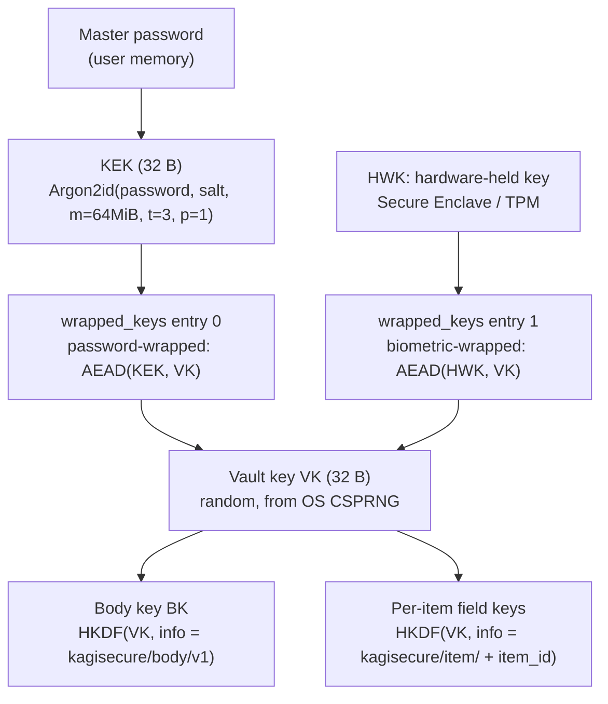

# Vault format

Status: **design phase**. Format version 1 is not frozen; it freezes when M1 ships with golden
vectors. Until then, breaking changes are expected and no migration is promised.

## 1. Goals

1. A single portable file. Copyable, backup-able, syncable by any file sync the user already has.
2. Nothing sensitive readable without the master password or an enrolled biometric.
3. The header is plaintext and self-describing, so a future version can always tell what it is
   looking at and how to derive the key.
4. Cryptographic parameters are data, not code, so they can be raised without a format break.
5. Lossless enough to hold a 1Password export without dropping fields.

## 2. File layout

```
+--------------------------------------------------------------+
| MAGIC        "KAGIVLT\x00"                        8 bytes     |
| format_ver   u16 LE                               2 bytes     |  = 1 or 2 (§9)
| header_len   u32 LE                               4 bytes     |
| header       CBOR, plaintext                      header_len  |
| body_nonce   24 bytes (XChaCha20-Poly1305)        24 bytes    |
| body_ct      AEAD ciphertext || 16-byte tag       rest of file|
+--------------------------------------------------------------+
```

- The header is **plaintext by necessity** (it contains the KDF salt and parameters needed to
  derive the key that decrypts everything else).
- The header is **authenticated**: the full byte range from `MAGIC` through the end of `header`
  is passed as AAD to the body's AEAD. Tampering with KDF parameters — e.g. downgrading Argon2id
  memory to 8 KiB — makes the body fail to decrypt rather than making an attack cheaper.
- CBOR (RFC 8949) for the header: compact, deterministic encoding available, no ambiguity about
  binary blobs. Body plaintext is also CBOR.

> **The lock file is not part of this format.** `<vault-path>.lock` — an empty, `0600` sibling
> file, never written, never deleted — serializes writers so that two of them cannot silently
> discard each other's changes by both replacing this file with their own copy. It carries no
> bytes belonging to this layout and predates-and-postdates the vault file itself (created on
> first write, never removed). See [ADR-0039](decisions/0039-transactional-vault-writes-and-the-lock-file.md)
> for the full mechanism; a 0.1.x reader/writer neither creates nor respects it.

> Assumption: CBOR over JSON for both header and body. JSON would need base64 for every salt,
> nonce, and wrapped key, inflating the file and complicating canonical AAD bytes. Owner may
> prefer JSON for hackability; if so, the AAD rule below must become "the exact header bytes as
> written", not a re-serialization.

### 2.1 Header (CBOR map)

| Key | Type | Meaning |
| --- | --- | --- |
| `v` | u16 | header schema version (independent of `format_ver`) |
| `vault_id` | bytes(16) | random UUIDv4, stable for the life of the file |
| `created_at` | u64 | unix seconds |
| `kdf` | map | KDF descriptor, below |
| `body_aead` | text | `"xchacha20poly1305"` or `"aes256gcm"` |
| `wrapped_keys` | array of map | wrapped copies of the vault key, below |
| `compression` | text | `"none"` or `"zstd"` — applies to body plaintext before encryption |
| `kdf_hint` | text? | optional human note, e.g. `"desktop-2026"` |

`kdf` map:

| Key | Type | Value for v1 default |
| --- | --- | --- |
| `alg` | text | `"argon2id"` |
| `salt` | bytes(16) | random, per vault, regenerated on password change; slots carrying their own `kdf` are unaffected (§3, [ADR-0006](decisions/0006-per-slot-kdf-parameters.md)) |
| `m_kib` | u32 | `65536` (64 MiB) |
| `t` | u32 | `3` |
| `p` | u32 | `1` |
| `out_len` | u32 | `32` |

### 2.2 Body (CBOR, encrypted)

```
body := {
  "schema": 1,
  "vaults":  [ VaultMeta, ... ],     # logical vaults inside the file
  "items":   [ Item, ... ],
  "envs":    [ Environment, ... ],
  "audit_head": bytes(32),           # hash chain head, see §8
  "devices": [ DeviceKey, ... ],     # optional; shared-vault device keys, §2.3 (format_ver 2)
  "retired_devices": [ bytes(32) ]   # optional; ids of removed device keys, §2.3
}
```

Everything after unlock is in memory as one structure. Vaults are a *logical* grouping inside one
file, mirroring 1Password's account→vault tree; kagisecure does not use one file per vault.

> Assumption: single-file, multiple logical vaults. The alternative (one file per vault) makes
> selective sharing easier later but multiplies unlock prompts. Chosen for simplicity; revisit if
> team sharing ever lands.
>
> **Revisited by [ADR-0035](decisions/0035-shared-vaults.md) §1:** a *shared* vault is a separate
> file of its own type, with its own format, and the personal vault keeps its logical vaults. The
> only change sharing makes to this file is §2.3. The shared formats are specified in the
> companion [shared-vault-format.md](shared-vault-format.md): as of Phase 1 (2026-09-27), the
> device public keys, signatures, the record envelope and body, item and environment payloads,
> roster and epoch payloads, epoch key wraps and chains, the bundle and the exchange directory —
> built as a library and pinned by golden vectors, not yet read or written by anything a person
> runs. The replica file, the exchange directory's descriptor, enrollment requests and invitations
> are not yet specified.

### 2.3 Device keys (`format_ver` 2)

**Built in shared vaults Phase 0 ([ADR-0035](decisions/0035-shared-vaults.md) §5, §16).** The
body's optional `devices` list holds this computer's key pairs for shared vaults: an X25519 key
that shared vaults' epoch keys are wrapped to and an Ed25519 key that signs its records. The
secret halves live only here, inside the body's AEAD, so a device key is usable exactly while the
personal vault is unlocked, through the same slots (§3) — no new unlock path, no Keychain item.

```
DeviceKey := {
  "device_key_id": bytes(32),        # SHA-256 of the suite and the public keys (ADR-0035 addendum)
  "suite":         text,             # "x25519-ed25519-v1"
  "label":         text,             # at most 128 characters, e.g. "Work laptop"
  "created_at":    u64,              # unix seconds
  "secret_keys":   bytes             # x25519-ed25519-v1: X25519 secret key (32) || Ed25519 seed (32)
}
```

- **Not an item.** A device key has no category, is never agent-visible, is never covered by
  `item show --reveal`, is never exported and is never shown. In memory it is a `DeviceKey` whose
  `secret_keys` is a `Secret` (§5.1); the type has no `Serialize`, `Deserialize` or `Clone`, and
  its `Debug` renders no key material. This CBOR map, inside the encrypted body, is its only
  encoding.
- **Absent when empty.** A body with no device key has no `devices` key at all, so it encodes
  exactly as it did before the key existed.
- **Removal is recorded and sticks.** Removing a device key moves its id — the id only, no key
  material — to the body's `retired_devices` list (absent when empty). The list only grows: a
  retired id can never be added again, and "keep this app's version" (§8) combines both versions'
  lists and writes no key either one retired, so an older copy of the file cannot bring back a
  computer someone retired. A later merge of personal vaults must keep the same rule.
- **Loaded, not yet created by anything a person runs.** Since Phase 1, `kagisecure-shared`
  generates a device key pair and loads one from this entry (`DeviceSecret::generate`,
  `DeviceSecret::from_device_key`, which refuses an entry whose stored id is not the id of its
  own key material); nothing in the CLI or the app calls either yet. The public half's encoding
  and the id's derivation are in [shared-vault-format.md](shared-vault-format.md) §2.
- **Which key is usable.** For `kagisecure-shared` (ADR-0035 Phases 1 and 2), a device key is
  usable only if it is in `devices`, **and** its id is not in `retired_devices`
  (`Vault::active_device_keys`), **and** it is not removed in the roster of the shared vault in
  question. This build never writes a body in which the first two overlap, but another writer
  could.
- **Audited.** Adding and removing a device key each write an audit entry (`device_key_added`,
  `device_key_removed`) whose detail is `id=<64 hex digits>` and nothing else.
- **Unknown keys survive** (§9 rule 1), like every other body type — but as ordinary values,
  not zeroized: a later format must not put secret material in a key an older build would carry
  this way.
- A `device_key_id` of any length but 32 fails the body's decode rather than being guessed at.
  This build creates device keys only for `x25519-ed25519-v1`, with exactly 64 bytes of secret key
  material, and refuses a body holding an `x25519-ed25519-v1` key of any other length; a key of
  another suite read from a newer build's file is kept as it is.
- **The core does no public-key cryptography.** It stores what `kagisecure-shared` generates and
  derives; the id's derivation is in the ADR-0035 addendum's encoding contract.
- **A body holding any device key is written as `format_ver` 2**, the migration in §9 — so that
  0.1.1, which predates the unknown-key passthrough and would drop the list on its next save,
  refuses to *open* the file.
- **What the version bump does not cover.** It only stops a build that opens the file after the
  upgrade. A 0.1.1 process that **already had the vault open** — or a sync tool, a backup restore,
  anything that puts an older copy of the file back — writes a version 1 file without the device
  keys, and nothing in the file can stop that (0.1.1 takes no lock and checks no version when it
  saves). What this build does is notice: adding or removing a device key writes an audit entry
  (`device_key_added` / `device_key_removed`, detail `id=<hex>`), and a file whose audit log does
  not continue this session's, or whose `format_ver` is lower than the one this session read or
  wrote, is refused as diverged (§8) rather than adopted. The keys survive in every session that
  still holds them, and "keep this app's version" puts them back; a session that opens the older
  file afresh sees none. Quit any 0.1.1 process before the first device key is created.

### 2.4 The machine vault (`format_ver` 3)

**Built in unattended jobs Phase 1 ([ADR-0042](decisions/0042-unattended-agent-access.md) §2 and
its implementation decisions).** The machine vault holds machine credentials that jobs kagisecure
starts may use with nobody present. It is **a separate file in this same format**, beside the
personal vault (`<name>.machine.kagivault` for `<name>.kagivault`), with two differences:

- **No slot of its own.** Its header's `wrapped_keys` is empty. Its vault key is held in the
  **personal** vault's body, under the optional key `machine_key` (absent when there is none), and —
  while armed, which persists across restarts — in the login Keychain, as the 48 bytes
  `vault_id || key` (`MachineVaultKey::to_keychain_bytes`). Recovering the personal vault
  recovers it; there is no password or recovery code for it alone.

  ```
  MachineVaultKey := {              # in the personal body, as "machine_key"
    "vault_id":   bytes(16),        # the machine vault file's header vault_id
    "key":        bytes(32),        # its vault key
    "created_at": u64
  }
  ```

  Like a device key it is not an item: never agent-visible, never exported, never shown; in memory
  a `MachineVaultKey` with no `Serialize`, `Deserialize` or `Clone`. Adding and removing it are
  audited in the personal log (`machine_vault_key_added`, `machine_vault_key_removed`, detail
  `vault_id=<32 hex digits>`). "Keep this app's version" (§8) keeps a machine key only the file
  holds, as it keeps device keys. `Vault::open_machine` opens the machine vault with it and
  refuses a file whose `vault_id` is not the key's, or that is not a machine vault.
- **Its body has a `machine` key**, which is what makes a file a machine vault: its jobs, command
  grants, login grants and armed state (`jobs`, `command_grants`, `login_grants`, `arm`), all
  metadata. Use counts and suspensions live in the grant records themselves.

**Structural rules**, checked by `kagisecure-core` every time a machine vault is written (never
by a UI), and refused with `MachineVault` before anything reaches the disk:

1. a website (`urls`) only on a Login item, and only as an exact https origin in its canonical
   form — `https://host[:port]`, lower-case host, no default port, no path, no trailing slash;
2. one-time-password fields only on Login items, and no environment variable bound to one;
3. no references out: every `ItemField` binding names a field of an item in this file, every
   item and environment lives in one of this file's logical vaults, no field is a `Reference`,
   and every job and grant names only this file's jobs, environments and items (a login grant's
   origin must be one of its item's websites);
4. no device keys and no `machine_key` in a machine vault;
5. jobs and grants within ADR-0042's bounds (absolute executables pinned by code-signing identity
   or a 32-byte SHA-256; a run of at most six hours; a grant's expiry within 90 days of its
   creation; at least one use).

A file that breaks one still opens; it cannot be written until the transaction fixes it.

## 3. Key hierarchy


```mermaid
flowchart TD
    MP["Master password<br/>(user memory)"]
    KEK["KEK (32 B)<br/>Argon2id(password, salt, m=64MiB, t=3, p=1)"]
    VK["Vault key VK (32 B)<br/>random, from OS CSPRNG"]
    W1["wrapped_keys entry 0<br/>password-wrapped: AEAD(KEK, VK)"]
    W2["wrapped_keys entry 1<br/>biometric-wrapped: AEAD(HWK, VK)"]
    HWK["HWK: hardware-held key<br/>Secure Enclave / TPM"]
    BODY["Body key BK<br/>HKDF(VK, info = kagisecure/body/v1)"]
    FLD["Per-item field keys<br/>HKDF(VK, info = kagisecure/item/ + item_id)"]

    MP --> KEK --> W1 --> VK
    HWK --> W2 --> VK
    VK --> BODY
    VK --> FLD
```

- **KEK** is derived from the master password. It never leaves memory and is zeroized once the
  vault key is unwrapped.
- **VK** (vault key) is 32 random bytes generated once at vault creation. It is *never* derived
  from the password, so a password change re-wraps rather than re-encrypts.
- **Wrapped copies** live in the header. There are at least one (password) and optionally more
  (Touch ID on this Mac, Windows Hello on that PC, a recovery key). Each entry:

```
{
  "kind":   "password" | "platform" | "recovery",
  "id":     text,             # e.g. "macos-secure-enclave-<device-uuid>"
  "label":  text,             # shown in UI: "MacBook Pro (Touch ID)"
  "aead":   "xchacha20poly1305",
  "nonce":  bytes(24),
  "ct":     bytes,            # wrap of VK, AAD = vault_id || kind || id
  "added_at": u64,
  "kdf":    { ... }?          # optional; same shape as the header's kdf map
}
```

The optional per-slot `kdf` applies to that slot alone; when it is absent the header's `kdf`
applies. It exists because the header's salt is rerolled on password change, which would
otherwise invalidate the recovery slot — see [ADR-0006](decisions/0006-per-slot-kdf-parameters.md).
v1 writes the password slot without it and the recovery slot with it. `"platform"` slots do not
use it: a hardware-held key is not stretched from a password.

- **Body key** and **per-item keys** are HKDF-SHA256 derivations of VK with distinct `info`
  strings, so a single nonce-reuse mistake in one subsystem does not compromise another, and so
  future selective sharing (hand someone one item's key) stays possible.

> Assumption: per-item subkeys are derived but, in format v1, the body is encrypted as one blob
> with the body key and per-item keys are unused. They are specified now so that a later format
> can adopt per-item encryption without a key-hierarchy change. This costs nothing today.

### 3.1 Platform (biometric) wrapping

**macOS.** VK is wrapped with a key held in the Keychain as a Secure Enclave–backed
`kSecAttrTokenIDSecureEnclave` private key, with a `SecAccessControl` created using
`.biometryCurrentSet` (plus `.privateKeyUsage`). Consequences, by design:

- Enrolling or removing a fingerprint invalidates the wrap. The user falls back to the master
  password and re-enrolls. This is the correct behavior: it means an attacker who adds their
  finger cannot inherit access.
- The key is bound to the device. Copying the vault file to another Mac requires the password.

**Windows.** VK is wrapped with a key from `KeyCredentialManager`, TPM-backed where available,
and each use is gated by `UserConsentVerifier.RequestVerificationAsync`.

Caveat, stated plainly: **Windows Hello credentials are scoped to the user and device, not to the
application.** They do not give the per-app isolation the Secure Enclave + keychain ACL gives on
macOS. kagisecure therefore binds the wrapped key additionally to an app-specific secret stored
in DPAPI (`CryptProtectData`, current-user scope) so that a Hello consent obtained by another
process is not sufficient by itself. This is defense in depth, not equivalence; see
[ADR-0004](decisions/0004-biometric-key-wrapping.md) and threat-model W-1.

### 3.2 Recovery

**Decided — v1 requirement.** Every vault gets a printable recovery code, generated once at vault
creation: 256 bits of CSPRNG output, displayed to the user as Base32 with a checksum, stretched
with Argon2id using the same parameters as the password path, and stored as a third
`wrapped_keys` entry (`"kind": "recovery"`, see the schema in §3 above). `kagisecure init` prints
it exactly once; the user is responsible for writing it down. `kagisecure recover` (CLI, M1) and
the equivalent native-app flow unlock the vault with it, independent of the master password or any
enrolled biometric. Without it, a forgotten master password on a machine with no enrolled
biometric means permanent data loss, which is an unacceptable support burden for an OSS project
with no account-recovery flow. See the M1 acceptance criteria in
[roadmap.md](roadmap.md#m1--core-crate--cli).

## 4. AEAD choice

**Primary: XChaCha20-Poly1305** (`chacha20poly1305` 0.11.0).

| Criterion | XChaCha20-Poly1305 | AES-256-GCM |
| --- | --- | --- |
| Nonce size | 192-bit — random nonces are safe indefinitely | 96-bit — random nonces require a counter or careful birthday-bound accounting |
| Misuse margin | Large; this matters for a file that is saved thousands of times, possibly restored from backup and saved again | Small; a restored-from-backup counter is a real footgun |
| Performance without AES-NI | Good | Poor |
| Performance with AES-NI/ARMv8 crypto | Slower than AES-GCM | Best |
| Vault-sized data (< a few MB) | Irrelevant either way | Irrelevant either way |

The deciding factor is **nonce misuse resistance across backup/restore**, not speed. A vault is
small; nobody notices the difference. A repeated 96-bit nonce across two saves of the same vault
would be catastrophic.

`aes256gcm` remains a selectable `body_aead` value for environments that mandate FIPS-adjacent
primitives or where a hardware path matters. Both are RustCrypto implementations; the only known
third-party audit of those AEADs is NCC Group's 2020 review, which found no vulnerabilities.
That is a thin audit record and is recorded as an accepted risk (threat-model W-6).

**Nonces** are 24 random bytes from the OS CSPRNG for every write. No counters, no derivation.

**AAD.** The body's AEAD receives, as associated data, the exact on-disk bytes from offset 0
through the end of the header. Wrapped-key entries use `vault_id || kind || id` as AAD, so a
wrapped key cannot be transplanted between vaults or between slots.

## 5. Item and field schema

Twelve first-class categories: eleven styled after 1Password 8's category set (ui-spec.md §5) and
mirroring the most common 1PUX categories so import is lossless for them, plus `Environment`,
kagisecure's own addition with no 1Password equivalent (§5.2); anything else falls through to
`Other(String)`, preserved verbatim (see [import.md](import.md) §2.3).

```rust
struct Item {
    id: ItemId,                 // uuid v4
    vault_id: VaultId,
    category: Category,
    title: String,
    fields: Vec<Field>,
    tags: Vec<String>,
    urls: Vec<Url>,
    notes: Option<SecretText>,  // secret in memory (ADR-0038); on disk a CBOR text string or null
    favorite: bool,
    archived: bool,
    trashed_at: Option<u64>,    // soft delete; None when the item is not in the trash (ADR-0012)
    agent_visible: bool,        // default false; see threat-model M-9
    created_at: u64,
    updated_at: u64,
    attachments: Vec<AttachmentRef>,     // DESIGN ONLY — not implemented, see §5.5
    history: Vec<FieldRevision>,         // retired values, Secret-typed; §5.5
    primary_secret: Option<FieldId>,     // the item's "password", by field id; see below
    extra: BTreeMap<String, CborValue>,  // lossless passthrough for unmapped import *metadata*
}                                        // extra is NOT Secret — nothing concealed goes in it

enum Category {
    Login, Password, SecureNote, CreditCard, Identity, ApiCredential, Server, Database,
    SshKey, SoftwareLicense, Document, Environment,
    Other(String),              // preserves unknown 1PUX categories
}

struct Field {
    id: FieldId,
    label: String,              // shown to agents
    kind: FieldKind,
    value: FieldValue,
    section: Option<String>,    // 1PUX sections
    agent_visible: bool,        // per-field override
    extra: BTreeMap<String, CborValue>,  // unmapped import metadata; NOT Secret, see §5.5
}

enum FieldKind {
    Text, Concealed, Email, Url, Phone, Date, MonthYear,
    Totp, Menu, CreditCardNumber, CreditCardType, Address, Reference, File,
}

enum FieldValue {
    Public(String),             // may be shown to agents if agent_visible
    Secret(Secret),             // never leaves the process except via injection
    Totp(Secret),               // NOT implemented as its own variant — see §5.3 and ADR-0016:
                                // a TOTP field is FieldKind::Totp + Secret(<otpauth:// URI>)
    Address(AddressValue),      // DESIGN ONLY — not implemented, see §5.5
    File(AttachmentRef),        // DESIGN ONLY — not implemented, see §5.5
}
```

**`primary_secret`** names, by `FieldId`, the field that is the item's *password* in every sense
the product uses the word: what "Copy password" (⇧⌘C, Quick Access ⏎) copies, what ⌘R reveals
when nothing is focused, what a browser fill writes, and what the presence prompt calls "the
password". By id because a field's label and position can both be changed in the edit sheet
without a presence check — "the field called *password*" or "the first concealed field" would let
a relabelled or reordered PIN take the role. A new item gets it from its template (§5.4: the first
secret that is not a one-time password), and an imported one from the first such field the source
listed. An item written before the key existed has none; until
then its first secret-valued, non-TOTP field is used, and the app's `save_item` pins that — from
the item as it was *before* the edit — the first time the item is saved. A designated field that is
deleted leaves the role empty rather than handing it to another stored secret; only a secret whose
value that same save supplied (typed, or shown under presence) can take it up. Additive: absent
when unset, so `body.schema` does not move, and an older build keeps it in `unknown` (§9).

A stored secret's `kind` cannot be changed by the app without its value coming with the change
(ADR-0038 step 3's "keeping" rule, extended): the kind is what the list's card digits, the prompt's
noun and primary-secret candidacy are read from, precisely because a label is not trustworthy.

### 5.1 `Secret`

```rust
/// Plaintext secret material. Deliberately un-serializable and un-printable.
pub struct Secret(Zeroizing<Vec<u8>>);

impl fmt::Debug for Secret {
    fn fmt(&self, f: &mut fmt::Formatter<'_>) -> fmt::Result {
        f.write_str("Secret(<redacted>)")
    }
}
// No Display. No Serialize. No Clone. No AsRef<[u8]> outside crate::inject.
// Serialization to the vault body goes through a private path in crate::vault.
```

This type is the enforcement mechanism for the product's central invariant. See
[mcp-server.md](mcp-server.md) §3 and [ADR-0002](decisions/0002-no-secret-values-over-mcp.md).

As implemented in M1 the type has no `Serialize`, `Display` or `Clone`, and its on-disk encoding
goes through a crate-private serde adapter; the byte accessor is a single explicitly named
`expose()` compiled only with the `secret-material` feature, rather than being confined to
`crate::inject`. The reasoning, and the resulting `kagisecure item show --reveal` flag, are in
[ADR-0005](decisions/0005-secret-material-in-m1.md).

**`SecretText` — an item's notes.** Since [ADR-0038](decisions/0038-app-release-needs-presence.md)
(user decision 3) an item's `notes` are secret material too: `Option<SecretText>`, where
`SecretText` is a `Secret` that can only be built from a `String` (so it is always UTF-8) and has
every one of `Secret`'s properties. **The on-disk encoding did not change**: where a field's
`Secret` is written as a CBOR byte string, a note is written — by its own crate-private adapter —
exactly as the `Option<String>` it used to be: a CBOR text string, or `null` for none. A file
written before or after the change reads back the same in both directions, and `body.schema` did
not move (§9). `tests/vectors/item-with-notes-v1.cbor`, `item-without-notes-v1.cbor` and
`v1-notes-argon2id-64k.kagivault`, all written by the code before the change, pin this.

### 5.2 Environments

An `Environment` is kagisecure's first-class notion of "the set of variables a project needs".
It is what the MCP tools mostly operate on.

```rust
struct Environment {
    id: EnvId,
    vault_id: VaultId,
    name: String,                  // "acme-api / staging"
    description: Option<String>,
    vars: Vec<EnvVar>,
    default_paths: Vec<PathBuf>,   // project dirs commonly targeted; UI convenience only
    agent_visible: bool,
    created_at: u64,
    updated_at: u64,
}

struct EnvVar {
    name: String,                  // "STRIPE_SECRET_KEY" — visible to agents
    source: VarSource,
}

enum VarSource {
    Literal(Secret),                       // value stored inline in this environment
    ItemField { item: ItemId, field: FieldId },  // reference into an item
}
```

Referencing (`ItemField`) is preferred over `Literal` so that rotating a credential in one item
updates every environment that uses it.

### 5.3 TOTP

**Implemented in M5.** A one-time-password field is `FieldKind::Totp` whose value is
`FieldValue::Secret`, and the secret's bytes are the **whole `otpauth://` URI** — seed and
parameters together. There is no separate `FieldValue::Totp` variant and no public sibling field
holding the algorithm, digit count, period or issuer: the URI is the credential, `issuer=GitHub`
is itself a disclosure, and storing exactly the bytes the service handed over is what makes import
and round-trip lossless. The parameters are *derived* on demand by
`Field::totp_generator()` → `totp::Totp::params()`. See
[ADR-0016](decisions/0016-totp-field-storage.md) for the alternatives and what they cost.

The supported parameter space is RFC 6238's: HMAC-SHA1 / SHA256 / SHA512, 6, 7 or 8 digits, any
period. Base32 decoding is deliberately tolerant of case, `=` padding, whitespace and hyphens,
because this is the one field a user retypes by hand.

Generated codes are `Secret` too — "expires in thirty seconds" is not "public", since anyone
holding one inside its window can complete a second factor with it — and are **never** returned
over MCP; the only agent-visible fact is that an item has a TOTP field. That is structural rather
than careful: `kagisecure_core::totp` is compiled only under the `secret-material` feature, which
`kagisecure-mcp` and `kagisecure-ipc` do not enable, so neither crate can name the type or call
the function (mcp-server.md §2.4).

Injection of a live TOTP code into an environment is possible in principle (`run_with_env` with a
`TOTP_CODE`-style variable) but would require a fresh approval every time, with no lease reuse,
since the value is time-bound.

> Assumption: TOTP injection is deferred past v1 unless a user asks. Listed here so the schema
> does not need to change later. M5 built generation and display only.

### 5.4 Default fields per category

Each first-class `Category`'s "+ New" flow pre-populates the fields below (ui-spec.md §5); every
field stays freely addable/removable afterward — this is a starting template, not a constraint on
what an item may contain. Fields marked **concealed** are `FieldValue::Secret`; everything else is
`FieldValue::Public` unless noted. Modeled on 1Password 8's per-category defaults.

`Item::urls` is not in this table: it is a top-level `Item` property, not a per-category template
field, so it is not something a category's template populates. `Login`'s "+ New" flow still shows
a Websites editor, but that editor reads and writes `Item::urls` directly — no `website` field is
created. Before ADR-0029 the `Login` template *did* add a separate `website` field, which
duplicated `urls`; an item written by that older template has its `website` field folded into
`urls` the next time its vault is opened.

| Category | Default fields |
| --- | --- |
| `Login` | username, password (concealed), one-time password (TOTP — concealed; §5.3) |
| `Password` | password (concealed), notes |
| `SecureNote` | notes (free-form) |
| `CreditCard` | cardholder name, number (concealed, kind `CreditCardNumber` — the only field the list's "•••• 1234" is read from; a card written by an older template has a plain `Concealed` number), expiry (month/year), CVV (concealed), PIN (concealed), issuer |
| `Identity` | first name, last name, email, phone, address |
| `ApiCredential` | key/token (concealed), endpoint/hostname |
| `Server` | hostname, username, password (concealed) |
| `Database` | hostname, port, username, password (concealed) |
| `SshKey` | private key (concealed), public key, fingerprint, passphrase (concealed) |
| `SoftwareLicense` | license key (concealed), licensed to, version, email |
| `Document` | attachment(s), notes |
| `Environment` | one or more named variables (§5.2), each `Literal` (concealed) or `ItemField` reference |

`Other(String)` carries no default-field template; unmapped-category items from import retain
whatever fields the source provided, via the `extra` passthrough (§4 of
[import.md](import.md)).

### 5.5 History

An item keeps the values it used to hold. `Item::history` is a list of retired field values —
each one the value itself, the label and kind of the field it belonged to, and a `retired_at`
timestamp — so that rotating a password does not destroy the one before it, and so that a
1Password export's `passwordHistory` survives the move into kagisecure
([import.md](import.md) §2.7).

Three properties define it, and they are what make keeping old passwords defensible rather than
merely convenient:

- **Retired values are `Secret`**, exactly like live ones: zeroized on drop, no `Serialize`, no
  `Debug`. History is never written into `Item::extra`, which is plaintext passthrough (§5).
- **History is never agent-visible**, regardless of the item's `agent_visible` flag. No MCP tool
  reaches it (threat-model M-9, M-21).
- **History is excluded from search.** A password the user retired should not be the string that
  makes an item findable.

The field is additive and `#[serde(default)]`, so a body written without it reads back as an empty
history. **Shape finalized by the core change in this milestone** (M8 —
[roadmap.md](roadmap.md#m8--import-1pux-and-the-csv-family)), which also records whether the
format version in §9 needs to move; absent that, it does not.

> **Correction, pending implementation.** Three things sketched in this section are design, not
> code, as of M8: `Item::attachments` and the `AttachmentRef` type (§6), and the `Address` and
> `File` variants of `FieldValue`. `kagisecure_core::model` implements neither — `FieldValue` has
> only `Public` and `Secret`, and an item has no attachment list. Import therefore drops
> attachments and counts them, and maps a 1PUX address into one `Address`-kind `Public` string plus
> per-component text fields ([import.md](import.md) §2.4, §4). They are kept in this document
> because the design still stands; they are marked because nothing should be written against them
> yet.

## 6. Attachments

1PUX exports can contain files. Attachments are stored as separate AEAD-encrypted blobs in a
sibling directory (`<vault>.attachments/<attachment_id>`), each with its own random nonce and a
key derived `HKDF(VK, info="kagisecure/attachment/" || attachment_id)`. The item holds an
`AttachmentRef { id, filename, mime, size, sha256 }`. Keeping them out of the main body means a
20 MB PDF does not get re-encrypted on every unrelated save.

Attachment *contents* are treated as secret material and are never exposed over MCP in any form,
including filenames if the item is not `agent_visible`.

## 7. Zeroization policy

| Material | Policy |
| --- | --- |
| Master password buffer | `Zeroizing<String>`; zeroized immediately after KEK derivation |
| KEK | `Zeroizing<[u8; 32]>`; zeroized after VK unwrap |
| VK | `Zeroizing<[u8; 32]>` held for the unlocked lifetime; zeroized on lock, sleep, screen lock, and app exit |
| Derived subkeys | Zeroized at end of the operation that derived them |
| Decrypted body plaintext | Zeroized after CBOR decode into the item structures |
| `Secret` field values | `Zeroize + ZeroizeOnDrop` via `Zeroizing<Vec<u8>>` |
| Injection buffers (`.env` contents, env blocks) | `Zeroizing`; the OS write happens from the zeroizing buffer |

A further caveat specific to the "env blocks" row: `Zeroizing` covers the buffer kagisecure holds
right up to the moment of use, and no further. `std::process::Command::env` hands the value to the
OS, which copies it into the child process's own environment block; that copy is the OS's memory,
not kagisecure's, and kagisecure has no handle to zeroize it — the child's environment lives (and
leaks, per W-4) for as long as the child process does, regardless of what kagisecure does with its
own buffer afterward. The `.env` file case is different in kind: kagisecure controls the file
contents until the final `write`, so zeroization there is real, but it is real on the writer's
side only — once bytes are on disk, an attacker who reads the file reads plaintext, same as with
any other written secret. "Injection buffers are zeroized" is therefore true of what kagisecure
holds in its own memory before injection, not a claim about the child process's environment or
the on-disk file's readers.

Caveats stated honestly: Rust can move values before drop, allocators may retain freed pages,
and the OS may swap. We mitigate what we can — no `mlock` in v1 (it is a privilege and portability
mess), but the app avoids long-lived plaintext and locks aggressively. Against T-3-and-worse this
is defense in depth, not a guarantee.

## 8. Integrity and audit chain

Beyond the AEAD tag, the body carries an append-only audit log with a hash chain:

```
entry_n.prev = SHA-256(canonical_cbor(entry_{n-1}))
body.audit_head = SHA-256(canonical_cbor(entry_last))
```

The chain protects against a *legitimately unlocked* process silently dropping or reordering
entries mid-log, and gives the UI a cheap "internally consistent" check — not a "complete" or
"latest" one. Two things it does not catch:

- **Whole-file rollback.** The AEAD tag authenticates the file's contents, not its recency. An
  attacker with file access but no key — same-user malware, or an injected coding agent with a
  shell (threat actors T-2/T-3, [threat-model.md](threat-model.md)) — can copy the vault file, get
  the vault locked (any same-user client can send `lock` over the IPC socket, or just wait for
  auto-lock), and copy the old file back. The restored file is fully authentic and verifies
  cleanly, and whatever the log recorded after the copy — e.g. the burst of denials that is the
  only evidence of an exfiltration attempt — is gone. While a session that saw the newer file is
  still unlocked, the restore is detected rather than silently written over (see below); the
  attack only works once no such session is running.
- **Key-holder truncation.** `body.audit_head` lives inside the same encrypted body as the entries
  it attests, so anything holding the vault key can drop the last *k* entries, store the digest of
  the new last entry, and have `verify` accept it (documented by two `#[ignore]`d tests in
  `crates/kagisecure-core/tests/adversarial_audit.rs`).

Both are the same missing property, **freshness**: nothing in the file can prove the file is its
own latest version. An entry count or counter in the (AAD-authenticated) header would not help
either case — a key holder re-seals it along with everything else, and a rollback swaps header and
body together.

**While a session stays unlocked, whole-file rollback is now caught.**
[ADR-0039](decisions/0039-transactional-vault-writes-and-the-lock-file.md) added a *continuity
check* that every transaction runs when it discovers the file has changed since this session last
read it: the fresh file's audit log must still contain, at the same position, the last entry this
session knows reached the disk, or the write is refused (`Error::VaultDiverged`) and the file is
left untouched. That closes the rollback case described above for exactly as long as some process
that saw the newer state is still running and unlocked — it is an in-memory precursor of an
external anchor, not a replacement for one. The moment every such session has locked or exited,
there is nothing left to compare against, and a rollback performed then still verifies cleanly.
Detecting *that* case, and key-holder truncation, needs state kept outside the file entirely — e.g.
an anchor in the OS keychain — which [ADR-0041](decisions/0041-anchor-the-audit-logs-freshness-outside-the-vault-file.md)
proposes and which is not implemented.

**Overwriting a restored file is explicit, and recorded in the file it writes.** A session that
detects a rollback (or a different, unreadable or missing file) writes nothing until a person
chooses. If they choose to keep the session's version, `Vault::overwrite_with_this_session`
([ADR-0039](decisions/0039-transactional-vault-writes-and-the-lock-file.md) §10) writes the
session's header and body — the session's full log, including the entries the rollback removed —
and appends an entry with `tool` `vault_overwritten_after_conflict` whose `detail` names what was
replaced: the kind of file found, the first 8 bytes of its SHA-256, its audit length and how much of
it the session's log shares, the session's audit length, how many device keys it kept from the file
and how many of the session's the file had retired (`device_keys_kept=`, `device_keys_retired=`,
below), and a reason. Because the header is the session's, unlock methods
that exist only in the replaced file (a changed master password, a reissued recovery code, a Touch
ID slot) are replaced too.

The one exception to "the session's version" is device keys (§2.3): a device key that only the
replaced file holds is carried over into what is written, after the session's own, because it has
no other copy and losing it would cut that computer out of every shared vault it belongs to. Where
both hold a key with the same id, the session's entry is written. Removals go the other way: the
two versions' `retired_devices` lists are combined, and a key either version retired is not
written — so a key this session removed is never brought back, and one the file removed is dropped
from the session's. The audit detail records both counts (`device_keys_kept=`,
`device_keys_retired=`), and `DivergedFile` reports them to the confirmation beforehand. What is written is never at a
lower `format_ver` than a diverged file it replaces (§9), and if it raises the file's version, the
replaced file is backed up first, as in §9 rule 3.

**Meaning of `Allowed`, and a pending queue for what has not been saved yet.** An `Allowed` entry
records that a tool call was authorized and (for the tools where a value cannot be un-released)
that the value was committed to be released at the point the entry was written — see
[ADR-0040](decisions/0040-audit-before-release.md) for where that ordering guarantee does and does
not yet hold. A `Failed` follow-up entry, when one exists, names the `Allowed` entry it belongs to
in its `detail` field. Audit entries record: timestamp, actor (user/CLI/MCP client identity),
action, item/environment ids, target path, lease id, and outcome. They record **names, never
values**. Appending updates the in-memory log immediately; a save that follows can still fail
(another writer holds the lock, the disk is full, the file no longer continues this session's
log), in which case the new entries do not vanish — they wait in a **pending queue**
([ADR-0039](decisions/0039-transactional-vault-writes-and-the-lock-file.md) §5) and are chained
onto the file's head by the next transaction that succeeds, keeping the time they were originally
recorded. Only a lock with entries still queued, and never flushed before the key is dropped, loses
them. The vault tracks how many entries are not yet saved and the last save error, and the macOS
app's Audit view warns when entries are unsaved.

## 9. Versioning and migration

Three independent version numbers:

| Number | Bumped when | Compatibility rule |
| --- | --- | --- |
| `format_ver` (u16, file) | The byte layout changes — or, deliberately, when a file holds something a build that predates rule 1's passthrough would drop (version 2, below) | Older readers must refuse to open a newer `format_ver` with a clear error, never guess |
| `header.v` | Header CBOR schema changes | Additive keys do not bump it; readers preserve unknown keys (see rule 1) |
| `body.schema` | Item/field schema changes | Additive changes do not bump it; unknown fields survive round-trip (see rule 1) |

**`format_ver` values.** The byte layout of §2 is the same in all three:

| `format_ver` | Meaning | Written by this build |
| --- | --- | --- |
| 1 | The original format. | For every new vault, and for every vault read at 1 that holds no device key |
| 2 | The body may hold device keys (§2.3). Otherwise identical to 1. | For every vault holding a device key, and for every vault read at 2 |
| 3 | A personal body may hold the machine vault's key, and a body may be a machine vault (§2.4). Otherwise identical to 2. | For every vault holding a machine vault key, every machine vault, and every vault read at 3 |

No data is converted between them: the first write that raises a file copies it to
`<file>.bak-<old version>` first (rule 3), and nothing else happens.

This build reads versions 1 to 3 and refuses 4 or later (`UnsupportedFormatVersion`) before
deriving any key, and refuses version 0, which nothing has ever written, as damage (`Malformed`).
A session whose file is replaced by one in a newer version reports it as its own conflict kind
(`FileConflict::TooNew`), and "keep this app's version" (§8) refuses to overwrite it: replacing a
newer build's file with an older version would destroy whatever that build keeps there. **A file keeps the version it was read with: no write lowers it** — a vault read
at 2 is written back at 2 even by a write that changes nothing needing it, and removing the last
device key does not take it back to 1 — so that a build too old for a file keeps refusing it.
`format_ver` is inside the body's associated data (§4), so it cannot be edited without the body
failing to open. Version 2 stretches this number's "byte layout" meaning on purpose: it is the one
version check a shipped build performs, and 0.1.1 predates rule 1's passthrough, so bumping it is
the only way to make that build refuse a file rather than silently drop its device keys (ADR-0035
§16). It is a check on *open* only: a 0.1.1 process that already had the vault open before the
upgrade can still save a version 1 file over it (§2.3 says what this build does about that). For
the same reason, a file at a lower `format_ver` than the one a session last read or wrote never
continues that session: its transactions refuse it as diverged (§8) instead of adopting it.

Rules:

1. **Forward-compat by preservation.** Every decoder keeps the top-level CBOR keys it does not
   recognize and writes them back unchanged, so an older kagisecure opening a vault written by a
   newer one (same `format_ver`) does not destroy data it did not understand. Concretely:

   - `Body`, `Header`, `Item`, `Field`, `Environment`, `VaultMeta`, a wrapped-key slot and a device
     key (§2.3) each carry an `unknown` map (`#[serde(flatten)]`) alongside their named fields, populated with whatever
     top-level keys this build has no field for. It round-trips through `Vault::transact` (and the
     crate-internal, test-only `Vault::save`, ADR-0039 step 6) unchanged. This is a value-level
     guarantee, not a byte-level one: the original
     key *order* and the original *encoding* of a value this build does re-derive (say, an integer
     written in a non-minimal form) are not preserved, only the decoded value — which is enough
     everywhere except the audit log, below, because a write always regenerates the header and
     body bytes fresh from whatever they hold in memory (§4), so a write is self-consistent
     regardless of key order.
   - `Item::extra` and `Field::extra` are a **different, older** mechanism — a single named key an
     *importer* fills with foreign metadata it has nowhere else to put (import.md §2.3) — and are
     unaffected by `unknown`.
   - **The audit log is the one place preservation must be byte-exact, not just value-exact**
     (§8): `entry_n.prev` is `SHA-256(canonical(entry_{n-1}))`, and a build that does not
     recognize every field of `entry_{n-1}` must still compute the *same* digest a build that does
     understand it would — otherwise the chain looks broken for no reason other than being read by
     an older build. `AuditEntry` therefore keeps the exact CBOR map it was decoded from and
     `canonical()` re-emits those bytes verbatim for any entry that came from a file, rather than
     re-deriving them from its typed fields; only an entry created fresh by the current process (no
     unknown fields to lose) is serialized field-by-field. `AuditEntry::unknown` still exposes any
     unrecognized field for inspection.
   - **Not covered**, and a known gap: a *new enum variant* (a native `Category` this build has no
     arm for, a new `VarSource`, a new `Outcome`) is a different problem from a new struct field —
     there is no value to fall back to — and is not solved by the `unknown`-map mechanism above.
     Today, an item field this build cannot represent at all is not something the format produces
     (every field-level enum is closed), so this is a forward-looking gap, not a live one; it does
     mean a *future* build must not add a bare new enum variant to `Category`, `FieldKind`,
     `VarSource` or `Outcome` without also giving older builds a documented fallback (e.g. the
     existing `Category::Other(String)`, which today is filled only by import's string parser, not
     by CBOR decode of an unrecognized variant — decoding one currently fails the whole body rather
     than falling back to it). `EnvVar`/`VarSource` also do not carry an `unknown` map of their own,
     for the same reason: a new `VarSource` variant is the harder enum problem above, and a struct
     field added to `EnvVar` itself would need the same treatment as `Environment`'s but has not
     been done.
   - `WrappedKey` (a `wrapped_keys` slot, §3) is included in the `unknown`-map coverage above: a
     field a future slot kind adds (e.g. a shared-vault device binding) survives the same way.
   - So is a **KDF descriptor** (`KdfParams`, the header's `kdf` and a slot's own), and a retired
     value in an item's history (`FieldRevision`, §5.5). A dropped KDF parameter would leave the
     newer build deriving a different key and the slot unopenable. Preserved is not *used*: a
     build never derives with a descriptor carrying a parameter it does not recognize — the
     derivation would produce the wrong key and read as a wrong password — and refuses it as
     `Unsupported` ("KDF parameter") instead. A slot this session did not open by (the recovery
     slot, when unlocking by password) does not stop the vault opening.
   - **A fresh wrap starts clean.** Changing the master password, upgrading the KDF, issuing a new
     recovery code and enrolling Touch ID each replace their slot wholesale, and the new KDF
     descriptor is built from this build's parameters with a new salt and no unknown keys. That is
     deliberate: the new slot is this build's ciphertext under this build's semantics, a key that
     described the old wrap would be wrong on the new one, and a descriptor must never claim a
     parameter that was not applied. A newer build that needs a slot key honoured by every writer
     must bump `header.v` (rule 2), which refuses the write before any re-wrap is sealed.
2. **A schema bump refuses a write, not a read.** `header.v` or `body.schema` greater than what
   this build writes means a **non-additive** change happened (the table above: additive changes
   do not bump the number), which the `unknown`-map mechanism does not claim to handle — this
   build's types may not represent the new shape faithfully. Opening such a vault still succeeds
   (rule 1 still applies to whatever *is* additive), but any write (`Vault::transact`,
   `Vault::overwrite_with_this_session`, the legacy `Vault::save`) is refused with
   `Error::VaultSchemaTooNew { field, found, supported }` before anything is re-encoded, rather
   than risk silently corrupting a structure it does not fully model. The fix is upgrading
   kagisecure, not editing the vault. A transaction that adopted such a file from another process
   rolls back like any failed write and keeps its audit drafts queued; see
   [ADR-0039](decisions/0039-transactional-vault-writes-and-the-lock-file.md) §11.
3. **Migration is on write, never silently on read.** Opening an older vault reads it as-is; the
   app offers to upgrade, states what changes, and takes a backup copy
   (`<name>.vault.bak-<format_ver>`) before writing the new format.

   **Built for version 2 (shared vaults Phase 0).** The upgrade happens in the transaction that
   adds the first device key. Under the vault's lock, before the new file is written, the file as
   it is on disk is copied to `<vault file name>.bak-<its format_ver>` — `…bak-1` — created new,
   owner-only (`0600`; the owner-only DACL on Windows), and flushed; if that name is taken, to
   `…bak-1-<8 hex digits>`, and an existing backup is never replaced. The copy is atomic: it is
   written to a temporary beside the vault and hard-linked to its name, so a crash leaves the whole
   copy or none (a file system without hard links refuses the upgrade). A backup already holding
   exactly these bytes — left by an earlier attempt at the same upgrade that then failed — is
   reused rather than copied again. If the copy cannot be written, nothing is written and the
   transaction fails. A write that raises nothing takes no copy. `Vault::format_upgrade_backup` reports where the copy went, for the CLI and the app to tell
   the person; neither does yet. The copy is sensitive for longer than it looks (threat-model
   W-22): it opens with the password and recovery code of the moment it was taken, and since a
   password change or a new recovery code only re-wraps the vault key (§3), the vault key it
   yields also opens the current file and every later one. The CLI and the app must therefore show
   its path with that warning, and offer to delete `<vault>.bak-*` whenever the master password is
   changed or the recovery code reissued (ADR-0035 Phase 2 and Phase 5). Nothing creates a device
   key yet, so no existing vault is upgraded by this build.
4. **KDF parameter upgrades** are a re-wrap, not a re-encrypt: derive a new KEK with stronger
   parameters, re-wrap VK, write new header. Cheap, so we can prompt for it opportunistically as
   hardware improves.
5. **Golden vectors.** `crates/kagisecure-core/tests/vectors/` holds vault files written by every
   released `format_ver`, with a known password, and a test asserts they still open (run in CI
   until CI was removed on 2026-09-19, locally since). These files are
   added the day a version is released and never edited. `v2-devices-argon2id-64k.kagivault` is
   the version 2 vector: one item and one device key whose key material is public test data — the
   X25519 key is RFC 7748 §6.1's Alice, the Ed25519 seed RFC 8032 §7.1's TEST 1 — with the device
   key id of their public keys. `examples/make_golden_vector.rs` writes each vector and refuses to
   overwrite one.
6. **Downgrade is not supported.** Documented, not defended.

## 10. Open questions

- Should the file be a single blob or a directory bundle (header + body + attachments + audit)?
  A directory survives partial sync corruption better; a single file is easier to move. Currently
  single file plus a sibling attachments directory, which is the awkward middle.
- Should `compression: zstd` be on by default? It leaks a little about content size; it also
  meaningfully shrinks large imported vaults. Currently `"none"` by default.
- ~~Whether to persist leases across app restart~~ **Resolved (M2): no.** A lease is scoped to the
  process that granted it and dies with it — restarting the app/daemon or locking the vault should
  require a fresh approval, not resurrect an old one as though it were still current; see
  `Lease` in `kagisecure-core::lease` and ADR-0007 §1/§3.
